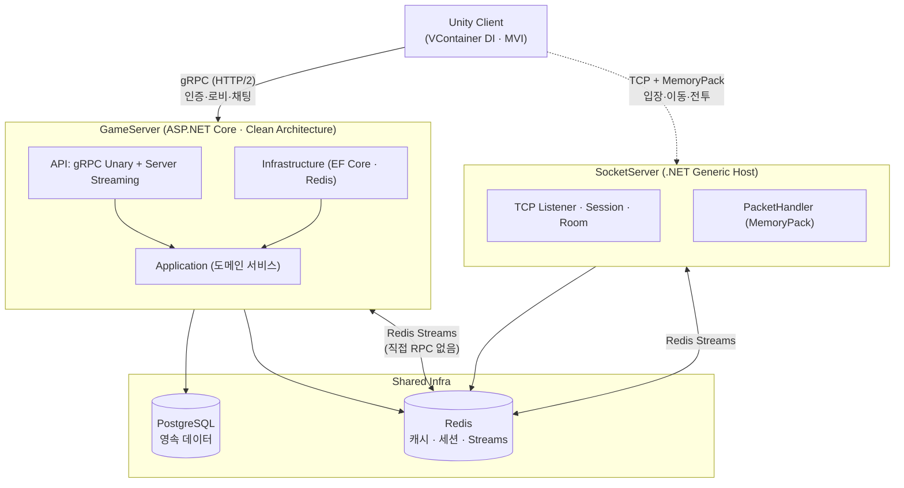
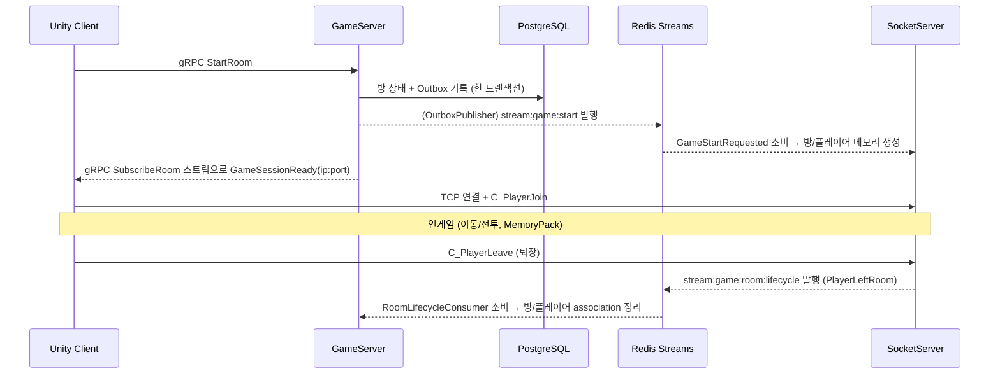
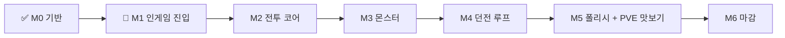

# Multiplay-ActionRPG-Unity

**Unity 멀티플레이 액션 RPG — 이중 서버 게임 서버 개발 포트폴리오**

[](https://unity.com/)
[](https://dotnet.microsoft.com/)
[](https://grpc.io/)
[](https://github.com/Cysharp/MemoryPack)
[](https://redis.io/)
[](https://www.postgresql.org/)

> **이중 서버 아키텍처**로 게임 서버 개발 역량을 증명하는 실전 프로젝트.
> 대부분의 게임 로직은 **gRPC**(HTTP/2)로, 극한 실시간 인게임은 **TCP + MemoryPack**으로 처리하며,
> 두 서버는 **직접 RPC 없이 Redis Streams**(Outbox 패턴)로만 통신합니다.

---

## 📋 목차

1. [프로젝트 개요](#-프로젝트-개요)
2. [아키텍처](#-아키텍처)
3. [기술 스택](#-기술-스택)
4. [프로젝트 구조](#-프로젝트-구조)
5. [구현 현황](#-구현-현황)
6. [개발 로드맵](#-개발-로드맵)
7. [핵심 설계 결정](#-핵심-설계-결정)
8. [테스트 & 품질](#-테스트--품질)
9. [실행 방법](#-실행-방법)
10. [문서](#-문서)

---

## 🎮 프로젝트 개요

**장르**: 멀티플레이 액션 RPG
**플레이 모드**: PVE 싱글 (오픈월드 탐험·퀘스트·사냥) + Co-op 던전 (2~4인 파티)

**기술적 목표**
- 실무 수준의 **이중 서버**(gRPC 게임 서버 + TCP 소켓 서버) 아키텍처 설계·구현
- **서버 간 강결합 제거** — 직접 RPC 대신 Redis Streams + Outbox 패턴으로 비동기 연동
- Clean Architecture 기반의 유지보수 가능한 도메인 설계
- 보안(JWT·DeviceId 바인딩·토큰 로테이션)과 성능(HTTP/2·바이너리 직렬화·캐시)을 모두 고려
- **테스트 주도** — 단위 / 통합(Testcontainers) / E2E(실서버) 3계층 + 회귀 방지 자동화

---

## 🏗 아키텍처

### 전체 구성



### 통신 3계층

| 계층 | 수단 | 용도 | 예 |
|------|------|------|----|
| **gRPC Unary** | HTTP/2, Protobuf | 요청-응답형 게임 로직 | 회원가입/로그인, 방 CRUD, 닉네임 |
| **gRPC Server Streaming** | HTTP/2 | 서버→클라 실시간 Push | 로비 방 갱신(SubscribeRoom), 채팅 |
| **TCP + MemoryPack** | 순수 TCP | 극한 실시간 인게임 | 입장(C_PlayerJoin), 이동(C_Move/S_Move), 전투 |

### 서버 간 연동 — Redis Streams + Outbox (직접 RPC 금지)

GameServer와 SocketServer는 **서로를 직접 호출하지 않습니다.** 모든 교차 이벤트는 Redis Stream을 경유합니다.



주요 스트림: `stream:game:start`(게임 시작) · `stream:game:session:ready`(세션 준비) · `stream:game:room:lifecycle`(플레이어 퇴장) · `stream:chat:*`(채팅).

---

## 🛠 기술 스택

### 클라이언트 (Unity)
- **엔진**: Unity `6000.4.8f1`
- **DI**: VContainer (씬별 LifetimeScope)
- **아키텍처**: MVI (OutGame / InGame), 상태머신 + 입력 버퍼 분리
- **gRPC**: Grpc.Net.Client + **YetAnotherHttpHandler**(HTTP/2 h2c)
- **소켓**: System.Net.Sockets (TCP) + **MemoryPack** 직렬화
- **비동기/반응형**: UniTask, R3
- **로딩**: Addressables (HUD/뷰 런타임 로드)
- **2-클라 테스트**: Unity Multiplayer Play Mode (MPPM)

### GameServer (ASP.NET Core)
- **.NET 10** + ASP.NET Core gRPC (Grpc.AspNetCore)
- **Clean Architecture**: API → Application ← Infrastructure / Domain
- **인증**: JWT (Access 15분 + Refresh), DeviceId 바인딩, 토큰 로테이션, 단일 기기 세션
- **DB**: EF Core + PostgreSQL / **캐시·세션·스트림**: StackExchange.Redis
- **신뢰성**: Outbox 패턴, BackgroundService(Consumer/Publisher)

### SocketServer
- **.NET 10** Generic Host (콘솔)
- **통신**: TCP + **MemoryPack**, 자동 패킷 핸들러(Union ID)
- Session/Room 관리, HeartBeat 타임아웃

### 공통 인프라
- **PostgreSQL 15** · **Redis 7** · **Docker Compose**
- **로깅**: Serilog + Graylog (TraceId 전파)
- **테스트**: xUnit + Testcontainers(통합), Unity Test Framework(EditMode/PlayMode E2E)

---

## 📂 프로젝트 구조

```
ServerAll/
├─ GameServer/
│  ├─ GameServer.API            # gRPC 서비스, 인터셉터, Installer, Consumer 등록
│  ├─ GameServer.Application    # 도메인 서비스 + 인터페이스 (Auth/User/DungeonLobby/GameSession/Chat)
│  ├─ GameServer.Infrastructure # EF Core · Redis 구현, MessageQueue, Consumer
│  ├─ GameServer.Domain         # 엔티티 (User, DungeonRoom ...)
│  └─ GameServer.Tests          # 단위 + 통합(Testcontainers) + 인메모리 E2E
├─ SocketServer/
│  ├─ SocketServer              # TCP Listener · Session · Room · PacketHandler
│  └─ SocketServer.Tests        # RoomManager 등 단위 테스트
├─ Shared/
│  ├─ Shared.Packet             # MemoryPack 패킷 정의 + Union 등록
│  ├─ Shared.Infrastructure     # Redis MessageQueue 베이스, 교차 서버 메시지
│  └─ Shared.Contracts/Protos   # .proto (common/auth/user/lobby/chat)
└─ Tools/ClientCodegen          # Shared.Packet → Unity 클라 패킷 동기화

Client/Assets/Script/
├─ Network/{Https, Socket}      # gRPC 채널·서비스 / TCP 세션·패킷·핸들러
├─ System/                      # Auth/Startup/DungeonLobby/InGame 등 시스템 레이어
├─ OutGame/ · InGame/           # MVI 모델 (로비 / 인게임)
├─ GUI/                         # 뷰·HUD·ViewController
├─ VContainer/                  # LifetimeScope · Installer · EntryPoint
└─ Tests/{EditMode, PlayMode}   # 단위 / Docker 대상 E2E
```

의존성 방향(서버): `API → Application ← Infrastructure`, `Application → Domain`. Application이 Infrastructure를 직접 참조하면 위반.

---

## ✅ 구현 현황

| 영역 | 상태 | 내용 |
|------|------|------|
| 서버 인프라 | ✅ | Clean Architecture, DI Installer, Serilog+Graylog 로깅 |
| 인증/세션 | ✅ | JWT(Access/Refresh), BCrypt, DeviceId 바인딩, 토큰 로테이션, 단일 기기 세션 |
| 던전 로비 | ✅ | gRPC 방 CRUD, 호스트 이양, `SubscribeRoom` Server Streaming |
| 채팅 | ✅ | Redis Streams 기반 Global/Room/Whisper |
| 게임 시작 E2E | ✅ | Outbox → `stream:game:start` → SocketServer 방 생성 → GameSessionReady(ip:port) |
| SocketServer | ✅ | TCP 입장(C_PlayerJoin)·이동(C_Move/S_Move)·Ping/Pong·HeartBeat |
| 던전 입·퇴장 일관성 | ✅ | 플레이어 단위 `PlayerLeftRoom` 이벤트 → association 정리(빈 방 삭제/호스트 이양), 재로그인 복원 차단 |
| DB/캐시 | ✅ | PostgreSQL + Redis Cache-Aside(+Delete), Testcontainers 통합 테스트 |
| Unity 클라(OutGame) | ✅ | gRPC 로그인/로비 UI, VContainer DI, MVI |
| Unity 클라(InGame) | 🔄 | 소켓 진입·이동·HUD·로비 복귀 완료 / 캐릭터 스폰·인게임 UI 진행 중 |
| 실시간 전투 | 📝 | 예정 (Phase B) |

자세한 “무엇을·왜” 결정 로그는 [`docs/wiki/codemap.md`](docs/wiki/codemap.md), 학습 기록은 [`docs/portfolio/`](docs/portfolio/README.md) 참고.

---

## 📅 개발 로드맵

**완성 목표(DoD)**: 2명이 로비에서 방 생성·시작 → 던전 입장(서로 보임·이동) → 몬스터 협력 처치 → 클리어 → 보상 → 로비 복귀를 **전 과정 서버 권위**로. 범위 = **Co-op 던전 버티컬 슬라이스 + PVE 오픈월드 맛보기**.



| 마일스톤 | 내용 | 상태 |
|---|------|------|
| M0 | 인증·로비·채팅·게임시작 E2E·소켓 이동·던전 입퇴장·DB/캐시·Unity OutGame | ✅ |
| **M1** | 인게임 진입 — 원격 캐릭터 스폰·이동 보간, 인게임 UI 전환 | 🔄 |
| M2 | 실시간 전투 — 서버 권위 Attack/Hit/Damage, Health·Attribute | 📝 |
| M3 | 몬스터 — Spawn/State/간단 AI/Dead 동기화 | 📝 |
| M4 | 던전 루프 — Clear → 보상(경험치/아이템) → 로비 복귀 | 📝 |
| M5 | 폴리시(애니메이션·스킬·아이템·사운드) + PVE 오픈월드 맛보기 | 📝 |
| M6 | 마감 — 데모 영상·부하/E2E 검증·배포 문서 | 📝 |

> 단일 진실 소스: [`docs/wiki/plan.md`](docs/wiki/plan.md)

---

## 🎯 핵심 설계 결정

- **이중 서버 분리** — 대부분 로직은 gRPC(타입 안전·HTTP/2)로, 60Hz급 인게임만 TCP로. 던전은 독립 생명주기·장애 격리.
- **서버 간 Redis Streams + Outbox** — GameServer↔SocketServer 직접 RPC를 금지. DB 트랜잭션과 이벤트 발행을 Outbox로 원자화하고, Consumer Group(at-least-once, `Beginning`부터)으로 소비. 강결합·유실을 동시에 해결.
- **TCP + MemoryPack** — 인게임은 HTTP/2 프레임 오버헤드를 피해 지연을 최소화. MemoryPack으로 제로카피에 가까운 고속 직렬화.
- **퇴장 = 플레이어 단위 이벤트** — 방이 빌 때만이 아니라 **퇴장마다** 이벤트를 발행해, 어느 경우든 플레이어 association을 정리(재로그인 시 떠난 방으로 복원되는 버그 방지).
- **클라 MVI + VContainer** — View는 자기 Model만 알고(Intent→Effect→Result→Reducer→State), 네트워크/시스템 레이어와 분리. HUD 등은 생명주기에 맞춰 Addressable 런타임 로드.
- **보안** — JWT + DeviceId 바인딩(SHA256), 토큰 로테이션·재사용 탐지, 단일 기기 세션.

자세한 트레이드오프는 [`docs/portfolio/`](docs/portfolio/README.md) 챕터별 기록 참고.

---

## 🧪 테스트 & 품질

- **단위** — GameServer.Tests(Application/Domain, Fake 레포), SocketServer.Tests(RoomManager 등), Unity EditMode
- **통합** — GameServer.Tests/Infrastructure(**Testcontainers** 실제 PostgreSQL+Redis), 인메모리 풀스택(gRPC Host) + Consumer 파이프라인
- **E2E** — Unity PlayMode가 **Docker 실서버**를 대상으로 검증 (Auth/User/DungeonLobby/Chat/Socket, 던전 퇴장→복원 차단)
- **2-클라 테스트** — 자동(단일 프로세스 다중 소켓) + 수동(Unity MPPM 가상 플레이어)
- **회귀 방지 자동화** — `.claude/` Hook으로 stale Docker 이미지 가드 / proto 재생성 / 서버 변경 시 테스트·codemap 갱신 유도

---

## 🚀 실행 방법

### 요구사항
- .NET 10 SDK · Docker & Docker Compose · Unity 6000.4.8f1 (클라)

### 인프라 + 서버 기동
```bash
cd ServerAll/Infra
docker compose up -d        # PostgreSQL · Redis · GameServer · SocketServer · Graylog 등
```

포트: GameServer HTTP `5131` / gRPC `5132`, SocketServer TCP `7777`.

### 빌드 & 테스트
```bash
# 서버 빌드 (코드젠 스킵)
dotnet build ServerAll/ServerAll.sln --no-restore -p:SKIP_CODEGEN=true

# 서버 테스트
dotnet test  ServerAll/GameServer/GameServer.Tests/GameServer.Tests.csproj
dotnet test  ServerAll/SocketServer/SocketServer.Tests/SocketServer.Tests.csproj

# 클라이언트 빌드
dotnet build Client/Game.Main.csproj --no-restore
```

### proto 수정 시
`.proto`를 바꾸면 클라이언트 `Client/Assets/Script/Network/Https/Generated/`를 재생성해야 합니다 (명령은 [`CLAUDE.md`](CLAUDE.md) 참조).

---

## 📖 문서

| 분류 | 위치 |
|------|------|
| 코드맵 + 설계 결정 로그 | [`docs/wiki/codemap.md`](docs/wiki/codemap.md) |
| 작업 플랜(로드맵) | [`docs/wiki/plan.md`](docs/wiki/plan.md) |
| 아키텍처 / 패킷 / 소켓 / Redis / 게임 흐름 | [`docs/wiki/`](docs/wiki/) |
| 포트폴리오 학습 기록(챕터별) | [`docs/portfolio/README.md`](docs/portfolio/README.md) |
| 기여/작업 규칙 | [`CLAUDE.md`](CLAUDE.md), [`.claude/rules/`](.claude/rules/) |
```
