# Multiplay-ActionRPG-Unity

**게임 서버 프로그래머 포트폴리오** — 실시간 세션 서버와 영속 백엔드 사이의 **상태 경계**를 설계하고, 동시 요청·실패 상황을 테스트로 검증한 프로젝트

[](https://unity.com/)
[](https://dotnet.microsoft.com/)
[](https://grpc.io/)
[](https://github.com/Cysharp/MemoryPack)
[](https://redis.io/)
[](https://www.postgresql.org/)

---

## 한눈에 보기

**목표 직무** · 게임 서버 프로그래머 (실시간 세션 + 영속 백엔드)
**주력** · C# / .NET 10 · gRPC(HTTP/2) · TCP(MemoryPack) · PostgreSQL · Redis · Docker

**핵심 역량 3가지**

| | 역량 | 이 저장소에서 볼 곳 |
|---|---|---|
| 1 | **분산 정합성** — 두 서버·두 저장소에 걸친 지급을 중복 없이 정확히 한 번 | [Outbox·멱등](#1-동시성과-일관성--지급은-정확히-한-번) · [`reward_grants` 원장](#데이터-모델--erd) |
| 2 | **서버 권위 설계** — 클라가 위조할 수 있는 값과 없는 값을 경계로 나눔 | [권위 경계](#2-서버-권위--클라가-무엇을-말할-수-있는가) · [authority-model](docs/wiki/authority-model.md) |
| 3 | **실패를 재현·측정해 고침** — 체감이 아니라 계측으로 원인을 특정 | [사례 표](#5-문제--원인--해결-실제-겪고-근본-수정한-것) · [combat-diagnostics](docs/wiki/combat-diagnostics.md) |

**바로 가기** · [플레이 영상](#실제-플레이--클라이언트-3개-서버는-docker-실서버) · [무엇을 만들었나](#무엇을-만들었나) · [직접 만든 도구](#직접-만든-도구--어빌리티-연출-타임라인-에디터) · [아키텍처](#아키텍처--상태의-소유자와-데이터-흐름) · [데이터 모델(ERD·SQL)](#데이터-모델--erd) · [핵심 흐름 시퀀스](#핵심-흐름--시퀀스) · [기술 사례](#주제별-기술-사례) · [검증](#검증--무엇을-어떤-조건에서-확인했나) · [한계](#한계와-다음-개선) · [설계 기록 28편](docs/portfolio/README.md)

---

## 프로젝트 요약

| 항목 | 내용 |
|---|---|
| **프로젝트** | Unity 멀티플레이 액션 RPG — PVE 싱글(탐험·퀘스트·사냥) + **Co-op 던전**(2~4인) |
| **해결한 문제** | 로비/영속 데이터와 실시간 인게임은 **연결 패턴·상태 보유·스케일 단위가 다르다.** 하나의 서버로 묶으면 둘 중 하나가 손해를 본다 |
| **기간 / 인원** | 2026.03 ~ 진행 중 / **1인**(서버·클라 전 범위 설계·구현) |
| **기술 환경** | C# · .NET 10 · ASP.NET Core(gRPC) · 자체 TCP 서버 · PostgreSQL 15 · Redis(캐시·Streams) · Docker Compose · Unity 6000.4 (VContainer·MVI) |
| **담당 범위** | 서버 2종 전체(도메인·인프라·프로토콜), 클라 네트워크·게임플레이·UI, 데이터 파이프라인, 테스트·CI 대체 자동화 |
| **계약 규모** | gRPC **11 서비스 / 34 RPC** · TCP 패킷 **Union 30종** · PostgreSQL **18 테이블** *(2026-08-25 코드 실측)* |
| **검증 범위** | 단위 · Testcontainers 통합(실 PostgreSQL+Redis) · **Docker 실서버 대상 E2E** · 자동 2-클라 동시 접속 · [수동 3-클라 MPPM](#실제-플레이--클라이언트-3개-서버는-docker-실서버) |
| **한계** | 부하 테스트 미실시(동시 접속 수치 없음) · 단일 인스턴스 전제 · 아래 [한계](#한계와-다음-개선) 참조 |

> 이 저장소는 **동시 접속 N명 같은 부하 수치를 주장하지 않습니다.** 측정하지 않았기 때문입니다.
> 대신 **동시 요청·순서 역전·프로세스 재시작** 같은 실패 조건을 재현해 검증한 결과를 씁니다.

---

## 무엇을 만들었나

플레이어가 **계정을 만들고 → 방을 만들어 → 함께 던전을 돌고 → 보상을 받아 → 로비로 돌아오는** 한 판이 전부 동작합니다.

### 실제 플레이 — 클라이언트 3개, 서버는 Docker 실서버

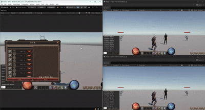

**한 화면에 창이 셋입니다.** 왼쪽이 메인 에디터, 오른쪽 위·아래가 Multiplayer Play Mode 가상 플레이어입니다.
셋 다 **서로 다른 계정**으로 로그인해 같은 GameServer·SocketServer(Docker)에 붙어 있습니다 — 녹화용 목업이 아닙니다.

| 구간 | 화면에서 보이는 것 | 그 뒤에서 도는 것 |
|---|---|---|
| **Main 월드** | 상점·인벤토리 열람, 필드 몬스터 사냥 | gRPC 도메인 RPC · Main 위치 주기 보고(Redis 1차) |
| **던전 입장** | 세 창의 타이틀이 `Client - Main` → `Client - Dungeon` 으로 동시에 바뀜 | `StartRoom` → **Outbox** → Redis Stream → SocketServer 방 생성 → `C_PlayerJoin` 검증 |
| **Co-op 전투** | 원격 플레이어 이동·공격, 몬스터 추적, 데미지 수치, 다운·부활 | 서버 권위 히트박스 재판정 · `RoomTickService` 10Hz 몬스터 AI · `S_ApplyEffect` 방 브로드캐스트 |
| **복귀·전리품** | 던전을 나와 Main 으로 돌아오고 바닥 아이템을 주움 | 클리어 판정(`Interlocked`) → 결과 이벤트 → **`reward_grants` 원장 멱등 지급** |

> 이 한 판이 아래 다이어그램의 루프이자, [핵심 흐름 시퀀스](#핵심-흐름--시퀀스) 4개가 실제로 이어져 도는 모습입니다.

아래는 그 루프를 이루는 실제 구현입니다.

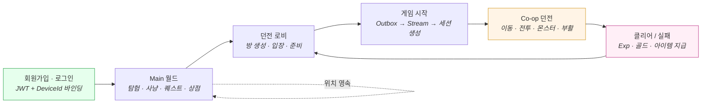

### 서버 — GameServer (gRPC · 영속)

| 도메인 | 구현 |
|---|---|
| **인증·세션** | 회원가입/로그인/로그아웃, JWT Access+Refresh, BCrypt, **DeviceId 바인딩**(SHA256), 토큰 로테이션 + **재사용 탐지**(버전), 단일 기기 세션 |
| **유저** | 프로필·닉네임(중복·금지어 검증), 진행도(레벨/Exp), **Main 위치 영속**(주기 보고 → 이탈 시 확정) |
| **던전 로비** | 방 CRUD, 던전 선택(MapId), 준비 상태, **호스트 이양**, 정원·중복 입장 방어(분산 락 + DB UNIQUE), `SubscribeRoom` **서버 스트리밍**(실시간 방 상태 푸시) |
| **채팅** | Redis Streams 기반 Global / Room / Whisper, 재연결 시 **이력 복구**(MessageId 기준), 금지어 필터 |
| **경제** | 인벤토리(스택·소비), **장비**(8슬롯 · 정의/소유/착용 3분리 · 스탯 합산), **지갑**(골드=통화), **상점**(구매/판매 · 차감 선행 + 실패 시 환불) |
| **성장·콘텐츠** | 퀘스트(수주→진행→완료→보상), 도감, 던전 결과 보상(**멱등 원장**) |
| **운영** | `api/admin` (상태 조회 · 방/세션 초기화), Serilog + Graylog **TraceId 전파** |

### 서버 — SocketServer (TCP · 실시간)

| 영역 | 구현 |
|---|---|
| **세션** | 4바이트 길이 프리픽스 프레이밍, Redis 배정 레코드로 **입장 검증**(소켓 전용 인증 패킷 없음), keep-alive, 유휴 타임아웃, **재접속 인수**(세션 교체·상태 보존) |
| **방** | 방 생성/입장/퇴장, 결정론 스폰(좌표 전송 없이 `layout + spawnIndex`), 플레이어 단위 퇴장 이벤트 |
| **이동** | `C_Move`/`S_Move` 릴레이(원본 타임스탬프 유지), 8방향 애니 상태 1바이트 |
| **전투** | **서버 권위 히트박스 재판정**, 발동 게이트(쿨다운·콤보 cadence·마나), 4단 콤보, 회피 i-frame, CC, **Co-op 부활** |
| **몬스터** | 단일 `RoomTickService`(10Hz)가 전 방 순회, AI(Idle/Patrol/Chase/Attack) 순수 함수 분리, 경계 Clamp, 레벨 스케일링, 드롭 roll |
| **던전 루프** | 전멸/전원 다운 판정(`Interlocked` 배타), 클리어/실패 브로드캐스트, 결과 이벤트 발행 |

### 클라이언트 — Unity

| 영역 | 구현 |
|---|---|
| **네트워크** | gRPC 채널 공유 + **인터셉터 토큰 주입**(h2c 강제), TCP 세션(MemoryPack), 끊김 감지·재접속 |
| **아키텍처** | VContainer DI, **MVI**(Intent→Effect→Result→Reducer→State), asmdef 단방향 레이어 강제 |
| **게임플레이** | Locomotion FSM(Ground/Jump/Fall/Land/Climb), Action 축 분리, 히트 판정(Animation Event), 타겟팅/락온, 사다리(IK 보정) |
| **UI** | 로그인·로비·방 대기실, HUD(HP/MP/버프), 인벤토리·장비·상점·퀘스트·도감·스탯창, Addressable 팝업 |
| **연출** | ARPGWarrior 애니 배선(8방향 · 발 슬라이딩 제거 · 4단 콤보), 원격 플레이어 동기화, 이펙트 Cue |

### 데이터 파이프라인 — 콘텐츠 추가에 서버 코드 수정 0

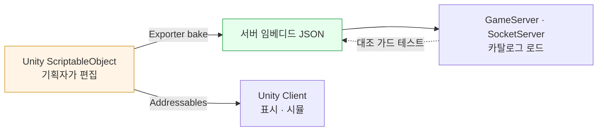

현재 저작된 콘텐츠 *(2026-08-25 bake 파일 실측)*

| 데이터 | 개수 | 데이터 | 개수 |
|---|---|---|---|
| 어빌리티 | **16** | 몬스터(변종 포함) | **13** |
| 드롭 테이블 | **12** | 레벨 테이블 | **60레벨** |
| 스폰 레이아웃(맵) | **8** | 아이템 | **11** |
| 퀘스트 | **4** | | |

> **스킬·몬스터·던전을 추가하는 데 서버 코드를 고치지 않습니다.** SO를 만들고 Export하면 끝입니다.
> 몬스터 레벨 스케일 공식조차 **상수 없이** 플레이어 성장 곡선을 직접 읽습니다.

---

## 직접 만든 도구 — 어빌리티 연출 타임라인 에디터

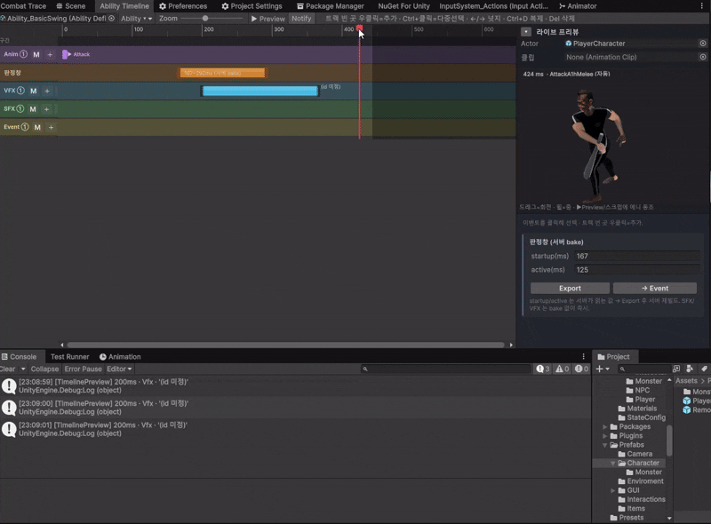

한 어빌리티의 **SFX · VFX · 애니메이션 · 메서드 호출 · 판정창** 타이밍을 시간축에서 편집하고, **라이브 3D 프리뷰**로 스크럽하며 프레임 단위로 맞추는 커스텀 Unity 에디터입니다. (Unreal *Animation Montage* · Unity *Timeline* 참고)

| | 내용 |
|---|---|
| **시각 편집** | 종류별 트랙, 클립 드래그/리사이즈, 다중 선택·복제·넛지, 이름 구간·루프, 반응형 룰러 |
| **라이브 프리뷰** | `PreviewRenderUtility` 뷰포트 + `PlayableGraph` **양방향 클립 샘플**(휴머노이드/제네릭 공용), VFX는 프리뷰 씬 소켓 스폰 + `ParticleSystem.Simulate` 동조 |
| **URP 대응** | 빌트인 렌더 경로가 URP 셰이더를 마젠타로 그리는 문제를 **픽셀 리드백으로 진단**하고 `RenderPipeline.SubmitRenderRequest`로 우회 |
| **자동 해석** | `cueTrigger`(enum) → 애니 파라미터 → AnimatorController 상태를 추론해 프리뷰 클립 자동 선택 |
| **2층 교리 강제** | **판정창(startup/active)은 서버로 bake · 연출은 클라 전용 — bake 안 됨.** exporter allowlist로 *"서버는 연출을 하나도 모른다"* 를 코드로 보장 |

> 기술 — UI Toolkit(`.uss`) · `SerializedObject` 바인딩(편집 중 필드 파괴 회피) · `PreviewRenderUtility` + URP Render Request · `PlayableGraph` 수동 스크럽 · 리플렉션 기반 Event 호출
> 상세 · [`docs/wiki/ability-timeline-tool.md`](docs/wiki/ability-timeline-tool.md)

---

## 아키텍처 — 상태의 소유자와 데이터 흐름

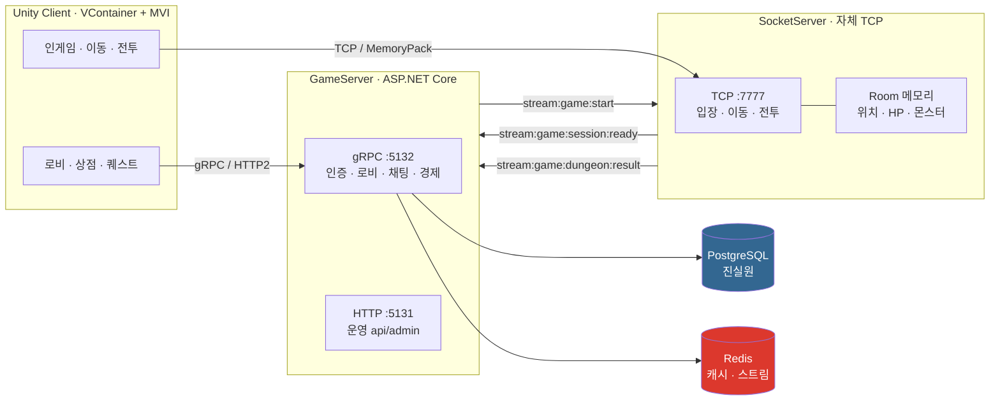

**불변식 하나** — 두 서버는 **서로를 직접 호출하지 않는다.** 모든 교차는 Redis Stream 메시지다.

### 상태를 누가 소유하는가

| 상태 | 소유자 | 수명 | 근거 |
|---|---|---|---|
| 계정·인벤토리·재화·진행 | **PostgreSQL** (GameServer) | 영구 | 되돌릴 수 없는 누적 |
| 로그인 세션·방 캐시 | Redis (GameServer) | TTL | 재구성 가능 |
| 방 안 게임 상태(위치·HP·몬스터) | **SocketServer 메모리** | 한 판 | 실시간, 방과 함께 소멸 |
| 입장 자격(배정) | Redis `gamesession:player:{userId}` | 2h | 프로세스 재시작에 살아남아야 함 |
| 연출(애니·이펙트) | **클라이언트** | 프레임 | 서버가 해석하면 진실원이 둘이 된다 |

### 통신을 셋으로 나눈 이유

| 채널 | 용도 | 왜 이걸 |
|---|---|---|
| **gRPC** :5132 | 인증·로비·채팅·경제 | proto가 계약서 · HTTP/2 멀티플렉싱 · 서버 스트리밍(방 목록 실시간) |
| **TCP + MemoryPack** :7777 | 입장·이동·전투 | 4바이트 길이 프리픽스 — 초당 수십~수백 패킷에서 헤더 오버헤드 최소화 |
| **HTTP** :5131 | 운영(`api/admin`) | 게임 채널과 분리된 조작 평면 |

> 상세 · [01. 이중 서버 아키텍처](docs/portfolio/chapter-01-architecture.md) · [authority-model.md](docs/wiki/authority-model.md)

---

## 데이터 모델 — ERD

### PostgreSQL (영속 · 진실원) — 18 테이블

```mermaid
erDiagram
    users ||--|| user_credentials : "인증정보"
    users ||--|| user_profiles : "닉네임"
    users ||--o| user_sessions : "로그인 세션(단일기기)"
    users ||--|| user_progressions : "레벨/경험치"
    users ||--o| user_wallets : "골드 잔액"
    users ||--o| user_positions : "Main 위치"
    users ||--o{ inventory_items : "소유"
    users ||--o{ user_equipments : "착용"
    users ||--o{ user_codex : "도감"
    users ||--o{ user_quests : "퀘스트"
    users ||--o{ reward_grants : "지급 원장"
    users ||--o| dungeon_room_players : "방 참가(1인 1방)"
    dungeon_rooms ||--o{ dungeon_room_players : "참가자"
    dungeon_rooms ||--o{ game_sessions : "게임 세션"
    game_sessions ||--o{ game_session_players : "세션 참가자"

    users {
        bigint UserId PK
        string PublicId UK "외부 노출용"
        datetime CreatedAt
    }
    user_credentials {
        bigint UserId PK "users.UserId 와 1:1"
        string Email UK
        string PasswordHash "BCrypt"
        string RefreshToken "SHA256(token+deviceId)"
        int RefreshTokenVersion "재사용 탐지"
        datetime RefreshTokenExpiresAt
    }
    user_profiles {
        bigint UserId PK "users.UserId 와 1:1"
        string NickName
    }
    user_sessions {
        string SessionId PK
        bigint UserId UK "단일 기기 = unique"
        datetime LoginAt
        datetime LastActiveAt
    }
    user_progressions {
        bigint UserId PK "users.UserId 와 1:1"
        int Level
        bigint Exp
        datetime UpdatedAt
    }
    user_wallets {
        bigint UserId PK "users.UserId 와 1:1"
        bigint Balance "골드 = 통화(아이템 아님)"
        datetime UpdatedAt
    }
    user_positions {
        bigint UserId PK "users.UserId 와 1:1"
        string MapId
        float X
        float Y
        float Z
        float RotY
        datetime UpdatedAt
    }
    inventory_items {
        bigint UserId PK
        int ItemId PK "대역=분류 1000소모 2100무기 3000재화"
        int Quantity
        datetime UpdatedAt
    }
    user_equipments {
        bigint UserId PK
        int Slot PK "EquipmentType 8슬롯"
        int ItemId "소유는 유지, 표시만 필터"
        datetime UpdatedAt
    }
    user_codex {
        bigint UserId PK
        int ItemId PK
        datetime DiscoveredAt
    }
    user_quests {
        bigint UserId PK
        string QuestId PK
        int Status "Accepted/Claimed 만 저장"
        int Progress "완료는 파생 — Progress 가 Required 이상"
        datetime UpdatedAt
    }
    reward_grants {
        bigint GrantId PK
        string GrantKey UK "멱등키 — 지급과 같은 트랜잭션"
        bigint UserId
        string Kind "exp/gold/item"
        string RefId
        bigint Amount
        datetime GrantedAt
    }
    dungeon_rooms {
        bigint RoomId PK
        string RoomName
        bigint HostUserId
        int MaxPlayers
        int Status "Waiting/Starting/Playing/Closed"
        string MapId "던전 선택 — 방에 영속"
        datetime CreatedAt
    }
    dungeon_room_players {
        bigint RoomId PK
        bigint UserId PK "UNIQUE 인덱스 — 1인 1방을 DB가 강제"
        datetime JoinedAt
    }
    game_sessions {
        bigint GameSessionId PK
        bigint RoomId FK
        string SocketIp "바인드 아닌 '공지' 주소"
        int SocketPort
        int Status
        datetime StartedAt
        datetime EndedAt
    }
    game_session_players {
        bigint GameSessionId PK
        bigint UserId PK
        datetime JoinedAt
    }
    outbox_messages {
        bigint MessageId PK
        string Topic
        string Payload "JSON"
        datetime CreatedAt
        datetime ProcessedAt "null=미발행"
    }
    chat_messages {
        bigint MessageId PK
        int ChatType "Global/Room/Whisper"
        string SenderUserNickName
        string Message
        bigint RoomId
        string TargetUserNickName
        datetime SentAt
    }
```

### 스키마에 새겨진 설계 결정

| 결정 | 스키마에 나타난 형태 | 왜 |
|---|---|---|
| **1인 1방** | `dungeon_room_players.UserId` **UNIQUE** | 애플리케이션 검사만으로는 동시 요청을 막지 못한다 — DB 제약이 최후 방어선 |
| **진행은 계정이 아니라 별도 테이블** | `user_progressions` 분리 (`user_profiles`에 컬럼 X) | 캐릭터 교체를 넣으면 Exp는 캐릭터 귀속이 된다. 되돌리기 비싼 결정을 미리 갈랐다 |
| **골드는 통화지 아이템이 아니다** | `user_wallets.Balance` (인벤토리 행이 아님) | 인벤 칸을 먹지 않고 단일 잔액. 라우팅은 지급 경계 2곳에서만 분기 |
| **착용해도 소유는 유지** | `user_equipments`와 `inventory_items` 분리 | "장착하면 사라진다"는 **표시 정책**이지 데이터 사실이 아니다 |
| **완료 상태를 저장하지 않음** | `user_quests`에 completed 컬럼 없음 | `Progress ≥ Required`로 파생. 저장 상태가 적을수록 불일치가 없다 |
| **지급 원장** | `reward_grants.GrantKey` **UNIQUE** | 지급과 "지급했음" 기록이 **같은 트랜잭션** → exactly-once |
| **이벤트도 행이다** | `outbox_messages` | 상태 변경과 메시지 기록을 한 트랜잭션으로 (이중 쓰기 제거) |
| **정적 기획 데이터는 DB에 없다** | 아이템·몬스터·드롭·레벨 테이블 **없음** | SO 저작 → JSON bake → 서버 임베디드. 콘텐츠 추가에 마이그레이션 0 |

### 스키마·쿼리 — 제약이 규칙을 강제한다

애플리케이션 검사만으로는 동시 요청을 막지 못합니다. **DB 제약이 최후 방어선**입니다.

```sql
-- ① 1인 1방 — 애플리케이션 검사(check-then-act)를 DB가 뒤에서 받쳐준다
CREATE TABLE dungeon_room_players (
    "RoomId"   bigint NOT NULL,
    "UserId"   bigint NOT NULL,
    "JoinedAt" timestamptz NOT NULL,
    PRIMARY KEY ("RoomId", "UserId")
);
CREATE UNIQUE INDEX "IX_dungeon_room_players_UserId"
    ON dungeon_room_players ("UserId");   -- ← 같은 유저가 두 방에 못 들어간다

-- ② 지급 멱등 — 원장 키가 UNIQUE 라서 "정확히 한 번"이 성립한다
CREATE TABLE reward_grants (
    "GrantId"   bigserial PRIMARY KEY,
    "GrantKey"  varchar(128) NOT NULL,   -- 예: dungeon:{roomId}:{userId}
    "UserId"    bigint NOT NULL,
    "Kind"      varchar(32) NOT NULL,    -- exp / gold / item
    "RefId"     varchar(64) NOT NULL,
    "Amount"    bigint NOT NULL,
    "GrantedAt" timestamptz NOT NULL
);
CREATE UNIQUE INDEX "IX_reward_grants_GrantKey"
    ON reward_grants ("GrantKey");       -- ← 동시 중복은 여기서 UNIQUE 위반으로 걸린다

-- ③ 단일 기기 세션 — 정책을 인덱스로 표현
CREATE UNIQUE INDEX "IX_user_sessions_UserId" ON user_sessions ("UserId");
```

**UNIQUE 위반을 에러가 아니라 정상 경합으로 처리합니다.**

```csharp
try {
    await context.SaveChangesAsync(ct);   // 원장을 "먼저" 쓴다
    await grant(ct);                      // 같은 트랜잭션 안에서 실제 지급
    await tx.CommitAsync(ct);
    return true;
}
catch (DbUpdateException e) when (IsUniqueViolation(e)) {
    await tx.RollbackAsync(ct);
    return false;   // 다른 인스턴스가 방금 지급 — 이중지급이 아니다
}
```

### 대표 조회 패턴 — 인덱스가 있는 이유

```sql
-- 방 목록 (페이징) — 무순서 Redis Set 이 소스라 "안정 정렬"이 페이징의 전제다
SELECT * FROM dungeon_rooms
 WHERE "Status" <> 3                      -- Closed 제외
 ORDER BY "RoomId" DESC                   -- ← 정렬 없이 OFFSET 하면 페이지가 흔들린다
 LIMIT 20 OFFSET 0;

-- 방 참가자 배치 조회 — N+1 회피 (방마다 쿼리하지 않는다)
SELECT * FROM dungeon_room_players WHERE "RoomId" = ANY(@roomIds);
SELECT * FROM users               WHERE "UserId" = ANY(@userIds);
--   방 20개: 40 쿼리 → 3 쿼리 (방 수와 무관)

-- 전투 스탯 합산의 소스 — 착용 장비만 (소유는 유지된다)
SELECT "Slot", "ItemId" FROM user_equipments WHERE "UserId" = @userId;

-- 채팅 이력 복구 — 시각이 아니라 MessageId 기준 (Clock Skew 회피)
SELECT * FROM chat_messages
 WHERE "MessageId" > @afterMessageId
 ORDER BY "MessageId"
 LIMIT 100;                               -- IX_chat_messages_SentAt / RoomId 보조

-- Outbox 발행 대기 — 부분 인덱스처럼 쓰이는 ProcessedAt
SELECT * FROM outbox_messages
 WHERE "ProcessedAt" IS NULL              -- ← IX_outbox_messages_ProcessedAt
 ORDER BY "MessageId"
 LIMIT 20;
```

| 인덱스 | 왜 있는가 |
|---|---|
| `dungeon_room_players(UserId)` **UNIQUE** | 정책(1인 1방)을 DB가 강제 |
| `reward_grants(GrantKey)` **UNIQUE** | 멱등 — 동시 중복을 제약으로 차단 |
| `user_sessions(UserId)` **UNIQUE** | 단일 기기 세션 정책 |
| `users(PublicId)` · `user_credentials(Email)` **UNIQUE** | 외부 식별자·로그인 키 |
| `outbox_messages(ProcessedAt)` | 미발행 메시지만 1초마다 스캔 |
| `game_sessions(RoomId)` | 방 → 현재 세션 역참조 |
| `chat_messages(SentAt · RoomId · TargetUserNickName)` | 이력 조회 3경로 |

> **정적 기획 데이터는 DB에 없습니다** — 아이템·몬스터·드롭·레벨은 SO 저작 → JSON bake → 서버 임베디드입니다.
> 콘텐츠를 추가해도 **마이그레이션이 생기지 않습니다.**

### Redis — 휘발 상태와 채널

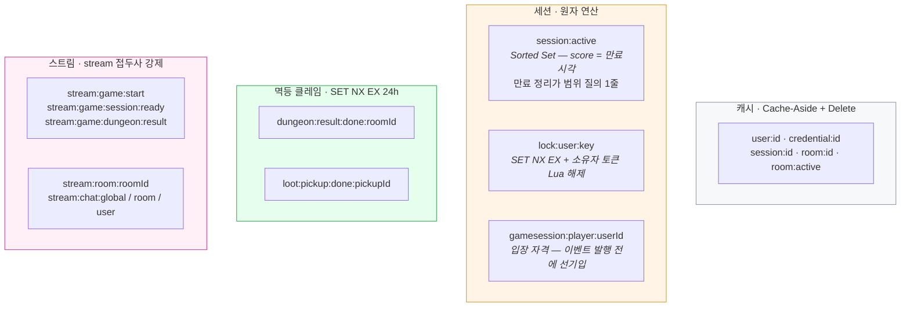

> `stream:` 접두사는 규칙이다 — 데이터 키와 이름이 겹치면 Redis가 `WRONGTYPE`을 낸다.
> 이건 지워서 해결되지 않고 **키 공간을 나눠야** 사라진다. → [04. 채팅](docs/portfolio/chapter-04-chat.md) 7절

### 캐시와 원본의 관계

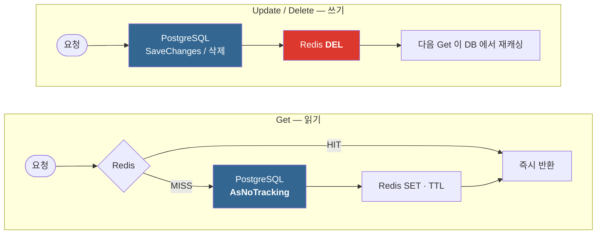

> **갱신(SET)이 아니라 삭제(DEL)다.** 캐시를 갱신하려 들면 "무엇이 최신인가"를 캐시가 판단해야 한다.

**캐시를 갱신하려 들면 "무엇이 최신인가"를 캐시가 판단해야 한다.** 삭제하면 그 판단이 필요 없어진다.
예외는 `user_positions` 한 곳 — 주기 보고라 쓰기가 매우 잦고 유실이 허용되는 유일한 데이터라 Redis가 1차 저장소이고 **이탈 시점에만 DB로 확정**한다.

> 상세 · [07. DB + Redis 캐시](docs/portfolio/chapter-07-db-cache.md)

---

## 핵심 흐름 — 시퀀스

### 1. 인증 — 토큰이 탈취된 뒤를 설계한다

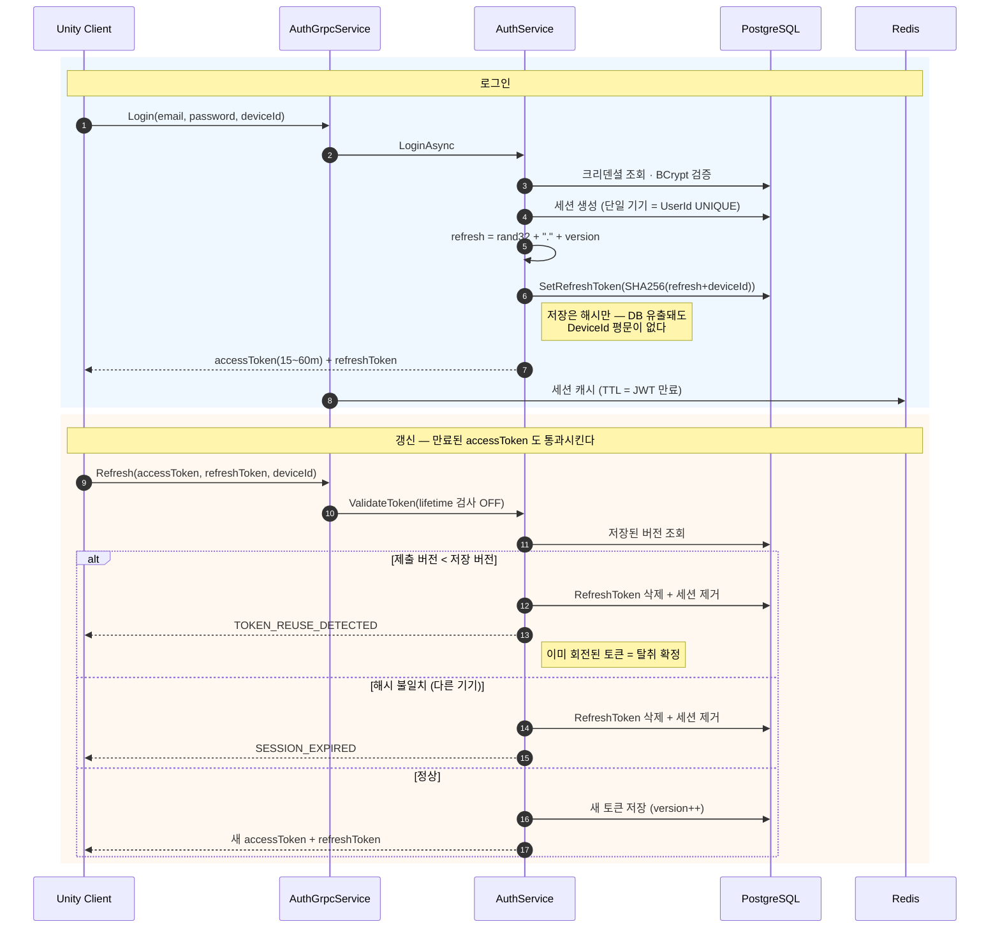

> **버전을 토큰 문자열에 심었다** — 폐기 목록(Blacklist)을 쌓는 대신 정수 하나로 재사용을 탐지한다.
> 버전 증가는 엔티티 `SetRefreshToken` 안에 있어 **호출자가 잊을 수 없다.** → [02. 인증](docs/portfolio/chapter-02-authentication.md)

---

### 2. 게임 시작 → 던전 입장 — 두 서버가 서로를 호출하지 않고

이 프로젝트에서 **가장 긴 흐름**입니다. gRPC·DB·Redis Stream·TCP가 전부 관여합니다.

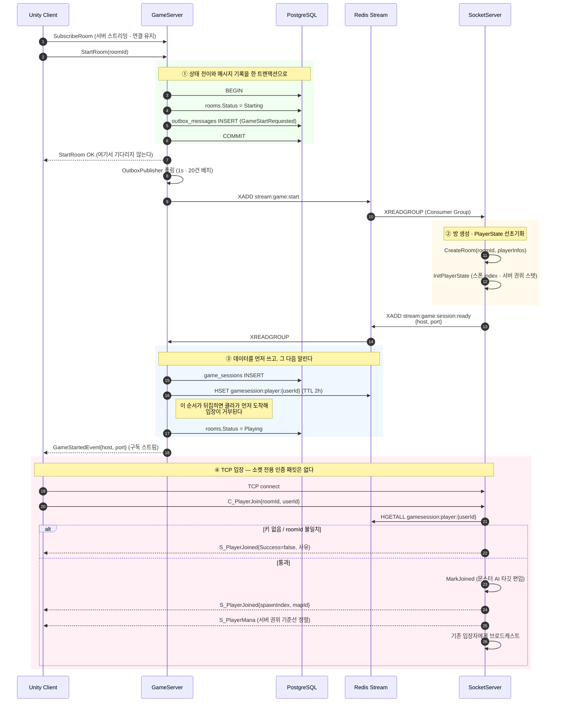

> **①의 트랜잭션과 ③의 순서가 이 흐름의 전부입니다.**
> ①이 없으면 "방은 Starting인데 아무도 시작을 모르는" 영구 정지가 생기고, ③이 뒤집히면 입장이 거부됩니다.
> → [05. 게임 시작 E2E](docs/portfolio/chapter-05-game-start-e2e.md) · [11. 소켓 진입](docs/portfolio/chapter-11-socket-session-entry.md)

---

### 3. 실시간 전투 — 클라는 트리거만, 판정은 서버

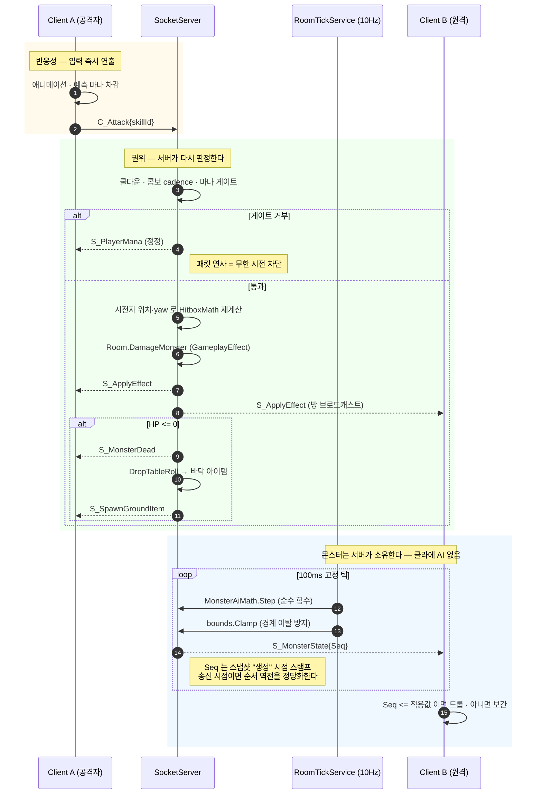

> **클라 예측과 서버 권위가 같은 상수**(`SkillTimeline`·`ManaConfig`)를 봅니다. 정상 플레이에선 정정이 무해하고, 위조했을 때만 되돌려집니다.
> → [13. 몬스터 서버 권위](docs/portfolio/chapter-13-monster-server-authority.md) · [26. 측정이 이끈 전투 정리](docs/portfolio/chapter-26-measured-combat-cleanup.md)

---

### 4. 던전 클리어 → 보상 — 두 번 배달돼도 한 번만 지급

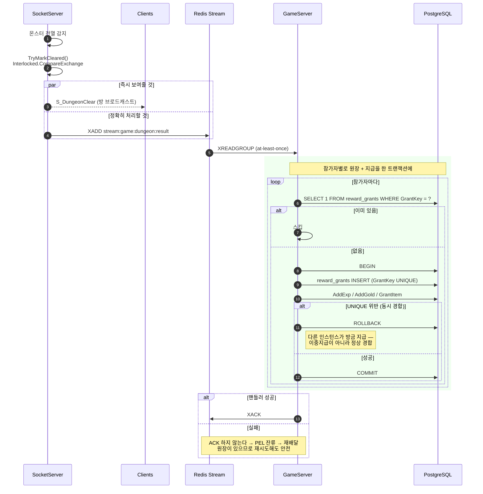

> **원장을 먼저 쓴다.** 지급하고 나서 기록하면 그 사이에 죽었을 때 중복이 되고, 먼저 쓰면 최악이 **미지급**(복구 가능)이다.
> `Interlocked.CompareExchange`로 클리어/실패가 **배타적이면서 정확히 1회**가 된다. → [14. 던전 클리어 루프](docs/portfolio/chapter-14-dungeon-clear-loop.md)

---

### 5. Outbox — 이중 쓰기 문제와 그 해결

두 서버를 이벤트로 잇는 순간 **DB와 메시지 큐 두 곳에 써야 하는데, 둘은 같은 트랜잭션에 들어가지 않습니다.**

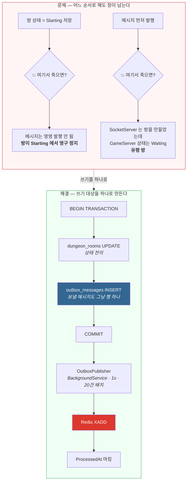

**메시지를 DB 행으로 먼저 씁니다.** 그러면 "상태는 바뀌었는데 메시지가 없는" 상태가 **원천적으로 불가능**해집니다.

| 성질 | 내용 |
|---|---|
| **보장** | 유실 없음 — 커밋된 메시지는 반드시 발행된다 |
| **대가 ①** | **at-least-once** — 발행 후 마킹 전에 죽으면 같은 메시지가 두 번 나간다 → **소비 측이 멱등해야 한다** |
| **대가 ②** | **지연 1초** — 즉시성과 맞바꿨다. 로비→던전 전환에서 허용 범위 |
| **왜 2PC 가 아닌가** | 분산 트랜잭션은 정확히 한 번을 얻지만 운영 복잡도가 급증한다. Outbox는 *"절대 유실 안 함 + 가끔 중복"* 을 택하고 중복은 소비 측에서 흡수 |

> 실제로 소비 측이 멱등합니다 — `CreateRoom`은 이미 있으면 `null`을 반환하고, 보상은 `reward_grants` 원장이 막습니다.
> → [05. 게임 시작 E2E](docs/portfolio/chapter-05-game-start-e2e.md) 3절

---

## 주제별 기술 사례

각 항목은 **문제 → 실패 조건 → 대안 → 결정 → 검증 → 한계** 순으로 정리돼 있습니다.

### 1. 동시성과 일관성 — 지급은 정확히 한 번

| 문제 | 결정 | 검증 |
|---|---|---|
| **이중 쓰기** — 상태는 바뀌었는데 이벤트가 발행되지 않으면 방이 영원히 멈춘다 | **Transactional Outbox** — 메시지를 DB 행으로 먼저 쓰고(같은 트랜잭션), 백그라운드가 발행 | 재시작 후 미발행 메시지 재처리 |
| **at-least-once 재배달** — Consumer Group은 같은 메시지를 다시 준다 | **claim-first 멱등** — 지급 전에 처리 기록을 원자적으로 선점 | 같은 메시지 2회 투입 시 지급 1회 |
| **비멱등 누적**(`+=`)의 부분 실패 | **DB 원장**(`reward_grants.GrantKey` UNIQUE) — 지급과 기록이 같은 트랜잭션 | 참가자별 키 분리로 부분 실패 후 나머지만 재지급 |
| **방 정원 초과** — 검사와 입장 사이에 끼어듦 | **방 단위 분산 락**(`AcquireAsync(RoomLockKey)`) + `UserId` UNIQUE 이중 방어 | 통합 테스트 |
| **두 도메인에 걸친 거래**(상점) | **차감 선행 + 실패 시 보상** — "돈 냈는데 물건 없음"(복구 가능)이 "돈 안 내고 물건 있음"(복제)보다 낫다 | 잔액 부족·미보유 거부 |

> **관통하는 원칙** — 검사와 행동을 하나로 묶는다. `Interlocked.CompareExchange`(던전 결과) · `SET NX PX`(파밍 쿨다운) · `TryBeginDodge`(발동 게이트) · 분산 락(방 입장)이 전부 같은 형태다.
> 상세 · [14. 던전 클리어 루프](docs/portfolio/chapter-14-dungeon-clear-loop.md) · [18. 재화·상점](docs/portfolio/chapter-18-wallet-shop.md)

### 2. 서버 권위 — 클라가 무엇을 말할 수 있는가

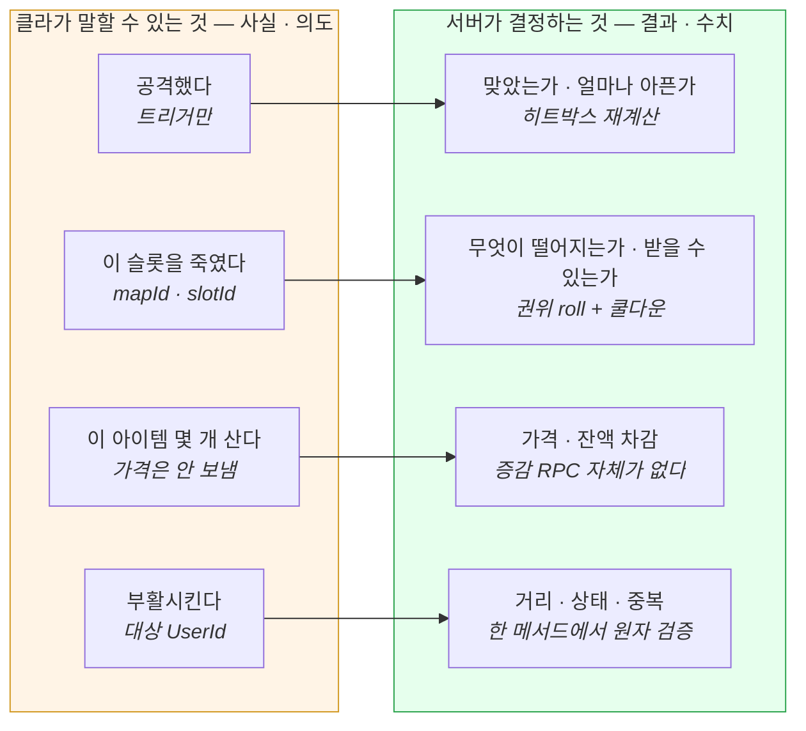

**설계가 한 번 틀렸다가 교정된 기록**이 이 프로젝트에서 가장 값어치 있는 부분입니다.

> 싱글 플레이라 클라가 판정해도 된다고 보고 `GrantItem(itemId, qty)`을 열었는데, 가드 3겹(인증·수량 상한·정의 검증)이 **호출 빈도를 막지 못했습니다.** 각 호출은 완벽히 합법인데 전체는 부정이었습니다.
> 교정은 검증 강화가 아니라 **클라가 보고하는 내용을 바꾼 것**이었습니다 — "이 아이템을 달라" → "이 슬롯을 죽였다".
> → [16. 싱글 플레이의 보상](docs/portfolio/chapter-16-main-loot-path.md)

| 자원 | 권위가 필요한 지점 | 막는 것 |
|---|---|---|
| HP | **사망 판정** — 서버가 HP 0을 직접 감지 | 불사 핵 |
| 마나 | **발동 허가** — 차감이 아니라 "쓸 수 있는가" | 무한 시전 |
| 아이템·골드 | **지급 경계** — 내용과 정원을 서버가 결정 | 무한 파밍 |

### 3. 실시간 동기화 — 무엇을 보내고 무엇을 보내지 않는가

| 값 | 결정 | 이유 |
|---|---|---|
| 8방향 이동 | **안 보냄** | 위치+회전에서 **역산 가능** |
| 로코모션 모드 | `byte` 1개 추가 | 점프·낙하·사다리는 전부 "y가 변한다" — 역산 불가 |
| 마나 리젠 | **안 보냄** | 같은 rate를 공유하면 **수렴**한다. 동기화는 변곡점(차감·거부·입장)에만 |
| 이동 타임스탬프 | 클라 원본 그대로 릴레이 | 보간에 필요한 건 "언제 발생했나"이지 "언제 도착했나"가 아니다 |
| 몬스터 상태 | `Seq`를 **스냅샷 생성 시점**에 스탬프 | 송신 시점에 찍으면 역전을 정당화해버린다 |

> `C_Move`는 최고빈도 패킷이라 **1바이트도 영구 비용**입니다. "역산 가능한가"가 계약을 늘리기 전의 기본 질문이 됐습니다.
> 상세 · [29. 멀티플레이 동기화](docs/portfolio/chapter-29-multiplayer-sync-invisible-failures.md) · [13. 몬스터 서버 권위](docs/portfolio/chapter-13-monster-server-authority.md)

### 4. 장애와 복구

| 실패 | 대응 |
|---|---|
| 프로세스 재시작으로 인메모리 인증 소실 | 입장 자격을 **Redis에 선기입** — 소켓 전용 인증 패킷(`C_Auth`) 자체를 제거 |
| Redis `LOADING`에 컨슈머 영구 사망 | `ResilientStreamConsumer` — 취소/스트림 실패(백오프)/독약 메시지(스킵) **3분류** |
| 무이동 60초에 서버가 연결을 끊음 | 클라 keep-alive 15초 주기 + `OnDisconnected` 감지 (의도적 종료와 분리) |
| 죽은 줄 모르는 세션이 자리 점유(감지 63초) | **재접속 인수** — 세션만 교체하고 `PlayerState`는 보존 |
| 느린 클라가 서버 메모리 잠식 | 세션당 **bounded 송신 큐** + 포화 시 그 세션만 끊음 |

### 5. 문제 → 원인 → 해결 (실제 겪고 근본 수정한 것)

| 증상 | 근본 원인 | 해결 |
|---|---|---|
| 던전 입장이 간헐적으로 안 됨 | 스트리밍 RPC의 long-lived DbContext가 **EF 추적 캐시의 stale 엔티티** 반환 | 캐시 미스 DB 폴백은 전부 `AsNoTracking()` 원칙화 |
| 몬스터 HP가 줄었다 **되돌아감** | 상태 브로드캐스트 **순서 역전** | `Seq`를 스냅샷 생성 시점 스탬프 + 클라 stale 드롭. 송신 FIFO 후 실측 역전 0건 |
| "체력 동기화가 느린 것 같다"(체감) | 계측 결과 공격→HP 반영 **~37ms, RTT 지배** | 틱레이트 상향을 **데이터로 기각** — 측정이 "고치지 않을 것"도 결정 |
| 사망 연출이 남에게 안 보임 | **아군 오사가 클라 HP만 깎아** 서버가 죽음을 모름 (로그 7회 vs 14회로 특정) | 아군 오사 제거 — "클라만 깎는 HP" 경로 자체를 없앰 |
| 캐릭터가 지면에 파묻힘 | 아바타 타입 불일치(Generic 클립 → Humanoid 메시) — **본 회전 0.0도** 실측 | 배선 완료 ≠ 재생됨. 컨트롤러 코드 생성 + 계약 테스트 |
| 발이 미끄러짐 | 블렌드 파라미터의 **단위 불일치**(의도 속도 vs 클립 실측 m/s) | 보정 계수가 아니라 **좌표계 의미를 m/s로 교정** → 비율 1.00 |
| 보스가 캡슐로 보임 | 변종 ID를 표시 카탈로그에 안 넣음 → **설계된 폴백이 조용히 삼킴** | 저작 시점 대조 테스트를 폴백의 짝으로. 가드가 잡는지 **고장 주입으로 실측** |

> 상세 · [combat-diagnostics.md](docs/wiki/combat-diagnostics.md) · [설계 기록 28편](docs/portfolio/README.md)

---

## 검증 — 무엇을 어떤 조건에서 확인했나

### 3계층 + 실서버

| 계층 | 대상 | 도구 |
|---|---|---|
| **단위** | 도메인 규칙 · 공유 수식(서버↔클라 parity) · 전투 게이트 | xUnit / Unity EditMode |
| **통합** | 실제 PostgreSQL + Redis에 대한 Repository·캐시 전략 | **Testcontainers** |
| **E2E** | **Docker로 띄운 실서버** 대상 전 구간 (gRPC 로비 → TCP 입장 → 이동 브로드캐스트) | Unity PlayMode |
| **다중 클라(자동)** | 2-클라 동시 접속·상호 수신·재접속 | 단일 프로세스 다중 소켓(`SocketE2ETests`) |
| **다중 클라(수동)** | 3-클라 한 판 완주 — Main→던전→전투→복귀·전리품 ([영상](#실제-플레이--클라이언트-3개-서버는-docker-실서버)) | Unity MPPM 가상 플레이어 + Docker 실서버 |

**목으로 서버를 대체하지 않습니다.** 목이었다면 원리적으로 못 잡았을 것들이 실제로 잡혔습니다 — HTTP/1.1 다운그레이드, 인증 헤더 누락, DI 등록 누락, **더미 구현이 항상 성공을 반환하던 문제**.

### 검증 규율

- **가드가 실제로 잡는지 실측한다** — "테스트를 추가했다"와 "그 테스트가 이 버그를 잡는다"는 다른 문장이다. 수정을 되돌리거나 고장을 주입해 **실패를 확인**하고 복구한다.
- **책임 소재부터 확정한다** — 스위트가 깨지면 `git stash`로 되돌려 **같은 실패가 나는지** 먼저 본다. 추정으로 시작하면 원래 있던 결함을 자기 변경 탓으로 오인한다.
- **전체를 돌린다** — 필터 실행은 인접 회귀를 못 본다. 실제로 생성자 의존성 하나를 추가해 **DI 호스트 4곳이 조용히 깨진** 적이 있다.
- **누락을 자동 감지한다** — CI 대신 세션 종료 훅이 "연결 소스를 고쳤는데 소켓 테스트가 안 바뀌었다", "서버 이미지가 소스보다 낡았다"를 경고한다.

> 테스트 개수는 2026-07 측정치가 [`docs/wiki/plan.md`](docs/wiki/plan.md)에 있습니다. **이 README 작성 시점에 재측정하지 않았으므로** 여기에는 수치를 옮기지 않습니다.

---

## 한계와 다음 개선

정직하게 남깁니다 — 하지 않은 것을 한 것처럼 쓰지 않습니다.

| 영역 | 현재 한계 | 다음 |
|---|---|---|
| **부하** | **부하 테스트를 하지 않았다.** 동시 접속·처리량·p95 지연 수치가 없다 | 부하 모델 정의 → k6/자체 클라로 측정 → 병목 프로파일 |
| **확장** | SocketServer **단일 인스턴스 전제**. 방 단위 스케일이라 `RoomId → 인스턴스` 라우팅 계층이 필요 | 라우팅 설계 후 다중 인스턴스 |
| **원격 보간** | 정석(스냅샷 버퍼 + 고정 지연)이 아니라 **lerp-to-latest 단순화본**. 토대(원본 타임스탬프 릴레이)는 이미 있음 | 버퍼 기반으로 승격 |
| **메시지 회수** | ACK 전 컨슈머가 죽은 메시지의 **`XAUTOCLAIM` 자동 회수가 없다** | 회수 컨슈머 추가 |
| **운영** | 헬스체크 엔드포인트 없음 · 이동 좌표 미검증(반응성과 맞바꾼 의도적 선택) | 배포 단계에서 |
| **관측** | 분산 로그(TraceId)가 gRPC→Stream까지. **TCP 세션 구간은 미전파** | 방이 TraceId를 보관하도록 |

> 미해결 항목은 근거와 함께 [`docs/wiki/cleanup-backlog.md`](docs/wiki/cleanup-backlog.md)에 관리합니다(착수 순서 포함).

---

## 실행 방법

### 요구사항
.NET 10 SDK · Docker & Docker Compose · Unity 6000.4.8f1(클라)

### 인프라 + 서버

```bash
cd ServerAll/Infra && docker compose up -d
```

PostgreSQL · Redis · GameServer · SocketServer · Graylog가 함께 뜹니다.
포트 — GameServer HTTP `5131` / gRPC `5132`, SocketServer TCP `7777`.

### 빌드 & 테스트

```bash
dotnet build ServerAll/ServerAll.sln --no-restore -p:SKIP_CODEGEN=true
```

```bash
dotnet test ServerAll/GameServer/GameServer.Tests/GameServer.Tests.csproj
```

```bash
dotnet test ServerAll/SocketServer/SocketServer.Tests/SocketServer.Tests.csproj
```

> 클라이언트 컴파일 판정은 **Unity가 유일한 권위**입니다 — `Client/*.csproj`는 Unity 생성물이라 `dotnet build` 대상이 아닙니다([`CLAUDE.md`](CLAUDE.md) §검증 명령).
> `.proto`를 바꾸면 클라 `Generated/`를 재생성해야 합니다(명령은 `CLAUDE.md`).

---

## 문서 색인

| 목적 | 위치 |
|---|---|
| **설계 기록 28편** (결정·근거·대가) | [`docs/portfolio/README.md`](docs/portfolio/README.md) |
| 마일스톤 한 장 요약 | [`docs/portfolio/00-roadmap.md`](docs/portfolio/00-roadmap.md) |
| 권위 모델(무엇을 서버가 소유하는가) | [`docs/wiki/authority-model.md`](docs/wiki/authority-model.md) |
| 코드맵 + 결정 로그 | [`docs/wiki/codemap.md`](docs/wiki/codemap.md) |
| 전투 계측·진단 | [`docs/wiki/combat-diagnostics.md`](docs/wiki/combat-diagnostics.md) |
| 클라 레이어·MVI·입력·상태머신 | [`docs/wiki/unity-*.md`](docs/wiki/) |
| 미해결 결함 백로그 | [`docs/wiki/cleanup-backlog.md`](docs/wiki/cleanup-backlog.md) |
| 원본 학습 로그(시행착오 기록) | [`docs/learning-log/`](docs/learning-log/) |
| 작업 규칙 | [`CLAUDE.md`](CLAUDE.md) · [`.claude/rules/`](.claude/rules/) |
