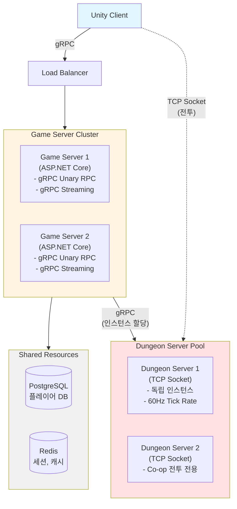
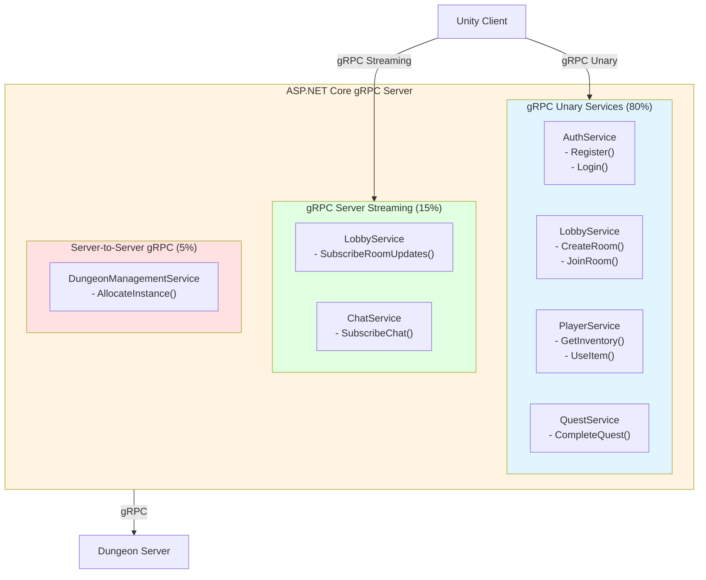
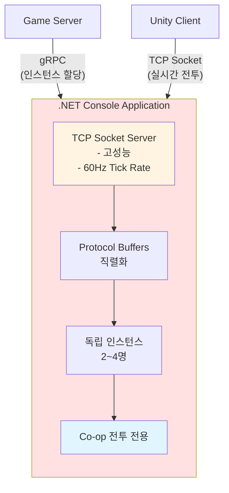
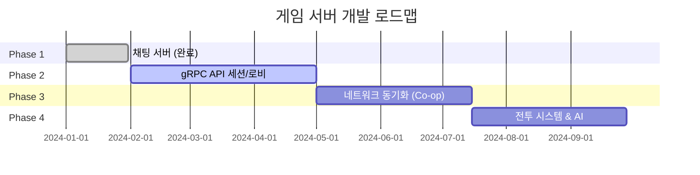
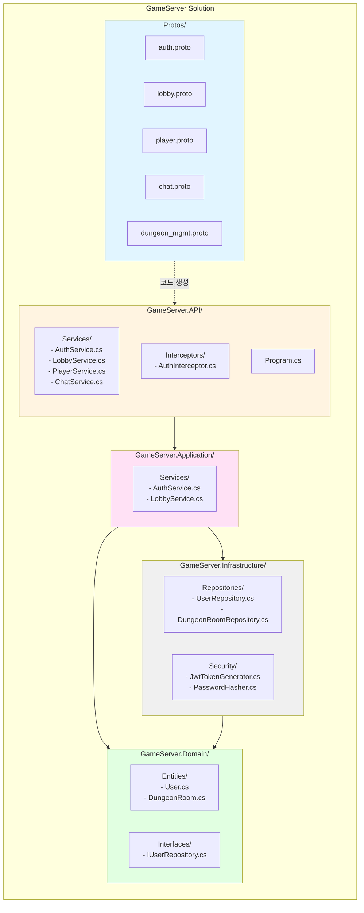
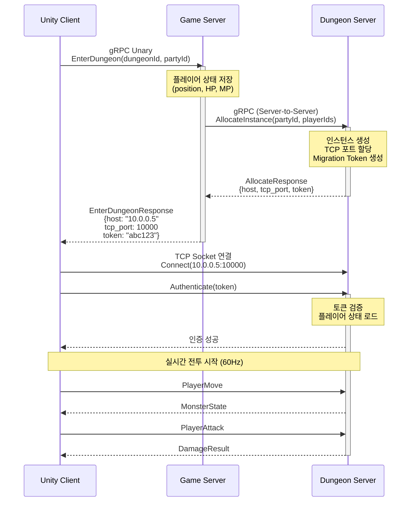

# Multiplay-ActionRPG-Unity

**원신 스타일 오픈월드 액션 RPG 서버 개발 포트폴리오**

[](https://unity.com/)
[](https://dotnet.microsoft.com/)
[](https://grpc.io/)

> **게임 서버 개발 역량을 증명하는 실전 프로젝트**  
> gRPC 기반 고성능 통신과 TCP Socket 실시간 전투를 결합한 현대적 아키텍처로 구현합니다.

---

## 📋 목차

1. [프로젝트 개요](#-프로젝트-개요)
2. [아키텍처 설계](#-아키텍처-설계)
3. [기술 스택](#-기술-스택)
4. [개발 로드맵](#-개발-로드맵)
5. [현재 진행 상황](#-현재-진행-상황)

---

## 🎮 프로젝트 개요

### 프로젝트 목표

**기술적 목표:**

- 실무 수준의 게임 서버 아키텍처 설계 및 구현
- **gRPC 기반 통신 + TCP Socket 실시간 전투**의 하이브리드 구조
- Protocol Buffers를 활용한 타입 안전하고 고성능 직렬화
- 확장 가능하고 유지보수 가능한 코드 작성
- 보안과 성능을 모두 고려한 설계

### 게임 컨셉

**장르**: 오픈월드 액션 RPG (원신 스타일)

**플레이 모드:**

- **PVE 모드**: 싱글 플레이 (오픈월드 탐험, 퀘스트, 몬스터 사냥)
- **Co-op 모드**: 2~4인 파티 플레이 (던전, 레이드 보스)

---

## 🏗 아키텍처 설계

### gRPC 기반 통신 모델

원신 스타일 게임의 특성을 분석한 결과, **gRPC를 주 통신 방식으로 사용하고 극한의 실시간 전투만 TCP Socket을 사용**하는 것이 최적입니다.

```mermaid
flowchart TB
    subgraph "통신 방식 선택 기준"
        direction TB
        
        subgraph grpc_unary["gRPC Unary RPC (80% - 대부분의 게임 로직)"]
            direction TB
            u1["요청-응답 1:1 패턴"]
            u2["Protocol Buffers (고성능 직렬화)"]
            u3["타입 안정성 (컴파일 타임 검증)"]
            u4["HTTP/2 멀티플렉싱"]
            u5["예: 로그인, 퀘스트, 아이템, 인벤토리"]
        end
        
        subgraph grpc_stream["gRPC Server Streaming (15% - 실시간 알림)"]
            direction TB
            s1["서버 → 클라이언트 지속적 Push"]
            s2["양방향 연결 유지"]
            s3["HTTP/2 기반"]
            s4["예: 채팅, 방 업데이트, 친구 알림"]
        end
        
        subgraph tcp_socket["TCP Socket + Protobuf (5% - 극한 실시간)"]
            direction TB
            t1["극도의 실시간성 (60Hz+)"]
            t2["최소 지연시간 (<10ms)"]
            t3["직접 제어 가능"]
            t4["예: Co-op 전투, 캐릭터 이동 동기화"]
        end
    end
```



### 전체 아키텍처



### 통신 레이어별 상세 설계

#### Layer 1: gRPC Unary RPC (일반 API)

**역할**: 기존 HTTP REST API 역할 대체

```protobuf
// auth.proto
service AuthService {
  rpc Register(RegisterRequest) returns (RegisterResponse);
  rpc Login(LoginRequest) returns (LoginResponse);
  rpc Logout(LogoutRequest) returns (LogoutResponse);
}

// lobby.proto
service LobbyService {
  rpc CreateRoom(CreateRoomRequest) returns (CreateRoomResponse);
  rpc JoinRoom(JoinRoomRequest) returns (JoinRoomResponse);
  rpc LeaveRoom(LeaveRoomRequest) returns (LeaveRoomResponse);
  rpc GetRooms(GetRoomsRequest) returns (GetRoomsResponse);
}

// player.proto
service PlayerService {
  rpc GetInventory(GetInventoryRequest) returns (GetInventoryResponse);
  rpc UseItem(UseItemRequest) returns (UseItemResponse);
  rpc CompleteQuest(CompleteQuestRequest) returns (CompleteQuestResponse);
}
```

**특징:**
- 요청 1번 → 응답 1번 (동기식)
- 실시간성 불필요
- 트랜잭션 처리

**장점:**
- Protocol Buffers 자동 코드 생성
- 타입 안정성 (컴파일 타임 검증)
- HTTP/2 멀티플렉싱으로 여러 요청 동시 처리

---

#### Layer 2: gRPC Server Streaming (실시간 알림)

**역할**: 기존 SignalR/WebSocket 역할 대체

```protobuf
// lobby.proto (추가)
service LobbyService {
  // ... Unary RPC들 ...
  
  // 실시간 방 업데이트 알림
  rpc SubscribeRoomUpdates(SubscribeRequest) returns (stream RoomUpdate);
}

message RoomUpdate {
  enum UpdateType {
    PLAYER_JOINED = 0;
    PLAYER_LEFT = 1;
    ROOM_STARTED = 2;
    ROOM_CLOSED = 3;
  }
  
  UpdateType type = 1;
  int64 room_id = 2;
  RoomInfo room_info = 3;
  int64 player_id = 4;
  string player_name = 5;
}

// chat.proto
service ChatService {
  // 채팅 구독 (서버 → 클라이언트)
  rpc SubscribeChat(SubscribeRequest) returns (stream ChatMessage);
  
  // 채팅 전송 (클라이언트 → 서버)
  rpc SendChat(SendChatRequest) returns (SendChatResponse);
}

message ChatMessage {
  int64 user_id = 1;
  string username = 2;
  string message = 3;
  int64 timestamp = 4;
}
```

**특징:**
- 서버 → 클라이언트 지속적 Push
- 클라이언트가 연결 유지하며 계속 수신
- HTTP/2 기반

**사용 예:**
- 채팅 메시지
- 방 업데이트 알림
- 친구 접속 알림
- 파티 초대

---

#### Layer 3: TCP Socket + Protocol Buffers (극한 실시간)

**역할**: Co-op 전투 (60Hz 동기화)

```protobuf
// dungeon.proto
syntax = "proto3";

message PlayerMove {
  int64 player_id = 1;
  float pos_x = 2;
  float pos_y = 3;
  float pos_z = 4;
  float rot_y = 5;
  int64 timestamp = 6;
}

message PlayerAttack {
  int64 player_id = 1;
  int32 skill_id = 2;
  int64 target_id = 3;
  float direction_x = 4;
  float direction_z = 5;
}

message MonsterState {
  int64 monster_id = 1;
  float pos_x = 2;
  float pos_y = 3;
  float pos_z = 4;
  int32 hp = 5;
  int32 state = 6; // 0: Idle, 1: Chase, 2: Attack
}
```

**왜 gRPC가 아닌 TCP인가?**

| 항목 | gRPC Bidirectional | TCP + Protobuf |
|------|-------------------|----------------|
| 기반 프로토콜 | HTTP/2 | 순수 TCP |
| 오버헤드 | 프레임 헤더 | 최소 |
| 지연시간 | ~15-25ms | ~3-8ms |
| 대역폭 | ~50KB/s | ~30KB/s |
| 제어 수준 | 제한적 | 완전 제어 |

**결론**: Co-op 전투는 5~10ms 차이가 체감되므로 TCP 사용!

---

### 서버 역할 분리

#### Game Server (ASP.NET Core)

**gRPC 기반 통합 서버**



**장점:**

- **타입 안전성**: Protocol Buffers 컴파일 타임 검증
- **자동 코드 생성**: .proto → C# 클래스 자동 생성
- **고성능**: HTTP/2 멀티플렉싱, 바이너리 직렬화
- **일관된 아키텍처**: 모든 API가 .proto로 정의됨
- **버전 관리 용이**: .proto 파일로 API 스펙 관리

---

#### Dungeon Server (Console App)

**분리된 서비스 - TCP Socket 전용**



**분리 이유:**

- 극도의 실시간성 필요 (60Hz 동기화)
- 독립적인 생명주기 (던전 종료 시 프로세스 종료 가능)
- 높은 CPU 사용 (물리, AI 계산)
- 장애 격리 (한 던전 크래시가 다른 곳에 영향 없음)

---

## 🛠️ 기술 스택

### 클라이언트

- **엔진**: Unity 6000.3.2 LTS
- **언어**: C# 10.0
- **gRPC**: Grpc.Net.Client (Unity 2021.3+)
- **TCP**: System.Net.Sockets
- **직렬화**: Protocol Buffers

### Game Server (Main)

- **프레임워크**: ASP.NET Core 8.0
- **gRPC**: Grpc.AspNetCore
- **인증**: JWT (Bearer Token)
- **DB**: Entity Framework Core + PostgreSQL
- **캐시**: StackExchange.Redis
- **직렬화**: Protocol Buffers (Google.Protobuf)

### Dungeon Server

- **프레임워크**: .NET 8.0 Console App
- **통신**: System.Net.Sockets (TCP)
- **직렬화**: Protocol Buffers
- **gRPC Client**: Grpc.Net.Client (서버 간 통신)

### 공통 인프라

- **데이터베이스**: PostgreSQL 15+
- **캐시**: Redis 7+
- **로깅**: Serilog
- **컨테이너**: Docker
- **오케스트레이션**: Kubernetes (K3s)
- **프로토콜**: Protocol Buffers 3

---

## 📅 개발 로드맵

### 전체 일정



---

## 📍 현재 진행 상황

### ✅ Phase 1: 채팅 서버 (완료)

**개발 기간:** 1개월  
**상태:** 완료

**구현 내용:**

- [x] TCP 소켓 서버
- [x] Protocol Buffers 통합
- [x] 메시지 브로드캐스팅
- [x] 자동화된 패킷 핸들러

**데모:**

**배운 점:**
- TCP Socket 직접 구현 경험
- Protocol Buffers 직렬화
- 비동기 네트워크 프로그래밍
- 패킷 핸들러 자동 생성

---

### 🔄 Phase 2: gRPC API 및 실시간 알림 (진행중)

**개발 기간:** 3~4개월  
**목표:** gRPC 기반 게임 서버 구축

---

#### Step 2-1: gRPC 프로젝트 세팅 (1주)

**목표:** gRPC 프로젝트 구조 및 기본 설정

**세부 작업:**

1. **프로젝트 생성**

```bash
# 솔루션 생성
dotnet new sln -n GameServer

# gRPC 서버 프로젝트
dotnet new grpc -n GameServer.API
dotnet sln add GameServer.API

# 공통 라이브러리
dotnet new classlib -n GameServer.Core
dotnet new classlib -n GameServer.Infrastructure
dotnet new classlib -n GameServer.Domain
```

2. **패키지 설치**

```bash
# gRPC
dotnet add package Grpc.AspNetCore
dotnet add package Google.Protobuf
dotnet add package Grpc.Tools

# Authentication
dotnet add package Microsoft.AspNetCore.Authentication.JwtBearer

# Database
dotnet add package Npgsql.EntityFrameworkCore.PostgreSQL
dotnet add package Microsoft.EntityFrameworkCore.Tools
dotnet add package StackExchange.Redis

# Security
dotnet add package BCrypt.Net-Next

# Logging
dotnet add package Serilog.AspNetCore
```

3. **프로젝트 구조**



4. **기본 설정 (appsettings.json)**

```json
{
  "ConnectionStrings": {
    "GameDb": "Host=localhost;Database=gamedb;Username=postgres;Password=password",
    "Redis": "localhost:6379"
  },
  "Jwt": {
    "Secret": "your-secret-key-min-32-characters",
    "Issuer": "GameServer",
    "Audience": "GameClient",
    "ExpirationMinutes": 15
  },
  "Grpc": {
    "EnableDetailedErrors": true,
    "MaxReceiveMessageSize": 4194304
  }
}
```

5. **Program.cs 기본 설정**

```csharp
var builder = WebApplication.CreateBuilder(args);

// gRPC 서비스 등록
builder.Services.AddGrpc(options =>
{
    options.EnableDetailedErrors = true;
    options.MaxReceiveMessageSize = 4 * 1024 * 1024; // 4MB
});

// JWT 인증
builder.Services.AddAuthentication(JwtBearerDefaults.AuthenticationScheme)
    .AddJwtBearer(options => { /* JWT 설정 */ });

var app = builder.Build();

// gRPC 서비스 매핑
app.MapGrpcService<AuthService>();
app.MapGrpcService<LobbyService>();
app.MapGrpcService<PlayerService>();
app.MapGrpcService<ChatService>();

app.Run();
```

**완료 조건:**

- [ ] gRPC 프로젝트 생성 및 구조 설정
- [ ] .proto 파일 기본 구조 작성
- [ ] gRPC 서버 실행 확인
- [ ] grpcurl로 Health Check 테스트

---

#### Step 2-2: 인증 시스템 (gRPC Unary) (2주)

**목표:** JWT 기반 회원가입/로그인

**.proto 정의:**

```protobuf
// auth.proto
syntax = "proto3";
package auth;

service AuthService {
  rpc Register(RegisterRequest) returns (RegisterResponse);
  rpc Login(LoginRequest) returns (LoginResponse);
  rpc Logout(LogoutRequest) returns (LogoutResponse);
}

message RegisterRequest {
  string username = 1;
  string password = 2;
  string email = 3;
}

message RegisterResponse {
  bool success = 1;
  int64 user_id = 2;
  string message = 3;
}

message LoginRequest {
  string username = 1;
  string password = 2;
}

message LoginResponse {
  bool success = 1;
  int64 user_id = 2;
  string username = 3;
  string access_token = 4;
  string session_id = 5;
  int64 expires_at = 6; // Unix timestamp
}

message LogoutRequest {
  string session_id = 1;
}

message LogoutResponse {
  bool success = 1;
}
```

**서비스 구현 예시:**

```csharp
public class AuthService : Auth.AuthServiceBase
{
    private readonly IAuthService _authService;
    
    public override async Task<RegisterResponse> Register(
        RegisterRequest request, 
        ServerCallContext context)
    {
        // 비즈니스 로직 호출
        var result = await _authService.RegisterAsync(request);
        
        return new RegisterResponse
        {
            Success = result.IsSuccess,
            UserId = result.UserId,
            Message = result.Message
        };
    }
    
    public override async Task<LoginResponse> Login(
        LoginRequest request,
        ServerCallContext context)
    {
        // 로그인 로직
        var result = await _authService.LoginAsync(request);
        
        if (!result.IsSuccess)
        {
            throw new RpcException(new Status(
                StatusCode.Unauthenticated, 
                result.Message));
        }
        
        return new LoginResponse
        {
            Success = true,
            UserId = result.UserId,
            Username = result.Username,
            AccessToken = result.AccessToken,
            SessionId = result.SessionId,
            ExpiresAt = result.ExpiresAt
        };
    }
}
```

**보안 구현:**

- 비밀번호 해싱: BCrypt (cost factor 12)
- JWT Access Token: 15분 유효
- Session 관리: Redis 저장 (7일 TTL)
- gRPC Interceptor를 통한 JWT 검증

**완료 조건:**

- [ ] .proto 파일 작성 및 코드 생성
- [ ] AuthService 구현
- [ ] JWT 토큰 발급/검증
- [ ] Redis 세션 저장
- [ ] grpcurl로 테스트
- [ ] Unity 클라이언트 연동

---

#### Step 2-3: 로비 시스템 (gRPC Unary + Streaming) (3주)

**목표:** 방 생성/관리 및 실시간 알림

**.proto 정의:**

```protobuf
// lobby.proto
syntax = "proto3";
package lobby;

service LobbyService {
  // Unary RPC
  rpc CreateRoom(CreateRoomRequest) returns (CreateRoomResponse);
  rpc JoinRoom(JoinRoomRequest) returns (JoinRoomResponse);
  rpc LeaveRoom(LeaveRoomRequest) returns (LeaveRoomResponse);
  rpc GetRooms(GetRoomsRequest) returns (GetRoomsResponse);
  
  // Server Streaming (실시간 알림)
  rpc SubscribeRoomUpdates(SubscribeRequest) returns (stream RoomUpdate);
}

message CreateRoomRequest {
  string room_name = 1;
  int32 max_players = 2;
}

message CreateRoomResponse {
  bool success = 1;
  RoomInfo room = 2;
}

message RoomInfo {
  int64 room_id = 1;
  string room_name = 2;
  int64 host_user_id = 3;
  int32 current_players = 4;
  int32 max_players = 5;
  string status = 6; // WAITING, PLAYING, CLOSED
}

message SubscribeRequest {
  int64 room_id = 1; // 0이면 모든 방 구독
}

message RoomUpdate {
  enum UpdateType {
    PLAYER_JOINED = 0;
    PLAYER_LEFT = 1;
    ROOM_STARTED = 2;
    ROOM_CLOSED = 3;
    ROOM_CREATED = 4;
  }
  
  UpdateType type = 1;
  int64 room_id = 2;
  RoomInfo room_info = 3;
  int64 player_id = 4;
  string player_name = 5;
}

message GetRoomsRequest {
  // 필터 조건 추가 가능
}

message GetRoomsResponse {
  repeated RoomInfo rooms = 1;
  int32 total_count = 2;
}
```

**Server Streaming 구현 예시:**

```csharp
public override async Task SubscribeRoomUpdates(
    SubscribeRequest request,
    IServerStreamWriter<RoomUpdate> responseStream,
    ServerCallContext context)
{
    // 클라이언트별 업데이트 큐
    var updateQueue = new Channel<RoomUpdate>(100);
    
    // Redis Pub/Sub 구독
    _pubsub.Subscribe($"room:{request.RoomId}:updates", (channel, message) =>
    {
        var update = JsonSerializer.Deserialize<RoomUpdate>(message);
        updateQueue.Writer.TryWrite(update);
    });
    
    try
    {
        // 클라이언트가 연결되어 있는 동안 계속 전송
        while (!context.CancellationToken.IsCancellationRequested)
        {
            var update = await updateQueue.Reader.ReadAsync(
                context.CancellationToken);
            
            await responseStream.WriteAsync(update);
        }
    }
    finally
    {
        // 연결 종료 시 정리
        _pubsub.Unsubscribe($"room:{request.RoomId}:updates");
    }
}
```

**Unity 클라이언트 구독 예시:**

```csharp
public async void SubscribeToRoomUpdates(long roomId)
{
    var request = new SubscribeRequest { RoomId = roomId };
    
    using var call = _client.SubscribeRoomUpdates(request);
    
    try
    {
        await foreach (var update in call.ResponseStream.ReadAllAsync())
        {
            // Unity Main Thread에서 UI 업데이트
            UnityMainThreadDispatcher.Enqueue(() =>
            {
                HandleRoomUpdate(update);
            });
        }
    }
    catch (RpcException ex) when (ex.StatusCode == StatusCode.Cancelled)
    {
        Debug.Log("Subscription cancelled");
    }
}
```

**완료 조건:**

- [ ] 방 목록 조회 (Unary RPC)
- [ ] 방 생성/입장/퇴장 (Unary RPC)
- [ ] 실시간 방 업데이트 (Server Streaming)
- [ ] Redis Pub/Sub 연동
- [ ] Unity 클라이언트 UI 연동

---

#### Step 2-4: 채팅 시스템 (gRPC Streaming) (2주)

**목표:** 실시간 채팅

**.proto 정의:**

```protobuf
// chat.proto
syntax = "proto3";
package chat;

service ChatService {
  // 채팅 구독 (Server Streaming)
  rpc SubscribeChat(SubscribeChatRequest) returns (stream ChatMessage);
  
  // 채팅 전송 (Unary)
  rpc SendChat(SendChatRequest) returns (SendChatResponse);
}

message SubscribeChatRequest {
  int64 room_id = 1;
}

message ChatMessage {
  int64 user_id = 1;
  string username = 2;
  string message = 3;
  int64 timestamp = 4;
  ChatType type = 5;
}

enum ChatType {
  NORMAL = 0;
  SYSTEM = 1;
  WHISPER = 2;
}

message SendChatRequest {
  int64 room_id = 1;
  string message = 2;
  ChatType type = 3;
}

message SendChatResponse {
  bool success = 1;
}
```

**완료 조건:**

- [ ] 채팅 메시지 전송 (Unary)
- [ ] 채팅 구독 (Server Streaming)
- [ ] Redis Pub/Sub로 브로드캐스팅
- [ ] 채팅 히스토리 (선택)
- [ ] Unity 클라이언트 연동

---

#### Step 2-5: 던전 마이그레이션 (Server-to-Server gRPC) (2주)

**목표:** Game Server → Dungeon Server 인스턴스 할당

**.proto 정의:**

```protobuf
// dungeon_mgmt.proto
syntax = "proto3";
package dungeon;

service DungeonManagement {
  // 던전 인스턴스 할당
  rpc AllocateInstance(AllocateRequest) returns (AllocateResponse);
  
  // 던전 완료 알림
  rpc NotifyDungeonComplete(DungeonResult) returns (AckResponse);
}

message AllocateRequest {
  int64 party_id = 1;
  repeated int64 player_ids = 2;
  int32 dungeon_id = 3;
}

message AllocateResponse {
  bool success = 1;
  string instance_id = 2;
  string host = 3;           // Dungeon Server IP
  int32 tcp_port = 4;        // TCP Socket 포트
  string migration_token = 5; // 인증 토큰
}

message DungeonResult {
  string instance_id = 1;
  repeated PlayerResult player_results = 2;
  int32 clear_time = 3;
  bool success = 4;
}

message PlayerResult {
  int64 player_id = 1;
  int32 damage_dealt = 2;
  int32 damage_taken = 3;
  repeated ItemDrop items = 4;
}

message AckResponse {
  bool success = 1;
}
```

**마이그레이션 흐름:**



**완료 조건:**

- [ ] DungeonManagement gRPC Service 구현
- [ ] Dungeon Server 프로토타입
- [ ] 인스턴스 할당 로직
- [ ] Migration Token 생성/검증
- [ ] TCP Socket 연동 테스트

---

### Phase 2 완료 기준

**기능 완성도:**

- [ ] gRPC Unary RPC (인증, 로비, PVE)
- [ ] gRPC Server Streaming (채팅, 알림)
- [ ] JWT 인증 및 Interceptor
- [ ] Redis 캐싱 및 Pub/Sub
- [ ] PostgreSQL 데이터 저장
- [ ] Server-to-Server gRPC (던전 할당)

**성능 목표:**

- 1,000명 동시 접속
- Unary RPC 응답 시간 < 50ms
- Server Streaming 지연 < 30ms

**테스트:**

- [ ] grpcurl로 모든 API 테스트
- [ ] 부하 테스트 (1,000명)
- [ ] Unity 클라이언트 E2E 테스트

---

### 📌 Phase 3: Co-op 던전 시스템 (예정)

**개발 기간:** 2~3개월  
**목표:** TCP Socket 기반 실시간 전투

**구현 시스템:**

- TCP Socket 서버 (Dungeon Server)
- Protocol Buffers 직렬화
- 실시간 위치 동기화 (60Hz)
- 전투 로직 (공격, 스킬)
- 서버 권위 검증
- Phase 1 경험 활용

---

### 📌 Phase 4: 데이터 & AI 시스템 (예정)

**개발 기간:** 2~3개월

**구현 시스템:**

- 인벤토리 시스템
- 퀘스트 시스템
- 몬스터 AI
- 보스 AI

---

## 🎯 핵심 설계 결정

### 왜 gRPC를 선택했는가?

**gRPC의 장점:**

1. **타입 안전성**
    - Protocol Buffers로 컴파일 타임 검증
    - 잘못된 타입 전송 불가능

2. **자동 코드 생성**
    - .proto → C# 클래스 자동 생성
    - 클라이언트/서버 인터페이스 일치 보장

3. **고성능**
    - HTTP/2 멀티플렉싱
    - 바이너리 직렬화 (JSON보다 빠름)
    - 헤더 압축

4. **양방향 스트리밍**
    - Server Streaming으로 실시간 알림 구현
    - SignalR/WebSocket 대체 가능

5. **실무 표준 기술**
    - Google, Netflix, Uber 등 사용
    - MSA 환경에서 서버 간 통신 표준
    - 포트폴리오 차별화

**실제 사례:**

- Google: 내부 마이크로서비스 통신에 gRPC 사용
- Netflix: 대규모 분산 시스템에서 gRPC 활용
- 게임: Supercell, Riot Games 등 서버 간 통신에 사용

### 언제 gRPC Server Streaming을 쓰는가?

**적합한 경우:**

- 서버 → 클라이언트 지속적 Push
- 실시간 알림 (채팅, 방 업데이트)
- 빈도: 초당 1~10회

**장점:**

- SignalR보다 간단한 구조
- Protocol Buffers로 타입 안전
- HTTP/2 기반으로 안정적

### 언제 TCP Socket을 쓰는가?

**적합한 경우:**

- 극한의 실시간 (60Hz+)
- 최소 지연시간 필수
- 양방향 고빈도 통신

**gRPC vs TCP 비교:**

| 항목 | gRPC | TCP Socket |
|------|------|-----------|
| 지연시간 | ~15-25ms | ~3-8ms |
| 오버헤드 | HTTP/2 프레임 | 최소 |
| 제어 수준 | 제한적 | 완전 제어 |
| 적합 용도 | 알림, 채팅 | Co-op 전투 |

**Co-op만 TCP 소켓인 이유:**

- 4명이 같은 공간에서 전투
- 60Hz 동기화 필요
- 5~10ms 차이가 체감됨
- 정확한 히트 판정 필요

---

## 🔒 보안

### JWT 인증

- Access Token: 15분 유효
- Session 관리: Redis (7일 TTL)
- gRPC Interceptor로 토큰 검증
- 비밀키 환경변수 관리

### gRPC 보안

- TLS/SSL 필수 (프로덕션)
- Rate Limiting (gRPC Interceptor)
- Input Validation (Protobuf 자동 검증)
- Deadline 설정 (타임아웃)

### 서버 검증

- 이동 속도 검증
- 아이템 획득 거리 검증
- 타임스탬프 검증

---

## 📊 성능 최적화

### gRPC 최적화

```csharp
builder.Services.AddGrpc(options =>
{
    // 메시지 크기 제한
    options.MaxReceiveMessageSize = 4 * 1024 * 1024; // 4MB
    
    // Keep-alive 설정
    options.KeepAliveTimeout = TimeSpan.FromMinutes(2);
    
    // Compression
    options.ResponseCompressionLevel = System.IO.Compression.CompressionLevel.Optimal;
});
```

### Protocol Buffers 최적화

- 필드 번호 재사용 금지
- Reserved 필드 활용
- 작은 필드 번호 우선 사용 (1~15)

---

## 🧪 테스트 도구

### grpcurl

```bash
# 서비스 목록 확인
grpcurl -plaintext localhost:5000 list

# 메서드 호출
grpcurl -plaintext \
  -d '{"username":"test","password":"1234"}' \
  localhost:5000 \
  auth.AuthService/Login
```

### Postman

- Postman v10.0+ gRPC 지원
- .proto 파일 import
- GUI로 테스트 가능

---

## 🚀 시작하기

### 환경 요구사항

- .NET 8.0 SDK
- Docker & Docker Compose
- Unity 6000.3.2 LTS (클라이언트)
- Protocol Buffers Compiler (protoc)

### 로컬 실행

```bash
# Redis & PostgreSQL 시작
docker-compose up -d

# gRPC Server 실행
cd GameServer.API
dotnet run

# grpcurl로 테스트
grpcurl -plaintext localhost:5000 list
```

---

## 📖 참고 자료

- [gRPC 공식 문서](https://grpc.io/docs/)
- [Protocol Buffers 가이드](https://protobuf.dev/)
- [ASP.NET Core gRPC](https://docs.microsoft.com/en-us/aspnet/core/grpc/)
- [Unity gRPC](https://github.com/grpc/grpc/tree/master/examples/csharp/HelloworldUnity)

---