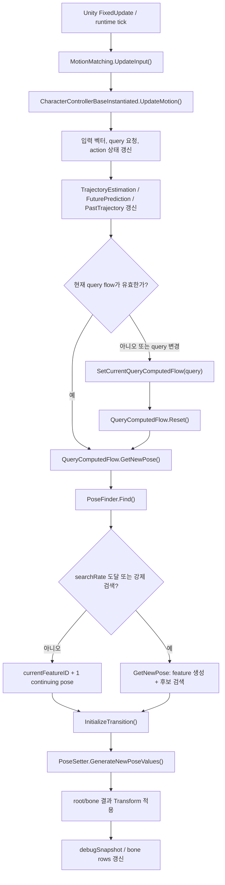
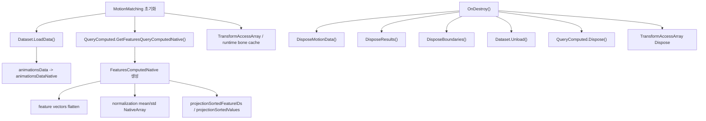
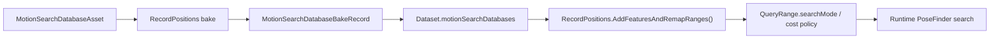
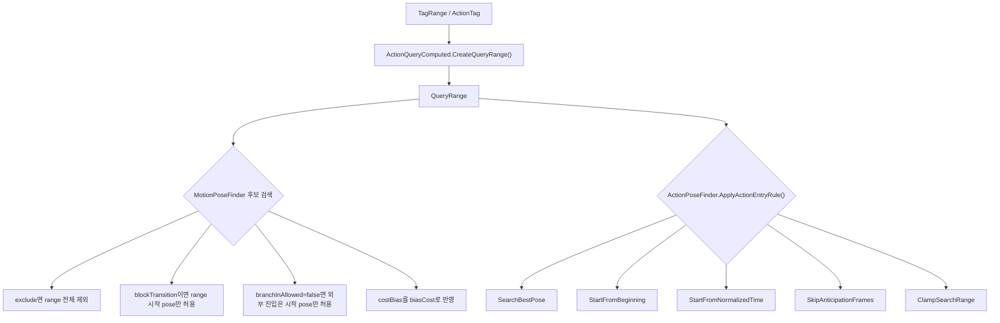
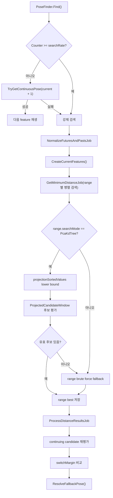
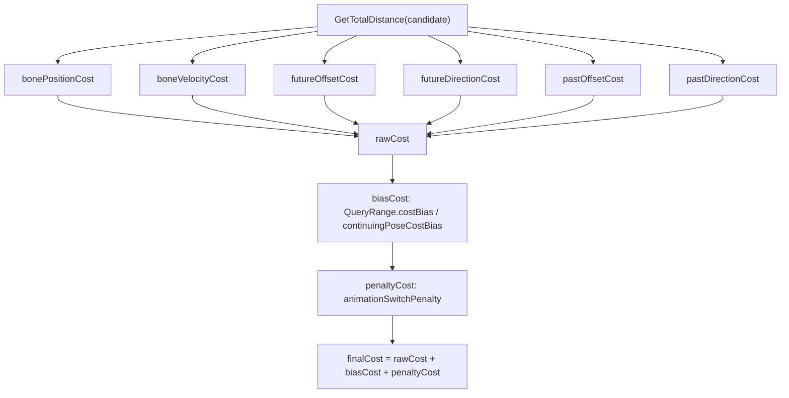
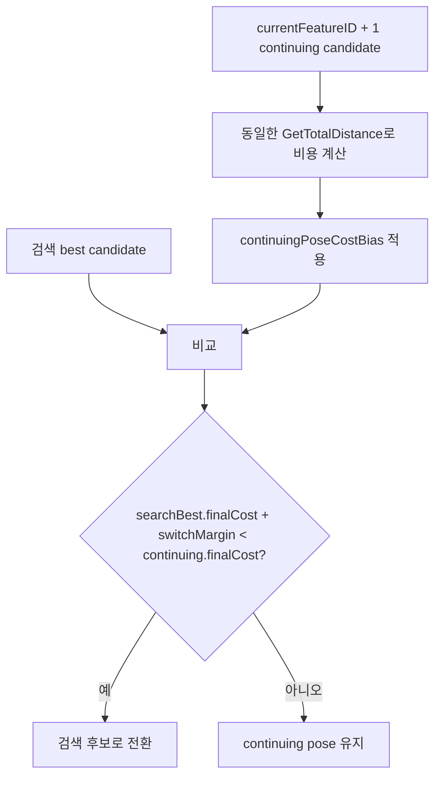
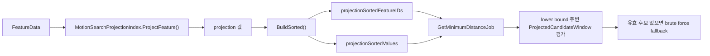
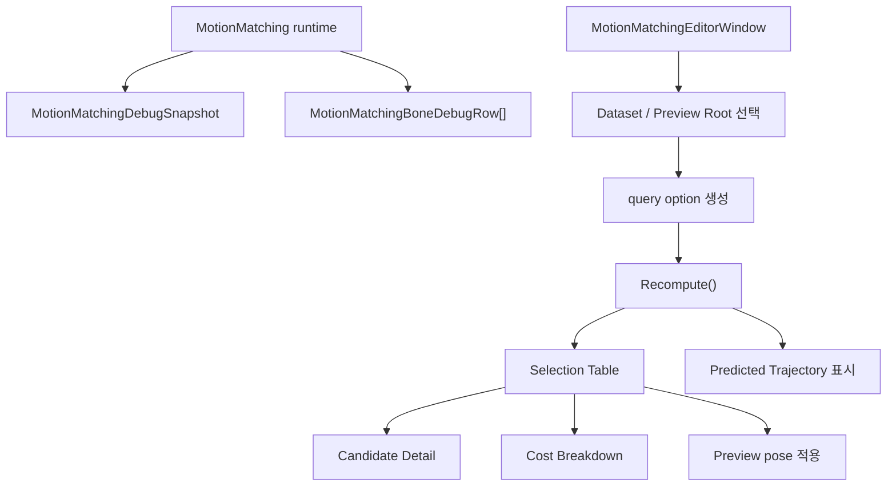

# MotionMatchingSystem Runtime Flow

이 문서는 현재 구현된 `Assets/Script/System/MotionSystem` 기준으로 Motion Matching 시스템의 런타임 흐름, 데이터 정책, 비용 계산, action entry rule, debugger 구조를 설명한다. 이전 계획/TODO 문서는 제거하고, 실제 코드가 어떻게 연결되는지 중심으로 정리한다.

## 핵심 구성

| 역할 | 주요 파일 |
| --- | --- |
| 런타임 진입점 | `MotionMatching.cs` |
| query 실행 단위 | `QueryComputedFlow.cs`, `MotionQueryComputedFlow.cs`, `IdleQueryComputedFlow.cs`, `ActionQueryComputedFlow.cs` |
| pose 검색 | `MotionPoseFinder.cs`, `ActionPoseFinder.cs`, `IdlePoseFinder.cs`, `LoopActionPoseFinder.cs` |
| pose 적용/blend | `PoseSetter.cs`, `MotionPoseSetter.cs`, `PoseBlender.cs`, `Inertialization.cs` |
| baked 데이터 | `Dataset.cs`, `QueryComputed.cs`, `FeaturesComputedNative.cs`, `QueryRange.cs` |
| 정책 데이터 | `MotionSearchDatabaseAsset.cs`, `TagRange.cs`, `ActionTag.cs` |
| projection 후보군 | `MotionSearchProjectionIndex.cs` |
| 디버거 | `MotionMatchingEditorWindow.cs`, `MotionMatchingDebugSnapshot` |

## 전체 런타임 흐름



`MotionMatching`은 MonoBehaviour 진입점이다. `UpdateInput()`에서 캐릭터 컨트롤러 입력을 먼저 갱신하고, 현재 query flow가 결정된 뒤 `QueryComputedFlow.GetNewPose()`가 현재 pose를 이어갈지 새 후보를 검색할지 결정한다.

## 데이터 로딩과 해제



런타임 NativeArray는 `OnDestroy()` 중심으로 정리한다. `Dataset.LoadData()`가 만든 animation pose native data는 `Dataset.Unload()`에서 해제하고, query feature native data는 `QueryComputed.Dispose()`와 `FeaturesComputedNative.Dispose()` 경로에서 해제한다. `SetExclusionMask()`는 runtime bone mapping/root disable 상태가 바뀌는 경우 필요한 버퍼를 다시 만들기 전에 기존 버퍼를 dispose한다.

## Bake 데이터와 정책 전파



`MotionSearchDatabaseAsset`에는 데이터베이스 단위 정책이 있다.

- `searchMode`: `BruteForce` 또는 `PcaKdTree`
- `normalizationGroup`
- `baseCostBias`
- `continuingPoseCostBias`
- `loopingCostBias`
- `sequenceStartExclusionTime`
- `sequenceEndExclusionTime`

Bake 시 `MotionSearchDatabaseBakeRecord`에 metadata가 복사된다. 런타임 검색은 asset 직접 참조가 아니라 bake record와 `QueryRange`에 복사된 값을 사용한다. 기존 asset은 기본값이 보존되도록 bias는 `0`, exclusion은 `0`, search mode는 `BruteForce`가 기본이다.

## QueryRange와 Action Entry Policy



기존의 stop/start/pivot 같은 hardcoded skip 대신 `TagRange` 정책이 검색 제한과 진입 위치를 결정한다.

`TagRange`와 `ActionTag`의 주요 정책:

- `entryMode`
- `exclude`
- `blockTransition`
- `branchInAllowed`
- `costBias`
- `normalizedEntryStart`
- `normalizedEntryEnd`
- `normalizedStartTime`
- `skipAnticipationNormalizedTime`

`ActionPoseFinder`는 action query 첫 진입 시 선택된 pose에 entry rule을 적용한다. 이후에는 action range 내부에서 sequential frame을 재생하고, range 끝에 도달하면 state transition 또는 query done으로 넘어간다.

## Pose 검색 흐름



검색은 range 단위로 병렬 처리된다. `PcaKdTree` search mode는 현재 완전한 KDTree가 아니라 projection 기반 후보 window이다. projection 후보에서 유효 후보를 찾지 못하면 brute force로 fallback한다. 따라서 기준 동작은 여전히 brute force와 호환된다.

## 비용 계산 구조



`DistanceResult`는 최종 거리뿐 아니라 channel별 비용을 들고 있다.

- `rawCost`
- `bonePositionCost`
- `boneVelocityCost`
- `futureOffsetCost`
- `futureDirectionCost`
- `pastOffsetCost`
- `pastDirectionCost`
- `biasCost`
- `penaltyCost`
- `finalCost`
- `flags`
- `pose`
- `queryRange`

선택 공식은 고정이다.

```text
finalCost = rawCost + biasCost + penaltyCost
```

`ProcessDistanceResultsJob`은 range별 best 결과 중 가장 낮은 `finalCost`를 선택한다. NaN/Infinity 값은 0 또는 invalid로 sanitize되어 검색 결과가 깨지지 않도록 방어한다.

## Continuing Pose 안정화



search tick이 아닐 때는 가능한 경우 다음 feature를 그대로 재생한다. search tick에서는 검색 best와 continuing candidate를 같은 비용 함수로 비교한다. 검색 후보가 `switchMargin` 이상 충분히 좋아야만 전환한다.

추가 방어:

- `poseJumpThresholdFrames`로 같은 animation 안에서 너무 가까운 과거/현재 frame 재선택을 방지한다.
- 마지막 frame 접근 시 `animPoseID + 1`은 clamp되어 범위를 벗어나지 않는다.
- 후보가 하나도 없으면 `ResolveFallbackPose()`가 `currentFeatureID + 1`, 현재/첫 유효 range 시작, 현재 feature 순으로 안전하게 fallback한다.

## Projection Search Mode



`PcaKdTree` 이름은 정책 enum에 남아 있지만 현재 구현은 1차 projection sorted index이다. 목적은 KDTree/PCA 최적화를 바로 켜는 것이 아니라, brute force 기준을 유지하면서 후보군 축소 구조를 안전하게 연결하는 것이다.

## Debugger 흐름



디버거는 UI Toolkit 기반 EditorWindow이다. Selection Table은 후보별 clip, frame, final/raw/bias/penalty cost, database, flags를 보여준다. 후보를 선택하면 channel별 cost breakdown과 candidate detail을 갱신하고 preview root에 pose를 적용할 수 있다.

## 실제 데이터 테스트 절차

1. Unity Editor에서 `PlayerMotionDataset.asset`을 연다.
2. `MotionSearchDatabaseAsset` 목록에 idle/walk/run/stop/pivot 등 database asset이 연결되어 있는지 확인한다.
3. 각 database의 `searchMode`, `baseCostBias`, `continuingPoseCostBias`, `sequenceStartExclusionTime`, `sequenceEndExclusionTime` 기본값을 확인한다.
4. sample database를 rebake한다.
5. `Tools/Motion Matching/Debugger Window`를 열고 dataset과 preview root를 지정한다.
6. query를 바꿔가며 Selection Table에서 `rawCost + biasCost + penaltyCost == finalCost` 흐름을 확인한다.
7. PlayMode에서 idle, walk, run, stop, pivot 순서로 입력을 넣고 다음 항목을 본다.
   - 후보 없음 fallback으로 멈추지 않는가
   - 마지막 frame에서 index 오류가 없는가
   - continuing pose가 불필요하게 자주 끊기지 않는가
   - action entry rule이 range 정책대로 시작 위치를 제한하는가
   - `PcaKdTree` search mode에서도 유효 후보가 없으면 brute force fallback이 동작하는가

## 테스트 코드 방향

현재 EditMode 테스트는 비용 합산과 정책 적용을 우선 검증한다. 테스트 메서드명은 한국어로 작성한다.

추가하면 좋은 테스트:

- channel cost 합산이 `rawCost`와 일치하는지 검증
- `biasCost`, `penaltyCost`가 `finalCost`에 반영되는지 검증
- `QueryRange.exclude`가 후보를 제거하는지 검증
- `blockTransition`, `branchInAllowed`가 range 진입을 제한하는지 검증
- projection search mode가 후보를 못 찾을 때 brute force fallback하는지 검증
- action entry mode별 시작 pose clamp 결과 검증

## 현재 설계상 주의점

- `PcaKdTree`는 아직 실제 KDTree/PCA 검색이 아니라 projection 후보 window이다.
- 성능 최적화보다 brute force 기준값과 동일한 선택 품질을 유지하는 것이 우선이다.
- `MotionSearchDatabaseAsset`의 새 필드는 기존 asset 호환을 위해 기본값이 기존 동작과 같아야 한다.
- debugger는 런타임 snapshot과 baked feature data를 읽는 보조 도구이며, 런타임 검색 경로에 의존성을 추가하지 않는다.
