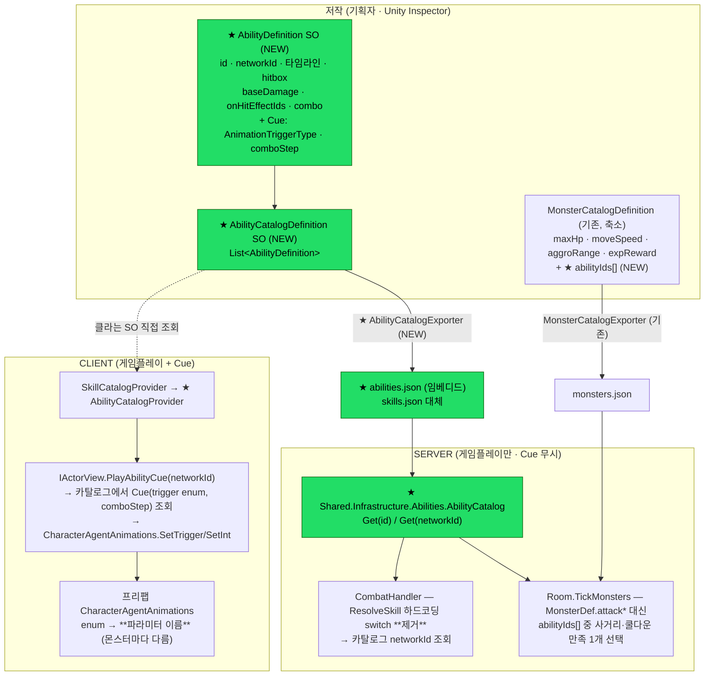
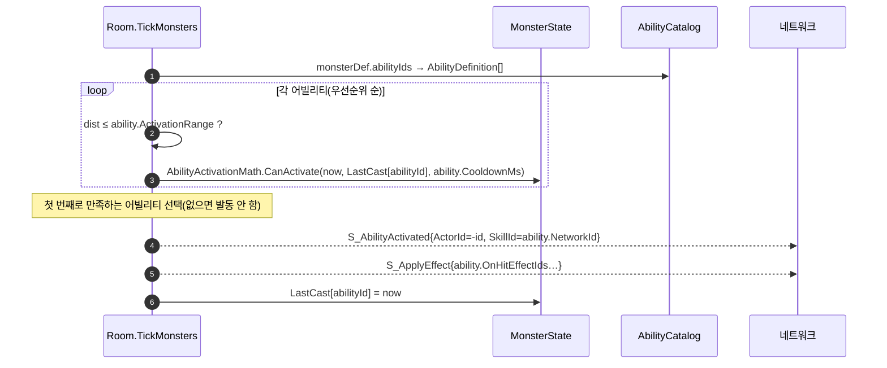

# AC-B: Ability SO 통합 저작 설계

> **목표**: 모든 GAS 공격·스킬(플레이어·몬스터)을 **Ability SO 하나에서 편집**한다 — 게임플레이 수치 + 연출(Cue)까지.
> 부수 효과로 **몬스터 다중 스킬(보스)** 이 열린다.
> 상위 교리 = [gas-architecture.md](gas-architecture.md) §2.5(SO 저작 → bake → 서버 검증) · 통합 파이프 = [actor-combat-architecture.md](actor-combat-architecture.md).
> 진행 = plan.md M5 "AC-B". 작성: 2026-07-16.

---

## 0. 한 줄 요약

**Ability SO = 게임플레이(타임라인·hitbox·수치) + Cue(애니 트리거 *의미*) 단일 저작 → `abilities.json` bake → 서버 검증.**
Cue 는 **의미(enum)만** SO 가 갖고, **Animator 파라미터 이름은 프리팹**(CharacterAgentAnimations)이 갖는다 — 그래야 컨트롤러가 제각각인 몬스터들이 같은 어빌리티를 공유한다.

---

## 1. 진단 — 저작이 3곳으로 분산돼 있다

| 무엇 | 지금 어디서 저작 | 문제 |
|------|-----------------|------|
| 플레이어 스킬 게임플레이 | `SkillDefinition` SO → bake `skills.json` | 연출 없음(주석: *"Cue/VFX/애니는 포함하지 않는다"*) |
| 몬스터 공격 게임플레이 | `MonsterCatalogDefinition.MonsterDefinition` 의 `attackRange`/`attackCooldownMs`/`attackDamage`/`onHitEffectId` | **어빌리티가 1급 개념이 아님** → 몬스터당 공격 1개 고정(보스 불가) |
| 연출(어떤 애니) | 프리팹 `CharacterAgentAnimations` 파라미터명 + **코드 하드코딩** (`RemoteDriver.PlayAbilityCue` 의 `skillId switch { 3=>1, 4=>2, _=>0 }`) | 기획자가 못 만짐. 스킬 추가 시 **코드 수정 필요** |
| int SkillId ↔ 문자열 id | `CombatHandler.ResolveSkill` **하드코딩 switch**(0=basic_swing/1=heavy/2~4=combo) | 스킬 추가 = 서버 코드 수정 |

→ 스킬 하나 추가하려면 **SO + 서버 switch + 클라 combo switch + 프리팹**을 손대야 한다. 이게 AC-B 가 없애려는 것.

---

## 2. 목표 구조



**핵심**: 서버는 `abilities.json` 의 **게임플레이 필드만** 읽고 Cue 필드는 무시한다(gas §2 "서버는 Cue 를 하나도 모른다" 보존).

---

## 3. AbilityDefinition SO 스키마 (제안)

```csharp
// Game.Gameplay.Abilities — SkillDefinition 을 확장·대체
[CreateAssetMenu(menuName = "Game/Ability Definition")]
public sealed class AbilityDefinition : ScriptableObject
{
    // ── 식별 ──
    public string id;              // 공용 키. 예: basic_swing, creepy_demon_attack, boss_slam
    public int networkId;          // S_AbilityActivated.SkillId(int) 에 실리는 안정 ID (패킷 계약 보존)

    // ── 게임플레이 (기존 SkillDefinition 그대로 이관) ──
    public int startupMs, activeMs, recoveryMs, cooldownMs, manaCost;
    public EHitboxShape hitboxShape; public Vector3 hitboxOffset, hitboxHalfExtents;
    public List<string> onHitEffectIds;      // GameplayEffectCatalog 키
    public int comboChainMs, comboWindowMs;

    // ── 게임플레이 (몬스터 공격에서 이관) ──
    public int baseDamage;         // MonsterDefinition.attackDamage 대체(스탯 스케일 전 base)
    public float activationRange;  // MonsterDefinition.attackRange 대체 — AI 가 "쏠 수 있나" 판정

    // ── Cue(연출) — ★ NEW. 클라 전용, 서버는 무시 ──
    public AnimationTriggerType cueTrigger = AnimationTriggerType.Attack; // 의미(enum)
    public int cueComboStep = 0;   // ComboStep int 파라미터 값(콤보 A/B/C). 미사용=0
}
```

### 왜 Cue 를 "enum + comboStep" 으로 두는가 (파라미터 *이름* 이 아니라)

Part A(codemap §2.64)에서 확정된 구조를 그대로 쓴다:

```
AbilityDefinition.cueTrigger = AnimationTriggerType.Attack   ← "공격이다"라는 의미 (어빌리티 소유)
        ↓
CharacterAgentAnimations (프리팹별 직렬화)                    ← 실제 파라미터 이름 (프리팹 소유)
   플레이어 프리팹: Attack → "Attack"
   몬스터 프리팹:   Attack → "Attack" / Dead → "Die"
   (컨트롤러가 제각각이어도 같은 어빌리티를 공유 가능)
```

만약 SO 가 파라미터 **문자열**을 직접 가지면, 컨트롤러 파라미터명이 다른 몬스터마다 어빌리티를 복제해야 한다 → 안 됨.

---

## 4. 핵심 결정

| # | 결정 | 이유 |
|---|------|------|
| ① | **패킷 계약 보존** — `S_AbilityActivated.SkillId(int)` 유지, SO 가 `networkId` 저작 | 문자열 id 로 바꾸면 직렬화 필드 변경(공개계약) + 페이로드 증가. int 유지가 무비용 |
| ② | **`ResolveSkill` 하드코딩 switch 제거** → `AbilityCatalog.Get(networkId)` | 스킬 추가에 서버 코드 수정이 필요 없어짐(= AC-B 의 실질 목표) |
| ③ | **Cue = enum(의미), 파라미터명 = 프리팹** | §3 — 컨트롤러 이질성 흡수 |
| ④ | **몬스터 = `abilityIds[]`** (MonsterDefinition 의 `attack*` 4필드 제거) | 보스 다중 스킬. `maxHp`/`moveSpeed`/`aggroRange`/`expReward` 는 "몬스터가 무엇인가" 라 잔류 |
| ⑤ | **`skills.json` → `abilities.json` 대체**(병행 아님) | 2-소스 유지가 곧 AC-B 가 없애려는 분산. 단 증분에서 임시 병행 후 제거 |
| ⑥ | **`RemoteDriver` 콤보 switch 제거** → 카탈로그의 `cueComboStep` | 기획 데이터로 이동 |

### ✅ 확정 — 데미지 출처 일원화 = **안 B(통합)** (2026-07-16 결정)

현재 **플레이어와 몬스터의 데미지 출처가 다르다**:
- 플레이어: `onHitEffectIds` → `CombatEffectCatalog.Resolve(effectId)` 의 Health 값 → `ScaleDamageByStats(AttackPower)`
- 몬스터: `MonsterDef.AttackDamage` → `StatCombatMath.MeleeDamage(base, 0, Defense)` (effectId 는 사실상 라벨)

**채택: 안 B — 양쪽 다 `ability.baseDamage` 를 base 로 `StatCombatMath.MeleeDamage(baseDamage, attackerAP, targetDefense)`.**
`onHitEffectIds` 는 **태그/CC 전용**(stun/slow 등)으로 역할을 좁힌다 → "데미지는 어빌리티에서만 편집" 이 진짜로 성립.

| 항목 | 처리 |
|------|------|
| `basic_attack_dmg`/`combo_a·b·c_dmg`/`monster_attack_dmg` (Health 감소 effect) | **폐기** — 데미지는 `ability.baseDamage` 로 이관. 이관 시 **현재 실효 데미지와 동일한 값**으로 산정(밸런스 무변경) |
| `CombatEffectCatalog.Resolve` · `CombatHandler.ScaleDamageByStats` | Health 감소 처리 제거 → CC/버프 모디파이어만 통과 |
| `S_ApplyEffect.Amount`(서버 권위 델타) | 그대로 사용 — 서버가 `MeleeDamage` 결과를 실어 보냄(몬스터 경로가 이미 그렇게 동작) |
| 플레이어→몬스터 데미지 | `Room.DamageMonster(mods)` → `ability.baseDamage` 기반 mods 로 대체 |

> **리스크 = 플레이어 밸런스 회귀.** 그래서 **B5 를 독립 증분**으로 두고, 이관 시 각 스킬의 baseDamage 를
> 현재 effect 값과 **동일**하게 넣어 실효 데미지 변화를 0 으로 만든 뒤 테스트로 고정한다.

---

## 5. 몬스터 다중 스킬 — AI 선택



**필요 변경**: `MonsterState.LastAttackAt`(단일 long) → **`Dictionary<string, long> LastCastByAbility`**(어빌리티별 쿨다운). `MonsterAiMath.Step` 의 `stats.AttackRange` 판정도 "가장 긴 ActivationRange" 기준으로 Attack 페이즈 진입 판정.

---

## 6. 서버 영향 (변경 지점)

| 파일 | 변경 |
|------|------|
| `Shared.Infrastructure/Skills/SkillCatalog.cs` | → `Abilities/AbilityCatalog.cs`(abilities.json, `Get(id)`/`Get(networkId)`) |
| `Shared.Infrastructure/Monsters/MonsterCatalog.cs` | `MonsterDef` 에서 `AttackRange/AttackCooldownMs/AttackDamage/OnHitEffectId` 제거 → `AbilityIds` 추가 |
| `CombatHandler.ResolveSkill` | 하드코딩 switch **삭제** → 카탈로그 조회 |
| `Room.TickMonsters` | `stats.Attack*` → 어빌리티 선택 루프(§5) |
| `Server.Monster.MonsterState` | `LastAttackAt` → `LastCastByAbility` |
| `MonsterAiMath.Step` | `stats.AttackRange` → 최대 ActivationRange |

**Shared.Gameplay(순수)**: `SkillTimeline` 은 그대로 재사용(어빌리티의 게임플레이 부분). `AbilityActivationMath` 무변경.

---

## 7. 증분 계획 (TDD — 각 단계 그린 후 다음)

| # | 증분 | 검증 |
|---|------|------|
| B1 | ✅ **완료(2026-07-16)** — SO 2종 + Exporter + 서버 `AbilityCatalog` + **5스킬 데이터 이관·bake**(읽기만, 아무도 미사용) | `AbilityCatalogTests` 7 · SocketServer.Tests 141/141 · Unity 0오류 |
| B2 | ✅ **완료(2026-07-16)** — `ResolveSkill` 하드코딩 switch **제거** → `AbilityCatalog.Get(networkId)`. `skills.json`·`Skills/SkillCatalog.cs`·`SkillCatalogExporter` **삭제**. **동작 무변경**(데미지 경로는 B5 까지 onHit 유지) | SocketServer.Tests 137/137 · **Docker E2E 31/31**(양 서버 리빌드) |
| B3 | ✅ **완료(2026-07-16)** — `AbilityCatalogProvider` 신설 → **클라도 Ability 카탈로그 단일 소스**. `IActorView.PlayAbilityCue(trigger, comboStep)`(라우터가 해석) → `RemoteDriver` 콤보 switch **제거**. `LocalCombat`/`PlayerCharacterAgent` 의 `SkillName` 하드코딩 매핑 **제거**. Skill 계열(SO·Provider·assets·Exporter) **전량 삭제** | EditMode 170/170 · PlayMode 애니 6/6(콤보 회귀) · Docker E2E 31/31 |
| B4 | ✅ **완료(2026-07-16)** — `MonsterDefinition.abilityIds[]` + `MonsterDef`/`MonsterStats` 축소(AttackRange=어빌리티 최대 사거리 **파생**) + `Room.SelectMonsterAbility` 선택 루프 + `MonsterState.GetLastCast/MarkCast`(어빌리티별 쿨다운) + 몬스터 9종 어빌리티 SO(networkId 100+) | `MonsterAbilitySelectionTests` 5 신규 · SocketServer.Tests 145/145 · Docker E2E 31/31 |
| B5 | ✅ **완료(2026-07-16)** — 데미지 출처 = `ability.BaseDamage` **단일**(플레이어·몬스터). `*_dmg` effect 5종 **폐기** → 데미지 라벨 `ability_damage` 하나(수치는 서버 `Amount`). `ScaleDamageByStats`(effect 경로) → `BuildDamageMods(ability, ap, def)`. onHit = **CC 전용** | SocketServer.Tests 146/146 · Shared 50/50 · EditMode 170/170 · Docker E2E 31/31 |
| B6 | ✅ **완료(2026-07-16)** — `leviathan` = `[leviathan_slam(강·cd6000·range3.5·dmg90·stun), leviathan_attack(평타)]`. **코드 변경 0, 데이터 저작만으로** 강스킬→쿨다운이면 평타 폴백 동작 | `BossMultiAbilityTests` 8 · SocketServer.Tests 154/154 · Docker E2E 31/31 |

- **B1~B2 만으로** "스킬 추가에 서버 코드 수정 불필요" 달성(가장 큰 가치).
- **B4 부터** 몬스터 다중 스킬이 열린다.
- 각 증분에서 소켓/연결 소스 변경 시 대응 테스트 동반(테스트 규칙 §연결 커버리지).

> ## ✅ AC-B 완료 (B1~B6, 2026-07-16)
>
> **달성**: 모든 GAS 공격·스킬(플레이어 5 + 몬스터 10)이 **Ability SO 한 곳에서 편집**된다.
> - int→스킬 **하드코딩 매핑이 클라·서버 어디에도 없다**(`ResolveSkill` switch·`SkillName` switch·`RemoteDriver` 콤보 switch 전부 제거 → `networkId` 데이터 조회).
> - **데미지 수치는 `ability.BaseDamage` 단일 출처**(`*_dmg` effect 5종 폐기 → `ability_damage` 라벨 + 서버 권위 Amount). effect 는 **CC/태그 전용**.
> - **연출(Cue)도 SO 저작**(`cueTrigger`/`cueComboStep`) — 단, 파라미터 *이름* 은 프리팹(컨트롤러 이질성 흡수).
> - **보스 다중 스킬** = `abilityIds` 에 2개 넣기만 하면 동작(코드 변경 0).
>
> **스킬 추가 절차(최종)**: `Ability_*.asset` 저작 → `Tools/Ability/Export` → 서버 재빌드. **코드 수정 없음.**
>
> ### 남은 확장점 (별도 트랙)
> - **어빌리티별 전용 애니**: 현재 `AnimationTriggerType` enum 에 Attack/Dodge/Dead… 만 있어 보스 강스킬도 `Attack` 트리거를 공유한다.
>   전용 모션을 주려면 enum 값 + `CharacterAgentAnimations` 파라미터 필드 + 컨트롤러 상태를 추가해야 한다(leviathan FBX 엔 AttackSpecial/AttackHard/Roar 클립이 이미 있음).
> - **플레이어→플레이어 데미지**: 기존대로 플랫(AP·Defense 미반영). 스탯 스케일 전환은 밸런스 결정 필요.
> - VFX/SFX Cue · `S_ApplyEffect` 문자열 abilityId · 플레이어 스킬바 — §8 그대로 YAGNI.

---

## 8. 안 하는 것 (YAGNI 경계)

- **VFX/SFX Cue** — `cueTrigger`(애니)까지만. VFX 는 Cue SO 확장점(gas §2 ③ CueCatalog)으로 후속.
- **AbilityCueTrack(ms 타임라인 큐)** — gas §2 ①의 (ms, Cue) 트랙은 지금 불요. 단일 트리거로 충분.
- **패킷 문자열 abilityId** — networkId(int)로 계약 보존(§4 ①).
- **플레이어 다중 스킬바/스킬트리** — 데이터 구조는 열리지만 UI·입력은 별개 트랙.
- **서버 ASC** — gas 문제②⑥ 그대로 범위 밖.

---

## 9. 리스크

| 리스크 | 완화 |
|--------|------|
| 잘 도는 플레이어 전투(콤보·쿨다운) 회귀 | B2/B3 를 분리하고 각각 E2E+PlayMode 콤보 테스트로 고정. 콤보 타이밍 값은 그대로 이관(수치 변경 금지) |
| `skills.json`→`abilities.json` 전환 중 서버/클라 불일치 | B1 은 **읽기만**(미사용) → B2 에서 원자적 전환 + Docker 리빌드 |
| 몬스터 데이터 축소(`MonsterDef.attack*` 제거)가 기존 monsters.json 과 불일치 | B4 에서 SO→bake 재실행 필수. 파싱 폴백(누락 시 기본 어빌리티) 제공 |
| 데미지 일원화(안 B)의 밸런스 변화 | B5 를 독립 증분으로 + 이관 시 현재 실효 데미지와 동일하도록 baseDamage 산정 |
