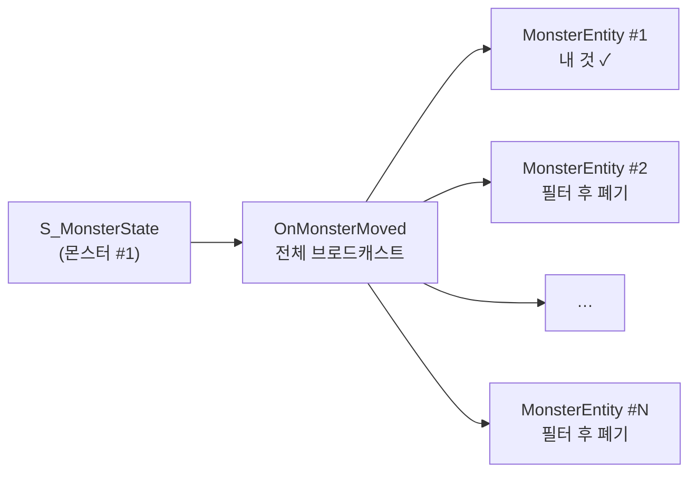
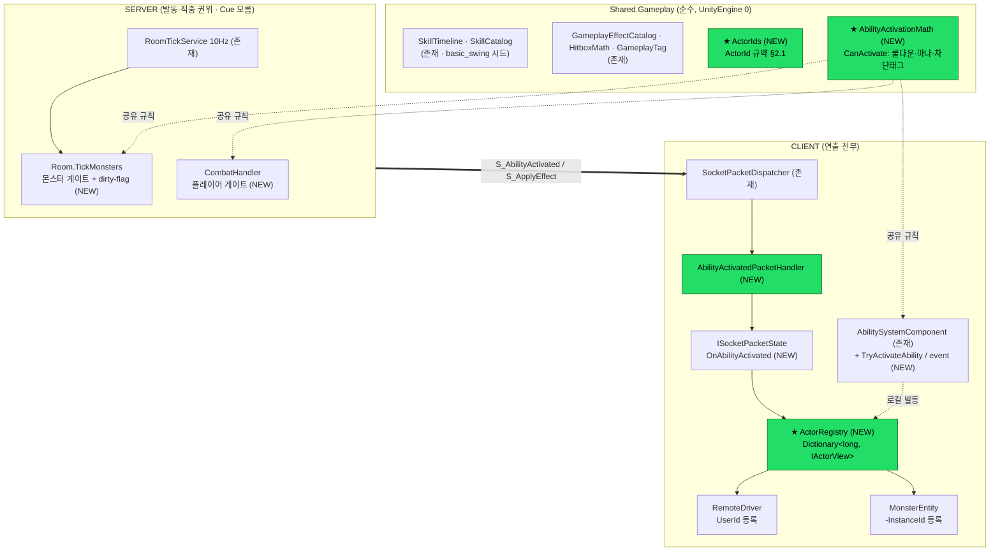
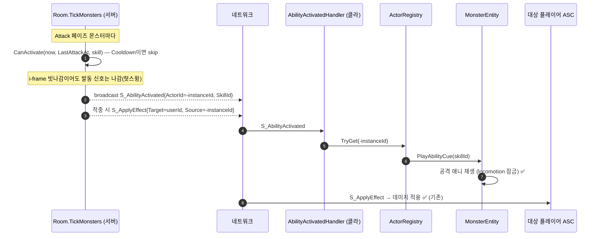
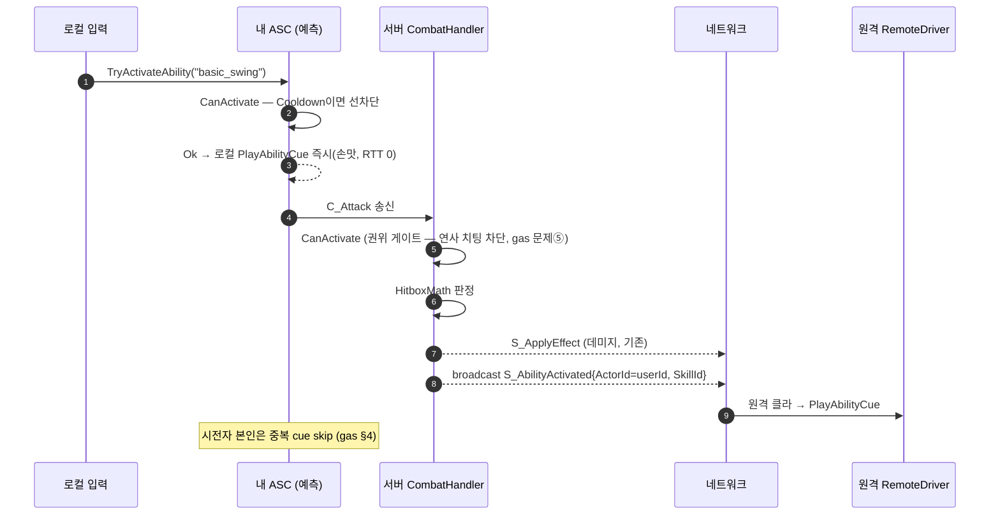
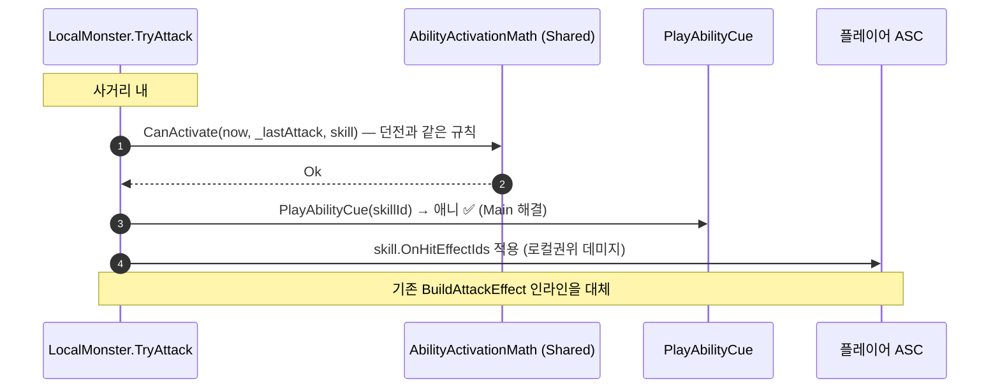
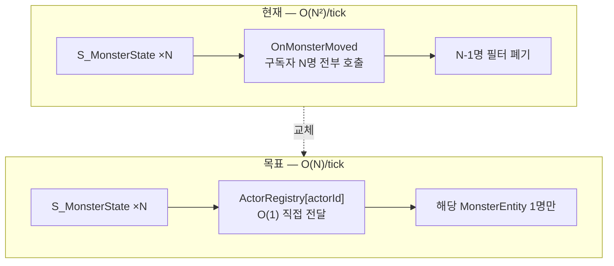
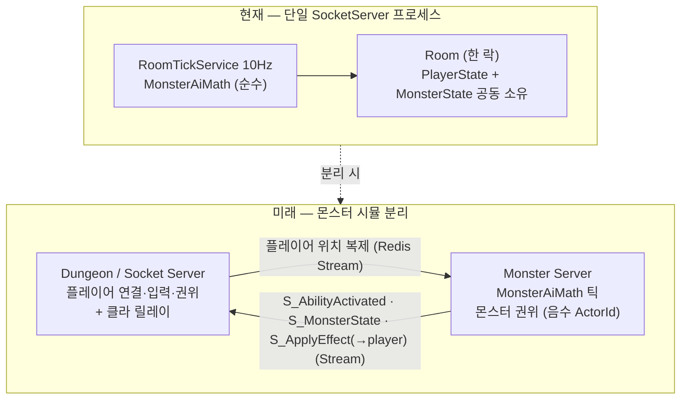

# Actor 통합 전투 아키텍처 (GAS 기반 Server/Client 설계)

> **목표**: 플레이어·몬스터를 전투 상호작용 관점에서 **하나의 Actor 모델**로 통합하고,
> 몬스터가 수백 마리로 늘어나도 클라 라우팅·서버 틱·패킷량이 안정적으로 버티는 구조를 만든다.
> 상위 교리 = [gas-architecture.md](gas-architecture.md) (Shared=게임플레이 단일소스 / Client=연출 전부 / Server=발동·적중 권위).
> 작성: 2026-07-16 (몬스터 공격 모션 부재 진단에서 출발한 설계 합의).

---

## 0. 한 줄 요약

**전투 상호작용(발동·적중·효과)은 ActorId 하나로 통합, 생명주기(스폰·상태·사망)는 종족별 유지.**
클라 라우팅은 "브로드캐스트+각자 필터"를 **ActorRegistry O(1) 조회**로 교체해 N² 병목을 제거한다.

---

## 1. 진단 — 현재 구조의 분리와 병목

### 1.1 종족별 분리 현황 (모든 층이 갈라져 있음)

| 층 | 플레이어 | 몬스터 | 통합 여부 |
|----|---------|--------|-----------|
| ID | `UserId` (long, 계정 영속) | `InstanceId` (int, 방 임시) | ❌ |
| 서버 상태 | `PlayerState` | `MonsterState` | ❌ (유지 — 권위 모델이 다름) |
| 클라 ASC | `AbilitySystemComponent` 보유 | 없음 (plain int HP) | ❌ |
| 발동 트리거 | `S_Attack{AttackerId}` → 원격 스윙 재생 | **없음 → 공격 모션 미표시(버그)** | ❌ |
| 데미지 | `S_ApplyEffect{TargetId, SourceId}` | 동일 패킷 (단 `SourceId=0` 뭉뚱그림) | ⭕ 절반 |
| 클라 드라이버 | `RemoteDriver` | `MonsterEntity` | ❌ (유지 — 보간은 동일하나 수명 다름) |

**결론**: 데미지 층은 이미 generic long ID로 통합돼 있다. 진짜 빠진 것은
① **발동(스윙) 신호의 통합 경로** ② **몬스터를 지칭할 ActorId 규약** ③ **클라의 ID→액터 조회 인프라**.

### 1.2 스케일 병목 — 클라 이벤트 라우팅이 O(N²)

현재 `SocketApiClient`(ISocketPacketState)는 **이벤트를 전체 브로드캐스트**하고 각 엔티티가 자기 것인지 필터한다:



- 서버는 10Hz로 몬스터마다 `S_MonsterState`를 보낸다 → 틱당 N패킷.
- 패킷 하나가 N개 구독자를 전부 깨움 → **틱당 N² 핸들러 호출**.
- N=10이면 1,000회/초(무시 가능) → **N=200이면 400,000회/초** (프레임 드랍 실화).
- `RemoteDriver`(플레이어)도 같은 패턴이지만 플레이어는 소수라 문제가 안 됐을 뿐.

→ **ActorRegistry(Dictionary 조회)로 라우팅하면 틱당 N회로 떨어진다.** Actor 통합이 곧 스케일 해법.

### 1.3 서버 병목 — per-monster per-tick 무조건 브로드캐스트

`Room.TickMonsters`는 몬스터마다 매 틱 `S_MonsterState`를 만든다(변화 없어도).
플레이어 M명 방에 몬스터 N마리 = **10Hz × N × M 패킷 송신**. Idle 경비 몬스터도 계속 쏜다.
→ dirty-flag(변화분만 송신)로 patrol 없는 Idle 몬스터의 트래픽을 0으로 만들 수 있다(§5.2).

---

## 2. Actor 모델 — ActorId 규약

### 2.1 단일 ID 공간 (부호로 종족 구분)

```
ActorId (long)
  > 0  : 플레이어 (= UserId 그대로, DB identity라 항상 양수)
  < 0  : 몬스터   (= -InstanceId, 방 내 유일)
  = 0  : 환경/시스템 (기존 S_ApplyEffect SourceId=0 의미 보존)
```

- **왜 부호인가**: 패킷 필드 추가 없이(공개계약 최소 변경) 기존 `long` 필드에 그대로 실린다.
  `S_ApplyEffect.SourceId`/`TargetId`, `S_Attack.AttackerId`가 이미 long — 규약만 정하면 즉시 수용.
- 변환 헬퍼는 Shared 한 곳에만 둔다 (`ActorIds.FromMonster(int) / IsMonster(long) / ToMonsterInstanceId(long)`).
  클라·서버가 각자 `-x` 손계산하는 것 금지 — 규약 이중정의 방지.

### 2.2 통합 범위 결정 (무엇을 합치고 무엇을 남기나)

| 통합한다 (ActorId 파이프) | 남긴다 (종족별 유지) | 이유 |
|--------------------------|---------------------|------|
| 어빌리티 발동 신호 (`S_AbilityActivated`) | 스폰 (`S_PlayerJoined` / `S_SpawnMonster`) | 스폰 페이로드가 본질적으로 다름(장비·닉네임 vs monsterId·HP) |
| 효과 적용 (`S_ApplyEffect` — 기존) | 상태 스트림 (`S_Move` / `S_MonsterState`) | 이동 권위 모델이 다름(클라 릴레이 vs 서버 시뮬) |
| 클라 액터 조회 (`ActorRegistry`) | 사망 (`S_PlayerDead` / `S_MonsterDead`) | 플레이어=다운·부활 / 몬스터=제거·드랍, 후속 흐름이 전혀 다름 |
| 발동 게이트 규칙 (`AbilityActivationMath`) | 서버 상태 (`PlayerState` / `MonsterState`) | 서버는 ASC 불가(헤드리스) — gas 문제②⑥, 별도 트랙 |

> 완전 Actor 통합(스폰·상태·사망까지 단일 패킷)을 **안 하는 이유**: 서버가 ASC를 못 쓰는 한
> "통합"은 반쪽이고, 재접속·루트·HP권위 전부 갈아엎는 대공사 대비 이득이 없다 (원칙1 YAGNI).

### 2.3 플레이어도 Actor다 — 통합 매핑 (비대칭 아님)

이 문서는 몬스터 공격 버그에서 출발해 몬스터 중심으로 읽히지만, **플레이어는 몬스터와 동등한 1급 Actor**다.
증분 5 이후 플레이어 전용 전투 경로는 없어지고 한 파이프로 합쳐진다.

| 축 | 플레이어 | 몬스터 | 통합 상태 |
|----|---------|--------|-----------|
| **ActorId** | UserId (양수) | −InstanceId (음수) | ✅ 같은 ID 공간 |
| **클라 조회** | `RemoteDriver` + 로컬 `PlayerCharacterAgent` 가 Registry 등록 | `MonsterEntity` 등록 | ✅ 같은 `ActorRegistry` |
| **`IActorView`** | RemoteDriver·PlayerCharacterAgent 구현 | MonsterEntity 구현 | ✅ 같은 `PlayAbilityCue` |
| **공격 발동** | `S_AbilityActivated{ActorId=userId}` (증분5) | `S_AbilityActivated{ActorId=-id}` (증분3) | ✅ 같은 패킷·핸들러 |
| **발동 게이트** | `CombatHandler` → CanActivate | `Room.TickMonsters` → CanActivate | ✅ 같은 Shared 규칙 |
| **데미지** | `S_ApplyEffect{Target,Source=ActorId}` | 동일 | ✅ 기존 통합 |
| **회피(Dodge)** | `S_Dodge` → SetTrigger (별도 패킷) | 없음 | 🔜 어빌리티化 후보 — 같은 파이프로 흡수 가능(확장점) |
| **사망/부활** | `S_PlayerDead`/`S_PlayerRevived` | `S_MonsterDead`(제거·드랍) | ⛔ 생명주기 축 — §2.2 규칙대로 종족별 유지 |

- **회피**: 지금은 전용 패킷이지만 발동 축이라 나중에 `S_AbilityActivated{SkillId=dodge}` 로 흡수 가능 —
  통합 파이프의 **확장 이득**(투사체·스킬과 동일). 지금은 범위 밖(YAGNI), 흡수 시 증분 5의 자연 확장.
- **사망/부활**: 발동이 아니라 생명주기(플레이어=다운·부활 / 몬스터=제거·드랍)라 §2.2 대로 **의도적으로 분리 유지**.
  통합 대상 아님 — 억지로 합치면 gas §7 사망 흐름과 충돌.

> 요약: **전투 발동·적중·연출·조회 = 플레이어·몬스터 완전 동일 파이프.** 회피는 흡수 후보, 사망은 축이 달라 별개.

### 2.4 Actor 통합 전역 지도 — 할 수 있는 것 / 없는 것 (canonical)

> "어디까지 Actor로 합치고 어디부터 못/안 합치나"의 **단일 기준표**. 새 상호작용(스킬·투사체·NPC 등)이
> 생길 때 이 축 분류에 넣으면 통합 여부가 자동 결정된다. 헷갈리면 여기부터 본다.

**6개 축과 통합 규칙:**

| 축 | 무엇 | 통합? | 근거 |
|----|------|-------|------|
| ① 식별·라우팅 | ActorId + ActorRegistry | ✅ **전부(예외 없음)** | 모든 액터를 long ID로 지칭·O(1) 조회. 종족·서버 무관 |
| ② 발동(Activation) | "액터가 능동적으로 스킬/액션을 씀" | ✅ **가능한 건 전부** | `S_AbilityActivated` 한 패킷. 공격·회피·스킬·투사체·캐스트 |
| ③ 상태·효과(Tag/Effect) | 버프·디버프·CC·무적·데미지·State.Dead | ✅ **클라 한정 통합** | 클라 ASC 공용. **서버는 ASC 불가 → 규칙(Shared math)만 공유** |
| ④ 연출(Cue) | 화면에 보이는 반응(스윙·피격·사망·부활·회피 애니) | ✅ **가장 넓게 통합** | `IActorView.Play*Cue` 한 창구. 트리거가 뭐든 독립 재생 |
| ⑤ 생명주기(Lifecycle) | 존재의 시작·끝(스폰·퇴장·사망후속·재접속) | ❌ **의도적 별개** | 페이로드·후속 흐름이 본질적으로 다름(§2.2·§9) |
| ⑥ 이동(Locomotion) | 위치·회전 스트림 | ⚠️ **라우팅만 통합** | ID는 통합, 스트림은 별개(클라권위 C_Move vs 서버시뮬 S_MonsterState) |

**상호작용 전수 배치 (모든 액터 동작을 위 축에 매핑):**

| 상호작용 | 축 | 통합 상태 | 비고 |
|---------|----|-----------|------|
| 근접 공격 | ② 발동 | ✅ 통합 (증분3·5) | `S_AbilityActivated` |
| 원거리·투사체·스킬 | ② 발동 | 🔜 통합 가능(미래) | 같은 패킷, 증분5 확장 — 지금 콘텐츠 없음(YAGNI) |
| 회피(Dodge) | ② 발동 | 🔜 통합 가능 | `S_AbilityActivated{dodge}` — 지금은 전용 `S_Dodge` |
| 데미지·힐 | ③ 상태(Instant) | ✅ 통합 | `S_ApplyEffect{Target,Source=ActorId}` 이미 |
| 버프·디버프·CC·무적 | ③ 상태(Duration+태그) | ✅ 통합(클라 ASC) | 서버는 Shared math 인라인 |
| 사망 표현 `State.Dead` | ③ 상태(태그) | ✅ **상태층 통합** | 태그는 ASC. **트리거는 ②발동 아님(⑤ 생명주기)** |
| 스윙·피격·사망·부활·회피 애니 | ④ 연출 | ✅ 통합 가능 | `IActorView` — 트리거와 독립 |
| 스폰 | ⑤ 생명주기 | ❌ 별개 | `S_PlayerJoined`(장비·닉네임) vs `S_SpawnMonster`(monsterId·HP) |
| 퇴장·제거 | ⑤ 생명주기 | ❌ 별개 | `S_PlayerLeft` vs `S_MonsterDead` |
| 사망 **후속** | ⑤ 생명주기 | ❌ 별개 | 플레이어=다운·부활 / 몬스터=제거·드랍 — 흐름 상이 |
| 재접속·크래시 유예 | ⑤ 생명주기 | ❌ 별개(플레이어만) | 몬스터엔 개념 자체가 없음 |
| 이동·회전 | ⑥ 이동 | ⚠️ 라우팅만 | 스트림 권위 모델이 다름(§4.4 는 라우팅 최적화) |
| HP 보관 | ③ 상태 | ⚠️ 플레이어=ASC / 몬스터=int | 몬스터 HP를 클라 ASC화하면 **서버 권위 깨짐** → 안 함(YAGNI) |
| 서버측 상태 엔진 | ③ 상태 | ❌ 서버 ASC 불가 | gas 문제②⑥ — 서버는 math만, ASC는 클라 전용 |

**한 줄 판별식**: 새 동작이 오면 —
`능동 발동인가? → ②(통합)` · `붙는 상태인가? → ③(클라 통합/서버는 규칙만)` · `보이는 반응인가? → ④(통합)`
· `존재의 시작·끝인가? → ⑤(별개)` · `위치 스트림인가? → ⑥(라우팅만)`.

**"할 수 있는데 안 하는" vs "구조상 못 하는" 구분 (혼동 방지):**
- 🔜 *할 수 있는데 지금 안 함*(YAGNI): 회피 어빌리티化, 투사체·스킬, 사망/부활 애니의 IActorView 흡수 → **나중에 통합**.
- ❌ *구조상 못/안 함*(영구): 발동 파이프에 사망을 넣기(축이 다름), 몬스터 HP를 클라 ASC 권위화(서버권위 붕괴),
  서버에서 ASC 돌리기(헤드리스 불가), 스폰/생명주기 단일화(§9 서버 분리 가능성까지 해침) → **통합 대상 아님**.

---

## 3. 컴포넌트 배치도 (누가 누구를 아는가)



의존 방향: `Gameplay(ActorRegistry) → Network(ISocketPacketState) → Shared`. 역참조 없음.
서버는 Cue·애니 문자열을 하나도 모른다(gas §2 원칙 보존).
Main(싱글)은 서버 박스 없이 CLIENT 만으로 동작 — `LocalMonster → ASC.TryActivateAbility` 로 동일 파이프.

---

## 4. 시나리오별 흐름

### 4.1 몬스터 공격 (던전, 서버 권위) — 지금 빠진 경로



### 4.2 플레이어 공격 (던전, 서버 권위) — 기존 경로를 같은 파이프로 흡수



이행기: 기존 `S_Attack`(1601) 은 `S_AbilityActivated` 안착 후 제거(마이그레이션 §6-5 에서 일괄).

### 4.3 몬스터 공격 (Main, 클라 로컬 권위) — 인라인 코드의 어빌리티 승격



Main 몬스터에 ASC를 붙이는 것(HP attribute화)은 **안 한다** — 지금 plain int HP로 충분(YAGNI).
단 발동 *규칙*과 *데이터*(SkillTimeline·EffectCatalog)는 던전과 완전히 같은 것을 쓴다.

### 4.4 대량 몬스터 상태 갱신 (스케일 경로)



`ISocketPacketState` 의 per-종족 이벤트(OnMonsterMoved 등)는 등록/해제 통지용으로 유지하되,
**고빈도 스트림(이동·발동)은 Registry 직접 라우팅**으로 옮긴다. 저빈도(스폰·사망·클리어)는 이벤트 유지.

> **증분7 재판정(코드 분석 후, 2026-07-16) — 이 클라 라우팅화는 보류(YAGNI).** 서버 dirty-flag(§5.2, ✅구현)가
> 이동 이벤트 수 자체를 줄이고, `OnMonsterMoved` fan-out의 비용은 몬스터당 **`InstanceId` int 비교 + early-return**
> (마이크로초)이다. 대량 몬스터의 실제 지배 비용은 **엔티티마다 매 프레임 도는 `MonsterEntity.Update()` 보간·렌더**로,
> Registry 라우팅으로 줄지 않는다. 즉 여기 O(N²)는 병목이 아니다. → **확장점만 남기고 지금은 안 만든다**:
> 프로파일러가 fan-out(전부 이동하는 대규모 스웜)을 병목으로 지목하면, `MonsterSpawner._monsters` 딕셔너리로
> 단일 구독자 dispatch(엔티티 self-구독 제거)로 전환한다 — IActorView 변경 없이 가능.

---

## 5. Dispatcher — 현황 판정과 확장 지점

### 5.1 패킷 Dispatcher (양측) — 그대로 둔다

| | 클라 `SocketPacketDispatcher` | 서버 `PacketDispatcher` |
|--|--|--|
| 방식 | `Dictionary<Type, IPacketHandler>` DI 수집 | `Dictionary<Type, PacketHandler>` + attribute 등록 |
| 복잡도 | O(1)/패킷 | O(1)/패킷 |
| 판정 | **병목 아님 — 변경 불필요** | **병목 아님 — 변경 불필요** |

패킷 수(초당 수천)에 Dictionary 조회는 무의미한 비용. 문제는 디스패처가 아니라
**디스패치 이후의 fan-out**(§1.2)이다. 새 패킷 2종은 기존 등록 패턴 그대로 추가만 한다.

### 5.2 서버 틱 송신 — dirty-flag (변화분만) ✅ 증분7 구현

```
Room.TickMonsters:
  변경 전:  모든 몬스터 → 매 틱 S_MonsterState 생성
  변경 후:  MonsterState.StateDirty()=위치/회전/HP/페이즈가 직전 송신(MarkStateSent)과 같으면 skip
            (Idle 경비 몬스터 = 트래픽 0. Chase/Patrol 은 어차피 매 틱 변함 = 기존과 동일)
  주의:     · 신규 입장자는 S_SpawnMonster 로스터로 최신 상태를 받으므로 유실 없음(기존 흐름 보존).
            · CombatHandler 데미지 S_MonsterState 송신도 MarkStateSent 호출(틱 중복 재송신 방지).
  구현:     MonsterState._sent* + StateDirty()/MarkStateSent(). 테스트 MonsterTickDirtyStateTests(idle 생략/chase 매틱).
```
배칭(`S_MonsterStateBatch` — 한 틱의 전체 변화를 패킷 1개로)은 **확장점으로만 명시**하고 지금은 안 만든다
— dirty-flag 만으로 idle 다수 시나리오가 해결되고, 배칭은 공개계약 변경이라 별도 합의 필요.

### 5.3 클라 ActorRegistry — 신설 (방 스코프)

```csharp
// Game.Gameplay — DungeonLifetimeScope 등록 (방 수명), Main 은 별도 인스턴스
public sealed class ActorRegistry
{
    private readonly Dictionary<long, IActorView> _actors = new();
    public void Register(long actorId, IActorView view);
    public void Unregister(long actorId);
    public bool TryGet(long actorId, out IActorView view);
}

public interface IActorView            // RemoteDriver·MonsterEntity·LocalMonster 구현
{
    void PlayAbilityCue(int skillId);      // 지금은 애니 트리거만. VFX/SFX 는 이 뒤에 plug-in (확장점)
}
```

> **구현 노트(2026-07-16)**: Cue 재생은 **Animator 파라미터**로 한다 — `CharacterAgentAnimations`(파라미터명이 프리팹에 직렬화)
> 경유로 이동=`SetFloat(Speed)` · 공격=`SetTrigger(Attack)` · 사망=`SetTrigger(Dead)`. 플레이어·몬스터 **동일 방식**.
> ※ 초기엔 몬스터만 상태이름 `CrossFade` 로 구동했는데, 컨트롤러의 `Walk→Idle[Speed<0.1]` 전이와 충돌해
> **Walk 가 즉시 튕기는 버그**가 있었다(Speed 미세팅). 파라미터 구동으로 통일해 해소 — codemap §2.64.
- 등록 시점 = 스포너(`CharacterSpawner`/`MonsterSpawner`)의 스폰/디스폰 — 이미 양쪽 다 Dictionary 를
  들고 있으므로 등록 한 줄씩 추가. **새 생명주기 관리 코드 없음.**
- `IActorView` 는 asmdef 경계(Interface 도입 기준 충족: 구현체 3개 + 소비자 레이어 분리).

---

## 6. 마이그레이션 증분 (TDD — 각 단계 그린 후 다음)

| # | 증분 | 검증 |
|---|------|------|
| 1 | ✅ **완료** — Shared `ActorIds` + `AbilityActivationMath`(원시 파라미터 게이트) + 단위테스트 | `Shared.Gameplay.Tests` 50/50 그린 (신규 10) |
| 2 | ✅ **완료** — 패킷 `S_AbilityActivated`(Union **1604**){ActorId, SkillId} + ClientCodegen 미러 재생성 | `SocketServer.Tests` 직렬화 3/3, Unity 컴파일 0오류 |
| 3 | ✅ **완료** — `Room.TickMonsters` → `AbilityActivationMath`(MonsterDef.AttackCooldownMs) 게이트 + `S_AbilityActivated`(ActorId=−instanceId) broadcast + `SourceId=−instanceId` 승격 | `MonsterAttackTests` +2(발동신호·헛스윙), SocketServer.Tests 132/132 |
| 4 | ✅ **완료(몬스터 공격 모션 해소)** — `ActorRegistry`+`IActorView`+`AbilityCueRouter`+`AbilityActivatedPacketHandler`+`MonsterEntity.PlayAbilityCue`(attackState CrossFade+lock)+스포너 등록+8프리팹 attackState="Attack" | EditMode 172/172(라우팅 6) · PlayMode `MonsterEntityAnimTests`(Attack 전이) · Docker E2E 31/31(S_AbilityActivated 수신 신규) |
| 5 | ✅ **완료** — `CombatHandler` `S_Attack`→`S_AbilityActivated{ActorId=UserId}` 전환 + `RemoteDriver` IActorView(PlayAbilityCue) + `CharacterSpawner` 레지스트리 등록. ※발동 게이트는 이미 존재(PlayerState 콤보/쿨다운)라 유지 · S_Attack(1601) 타입은 보존(orphaned, 삭제는 후속 승인) | Docker E2E 31/31(플레이어 S_AbilityActivated) · PlayMode 콤보 4/4 · EditMode 172/172 |
| 6 | ✅ **완료(Main 몬스터 공격 모션 해소)** — `LocalMonster` 인라인 쿨다운→`AbilityActivationMath` 게이트 + `IActorView.PlayAbilityCue`(attackState CrossFade+lock, 헛스윙 포함) + CreepyDemonLocal prefab attackState="Attack" | PlayMode `LocalMonsterAnimTests`(Attack 전이) · EditMode 172/172 |
| 7 | ✅ **완료** — 서버 dirty-flag(§5.2, `MonsterState.StateDirty`/`MarkStateSent`): Idle 몬스터 S_MonsterState 트래픽 0. ※클라 이동 라우팅 Registry화(§4.4)는 **보류(YAGNI)** — fan-out은 병목 아님(int 비교), 실비용은 엔티티 Update. 확장점만 | `MonsterTickDirtyStateTests` 2 · SocketServer.Tests 134/134 · Docker E2E 31/31 |

- 1~4 만으로 **몬스터 공격 모션 버그가 해소**된다(최소 가치 선행).
- 5 는 공개계약(1601 제거) 변경 — 단계 진입 전 재확인.
- 연결 소스 변경이므로 각 단계에서 소켓 테스트 동반 갱신(테스트 규칙 §연결 커버리지) 필수.

> **증분 1 확정 개선(코드 확인 후, 2026-07-16)**: 계획의 "몬스터 스킬 시드"는 **철회**한다.
> 몬스터 공격 데이터(cooldown/range/damage/onHit)는 이미 `Shared.Infrastructure.Monsters.MonsterCatalog`
> (monsters.json) 단일소스에 존재하므로, 별도 SkillTimeline 을 시드하면 중복이다. 대신
> `AbilityActivationMath` 를 **원시 파라미터 게이트**로 만들어 플레이어는 `SkillTimeline`(CooldownMs/ManaCost),
> 몬스터는 `MonsterDef.AttackCooldownMs` 에서 값을 먹인다 — 규칙은 하나, 데이터 출처만 각자. (원칙1 중복 제거)
> · 신규 파일: [ActorIds.cs](../../ServerAll/Shared/Shared.Gameplay/Actors/ActorIds.cs) ·
>   [AbilityActivationMath.cs](../../ServerAll/Shared/Shared.Gameplay/Abilities/AbilityActivationMath.cs)

---

## 7. 안 하는 것 (YAGNI 경계)

- **완전 Actor 통합**(스폰·상태·사망 단일 패킷, 몬스터 ASC) — 서버 ASC 불가인 동안 반쪽. 별도 트랙.
- **S_MonsterStateBatch 배칭** — dirty-flag 로 충분해질 때까지 확장점만.
- **VFX/SFX Cue SO 3종**(gas §2 ①②③) — `PlayAbilityCue` 진입점만 만들고 애니부터. SO 는 후속.
- **active-window 정밀 시뮬 / 이동 sanity 검증** — gas §9 그대로 범위 밖.
- **관심영역(AOI) 필터링**(멀리 있는 몬스터 미송신) — 방 하나가 좁은 현 던전엔 불요. 오픈월드(4.6)에서.

---

## 8. 왜 이 구조인가 (대안 대비)

- **vs 종족별 병렬 패킷(`S_MonsterAttack` 추가)**: 발동 신호가 "액터가 스킬을 썼다" 하나로 충분한데
  패킷·핸들러·이벤트를 종족마다 복제하게 됨. 투사체·보스·NPC 가 늘 때마다 또 복제 → ActorId 통합이 증분비용 0.
- **vs 완전 통합**: §2.2 표 — 생명주기는 진짜 다르고 서버 ASC 제약이 풀리기 전엔 이득 없음.
- **변경 규모**: Shared 순수 2파일 + 패킷 1종 + 클라 Registry/인터페이스 1쌍 + 기존 4파일 수정.
  기존 Dispatcher·ISocketPacketState·스포너 골격은 그대로 재사용 — 신규 레이어는 ActorRegistry 하나뿐.

---

## 9. 서버 토폴로지 진화 — 미래 분리 대비 (Monster Server 등)

> Q. "몬스터가 폭발적으로 나오는 던전이 생기면 SocketServer 에서 몬스터 시뮬을 떼어
> 전용 Monster Server 로 분리할 수 있나? 이 설계가 그걸 막지 않나?"
> **A. 막지 않는다. 오히려 분리에 필요한 seam 을 이 설계가 이미 만든다.** 단 분리의 고유 비용은 남는다.

### 9.1 현재 vs 분리 시



**클라는 무변경.** DS 가 몬스터 이벤트를 릴레이하므로 클라는 소켓 하나만 본다 —
이미 GameServer→SocketServer→클라 릴레이 패턴과 동일. `ActorRegistry` 는 이벤트 출처를 모른다.

### 9.2 이 설계가 분리를 돕는 지점 (seam 4개)

| seam | 설계 결정 | 왜 분리에 유리한가 |
|------|-----------|--------------------|
| **위치 투명 ID** | `ActorId` = 순수 identity, 서버 소유 미인코딩 | 몬스터가 다른 프로세스에서 시뮬돼도 클라 라우팅 불변. **부호로 권위 서버 자명**(음수=Monster Server) |
| **relocatable 순수 로직** | `MonsterAiMath`·`AbilityActivationMath`·`HitboxMath` = 무상태 순수함수 | 틱 루프를 다른 프로세스로 옮기는 건 **호스팅 변경**이지 로직 재작성이 아님 |
| **메시지 경계** | 전투가 in-process 호출이 아니라 패킷(`S_AbilityActivated`/`S_ApplyEffect`) | 분리는 메시지 경계에서 일어남. 직접 RPC 금지 규칙 덕에 이미 Stream 화 가능 |
| **상태 미병합** | §2.2 — PlayerState/MonsterState 를 억지로 Actor 로 안 합침 | MonsterState 만 떼어 다른 프로세스로 이전 가능. 합쳤다면 통짜라 분해 불가 |

→ 즉 §2.2 의 "완전 통합 안 함" 결정이 여기서 **분리 가능성으로 되돌아온다**(통합했으면 오히려 못 뗌).

### 9.3 남는 고유 비용 (이 설계로도 안 사라짐 — 정직하게)

- **틱 간 상태 복제**: Monster Server 가 타겟팅하려면 플레이어 위치 replica 가 필요(매 틱 push).
  Dungeon Server 는 몬스터 스냅샷을 되받음 → 크로스서버 트래픽 발생(dirty-flag §5.2 가 더 중요해짐).
- **크로스서버 히트 지연**: 몬스터→플레이어 히트를 ~1틱 늦은 위치로 판정 → 10Hz 입도 허용 or
  플레이어 피해 *권위*는 플레이어 서버에 유지. (분산 시뮬 공통 비용, 설계 특정 문제 아님)
- **권위 핸드오프**: 존 이동·인스턴스 전환 시 몬스터 소유 이전 프로토콜 필요 = 사실상 AOI/샤딩 결정(§7 미래).

### 9.4 지금 지킬 것 (분리는 YAGNI, seam 만 보존)

지금 Monster Server 를 만들지 않는다 — 단일 프로세스로 충분. **아래 3원칙만 지키면 나중에 뗄 수 있다:**

1. `MonsterState` 를 `PlayerState` 와 **한 구조로 합치지 않는다**(§2.2 유지).
2. `MonsterAiMath` 등 sim 로직에 **락·IO·프로세스 가정을 넣지 않는다**(순수 유지 — 테스트 가능성과 동일 규율).
3. 서버 간 통신이 필요해지면 **직접 RPC 금지 → Redis Stream**(기존 GameServer↔SocketServer 규칙 그대로).
