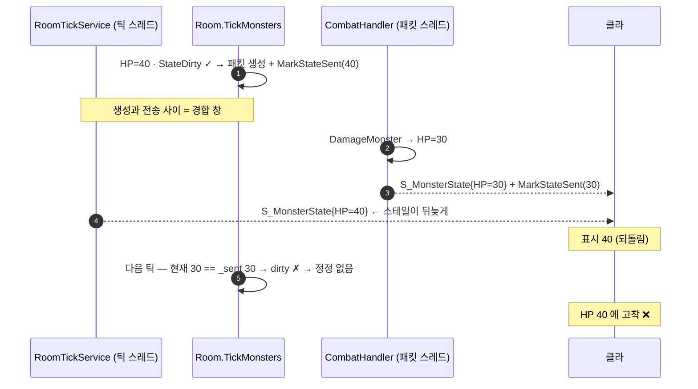
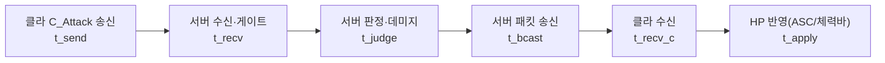
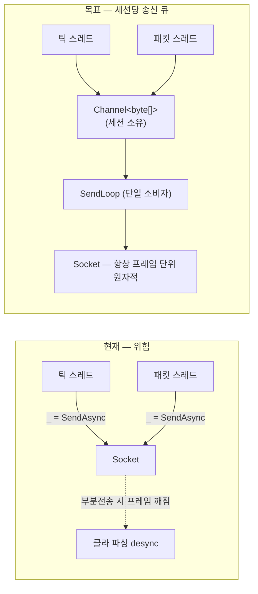

# AC-C: 전투 진단/관측 + 동기화 무결성 설계

> **계기**: "던전에서 체력 동기화가 살짝씩 느린 것 같다" (사용자 관측, 2026-07-16).
> **원칙**: 체감은 증상이지 원인이 아니다. **먼저 측정(C1)** 하고, 코드에서 확인된 결함은 **근본 수정(C2·C3)** 한다.
> 관련 = [actor-combat-architecture.md](actor-combat-architecture.md) · 진행 = plan.md M5 "AC-C". 작성: 2026-07-16.

---

## 0. 한 줄 요약

**관측(C1) → 무결성(C2 송신 직렬화 · C3 상태 신선도) 순서.**
코드 리딩으로 **재현 조건이 명확한 결함 2건**을 이미 찾았다 — 이건 측정 전에도 고칠 근거가 충분하다.

---

## 1. 진단 — 지금 아는 것 / 모르는 것

### 1.1 확인된 결함 (코드 근거 있음)

| # | 결함 | 근거 | 영향 |
|---|------|------|------|
| **D1** | **송신 경로에 직렬화가 없다** — `Room.Broadcast` 가 `_ = session.SendPacketAsync(packet)`(fire-and-forget), `SendPacketAsync` 는 큐·락 없이 `while(offset<len) await Socket.SendAsync(...)` 부분전송 루프 | `Room.cs` Broadcast · `Session.cs:120-146` | 틱 스레드(`RoomTickService`)와 패킷 스레드(`CombatHandler`)가 **동일 소켓 동시 write** → ① 순서 역전 ② **부분전송 시 길이-프리픽스 프레임 인터리브 = 파싱 desync**(치명) |
| **D2** | **dirty-flag 스테일 고착** — 틱이 만든 옛 HP 패킷이 데미지 패킷보다 늦게 도착하면 되돌아가고, 다음 틱은 `StateDirty()==false` 라 **정정하지 않는다** | `Room.TickMonsters`(생성 시 `MarkStateSent`) + `CombatHandler.ApplyAttackToMonsters`(즉시 전송 + `MarkStateSent`) | 몬스터 HP 가 **틀린 값에 영구 고착**(정지한 몬스터면 영원히). **증분7 이전엔 매 틱 재전송이 자가 교정**했다 → **내가 만든 회귀** |



### 1.2 아직 모르는 것 (측정 필요)

- 체감 지연의 **실제 크기**와 **구간**. 가설: ① 1 RTT 고유(스윙은 로컬 즉발 / HP 는 서버 왕복) ② 몬스터→플레이어는 **10Hz 틱** = 최대 100ms 입도 ③ D1/D2 로 인한 스테일.
- D2 가 실제로 얼마나 자주 터지는지(경합 창은 µs 지만 10Hz × N몬스터 × 전투 내내).
- → **C1 없이는 "무엇을 고쳐야 체감이 나아지나"를 알 수 없다.**

---

## 2. C1 — 전투 계측 (타임라인 + 판정/공식)

트레이스는 **두 축**을 기록한다. 하나만으론 "왜 이런가"를 못 푼다.

| 축 | 답하는 질문 | §  |
|----|-------------|----|
| **A. 타임라인** | *언제* 반영됐나 — 구간별 지연 (체감 "느림"의 원인 구간) | §2.1 |
| **B. 판정/공식** | *왜 이 숫자*인가 — 어떤 어빌리티가 어떤 공식·입력으로 이 데미지를 냈나 | §2.2 |

### 2.1 축 A — 타임라인 (구간 delta)



| 구간 | 의미 | 이 값이 크면 |
|------|------|-------------|
| `t_recv - t_send` | 상행 네트워크 | 네트워크/버퍼 |
| `t_judge - t_recv` | 서버 처리 | 서버 로직 |
| `t_bcast - t_judge` | 송신 대기 | **D1(직렬화 없음)·백프레셔** |
| `t_recv_c - t_bcast` | 하행 네트워크 | 네트워크 |
| `t_apply - t_recv_c` | 클라 반영 | 디스패치·표시 |

### 2.2 축 B — 판정/공식 (데미지가 왜 이 숫자인가)

**"어떤 공격이 어떤 공식으로 처리됐나"를 그대로 출력한다.** 서버가 계산한 **입력·경로·결과**를 트레이스에 싣는다.

현재 산식(진실원 = `Shared.Gameplay/Combat/StatCombatMath.cs`):
```
MeleeDamage(baseDamage, attackPower, defense) = max(1, baseDamage + attackPower − defense)
```

**경로가 3개이고 입력이 서로 다르다** — 이게 트레이스로 드러나야 할 핵심(비대칭이 실재):

| 경로 | 산식 호출 | base | AP | DEF | 비고 |
|------|-----------|------|----|-----|------|
| 플레이어 → 몬스터 | `CombatHandler.BuildDamageMods` | `ability.BaseDamage` | 시전자 AttackPower | **0**(몬스터 방어 미도입) | 스탯 스케일 O |
| 몬스터 → 플레이어 | `Room.TickMonsters` | `ability.BaseDamage` | **0** | 대상 Defense | 스탯 스케일 O |
| 플레이어 → 플레이어 | `CombatHandler.HandleAttack` | `ability.BaseDamage` | **미적용** | **미적용** | **플랫 — 산식 미경유** ⚠ (AC-D2) |

→ 트레이스가 경로·입력을 찍으면 **AC-D2 비대칭이 데이터로 보인다**(밸런스 결정의 근거).

**기록 필드**(`CombatTraceEntry` 의 판정부):
```
abilityId / networkId        어떤 공격인가
path                         Player→Monster | Monster→Player | Player→Player
formula                      "max(1, base+AP-DEF)" | "flat(base)"   ← 경유한 산식
baseDamage, attackPower, defense
finalDamage                  서버 결과(= S_ApplyEffect.Amount / DamageMonster mods)
targetHpBefore → targetHpAfter
onHitEffectIds[]             함께 부여된 CC(태그 전용)
gate                         Ok | OnCooldown | NoMana | Blocked | OutOfRange  ← 발동 거부 사유
```

- **발동 거부(gate)도 기록**한다 — "왜 공격이 안 나갔나"(쿨다운·마나·사거리·콤보 cadence)가 체감 버그의 절반이다.
- 산식 문자열은 **호출부가 기록**(하드코딩 X — `StatCombatMath` 를 부르는 지점이 자기 경로명을 넣는다). 산식이 바뀌면 여기 표기도 같이 바뀌게 리뷰 대상.

### 2.3 수집 설계

- **상관키**: `ActorId`(발동자) + `InstanceId`(대상 몬스터) + **`seq`**(§4의 상태 시퀀스). 클라·서버 로그를 이 키로 조인.
- **서버**: `ILogger` 구조적 로그(`[CombatTrace]`) — 기존 Graylog 스택(docker-compose 에 이미 있음)으로 흘려보낸다. 새 인프라 X.
  > ⚠️ **정정(C1a 구현 중 발견)**: 아래 "서버: `appsettings` 의 `Logging:CombatTrace`" 는 **이 서버에선 틀린 설명이었다.**
  > SocketServer 는 `UseSerilog` + `ReadFrom.Configuration` 이라 **`Serilog:` 섹션만 읽고 `Logging:LogLevel` 은 무시한다.**
  > 실제 스위치: `Serilog:MinimumLevel:Override:CombatTrace`(기본 `Information` = 트레이스는 `Debug` 라 Off) /
  > 켜기 = `Serilog__MinimumLevel__Override__CombatTrace=Debug`.
- **클라**: `CombatTraceRecorder`(순수 C#) — **링버퍼(최근 N=512건)**. 이게 **단일 소스**이고, 에디터 창·콘솔 덤프는 그 위의 뷰.
- **스위치(필수 — 상시 로그 금지)**:
  - 서버: **`Serilog:MinimumLevel:Override:CombatTrace`**(기본 `Information` → 트레이스는 `Debug` 라 Off). ~~`Logging:CombatTrace`~~ 는 이 서버에서 죽은 설정 — 위 정정 참조.
  - 클라: `CombatTraceRecorder.Enabled`(기본 Off) — 에디터 창에서 토글.
- **오버헤드**: Off 면 호출 자체가 없어야 한다(`if (!Recorder.Enabled) return;` 선행 — **문자열 보간 금지**, 구조체 필드만 기록. 링버퍼는 사전할당·무할당 쓰기).

### 2.4 Combat Trace Window (에디터)

기존 관례 계승: `Gameplay/Editor/` 에 EditorWindow(`MapEditorWindow`·`DialogueGraphWindow` 선례) + UI Toolkit.

```
Tools/Combat/Combat Trace          ← 메뉴

┌─ Combat Trace ────────────────────────────────────────────────────────┐
│ [● Record] [Clear] [Export CSV]   Filter: Actor▾ Ability▾ Path▾ ☐거부만│
├───────────────────────────────────────────────────────────────────────┤
│ 요약 (N=124)   [타임라인] [판정]        ← 탭                          │
│   구간            avg     p95     max                                 │
│   상행(→서버)     12ms    28ms    41ms                                │
│   서버 처리        1ms     2ms     6ms                                │
│   송신 대기        3ms    19ms   112ms  ← D1 후보                     │
│   하행(→클라)     11ms    27ms    38ms                                │
│   클라 반영        4ms     9ms    16ms                                │
│   ── 총 지연 ──   31ms    72ms   180ms                                │
├───────────────────────────────────────────────────────────────────────┤
│ 이벤트 (최신순)                                                       │
│ time    actor ability          target dmg  gate      총    구간막대   │
│ 12.34s  +100  combo_a          -3      27  Ok        34ms  ▇▇▇▁▇▇     │
│ 12.20s  +100  combo_b          -3       -  OnCooldown  -   (거부) ⚠   │
│ 12.02s  -3    creepy_demon_at  +100    10  Ok        29ms  ▇▇▁▁▇▇     │
│ 11.88s  +100  basic_swing      -3      27  Ok        88ms  ▇▇▇▇▇▇▇ ⚠ │
├───────────────────────────────────────────────────────────────────────┤
│ 상세 — actor +100 → target -3 / combo_a (netId 2) / seq 41            │
│                                                                       │
│  ■ 판정 (왜 이 숫자인가)                                              │
│    path     Player → Monster                                          │
│    formula  max(1, base + AP - DEF)                                   │
│             = max(1, 10 + 17 - 0)  =  27                              │
│                    ▲base  ▲AP  ▲DEF(몬스터 방어 미도입)               │
│    base     10   ← Ability_ComboA.baseDamage (SO 저작)                │
│    AP       17   ← 시전자 AttackPower(레벨/장비 합산, 서버 권위)       │
│    DEF       0                                                        │
│    result   27   → S_ApplyEffect.Amount = -27                         │
│    HP       30 → 3                                                    │
│    onHit    (없음)          gate: Ok                                  │
│                                                                       │
│  ■ 타임라인 (언제 반영됐나)                                           │
│    t_send    0.0ms                                                    │
│    t_recv   +14.2ms   상행                                            │
│    t_judge   +0.8ms   서버 처리                                       │
│    t_bcast  +51.0ms   송신 대기   ⚠ 이상치                            │
│    t_recv_c +18.1ms   하행                                            │
│    t_apply   +3.9ms   클라 반영                                       │
│    ⚠ 스테일 드롭: seq 40 이 seq 41 이후 도착 → 무시됨                  │
└───────────────────────────────────────────────────────────────────────┘
```

- **Record 토글** = `CombatTraceRecorder.Enabled`(플레이 중 켜고 끔). 창을 안 열면 기록 안 함.
- **요약 탭 2개**: **[타임라인]** 구간별 avg/p95/max(§2.1 표와 1:1 — 어느 구간이 범인인지) / **[판정]** 어빌리티별 발동수·평균 데미지·**gate 거부 분포**(쿨다운/마나/사거리로 몇 번 씹혔나).
- **이벤트 목록** = 최신순. `dmg`·`gate` 컬럼으로 **거부(발동 안 된 공격)도 한 줄로 보인다** — "왜 공격이 안 나갔지"가 바로 풀린다. `☐거부만` 필터.
- **상세 = 판정 + 타임라인 2단**:
  - **판정** — `formula` 를 **실제 값을 대입한 식 그대로**(`max(1, 10 + 17 - 0) = 27`) 출력하고, 각 입력의 **출처**를 병기(base=SO 저작 / AP=서버 권위 스탯 / DEF=대상). 결과가 `S_ApplyEffect.Amount`·HP 전후와 이어짐 → **"이 숫자가 왜 나왔나"가 한 화면에서 닫힌다.**
  - **타임라인** — 구간 delta + **스테일 드롭 표시**(§4 Seq 도입 시 D2 재현을 눈으로 확인).
- **Path 필터** — `Player→Player` 만 걸어보면 **산식 미경유(flat) 비대칭**(§2.2 표, AC-D2)이 데이터로 드러난다.

> ⚠️ **정정(C1b 구현 중 발견) — 위 상세 패널의 `AP=17 ← 시전자 AttackPower` 는 클라가 채울 수 없다.**
> AP/DEF 는 **서버 권위 스탯이라 클라에 오지 않는다**. 그런데 §2.5 는 "서버 로그를 창으로 끌어오지 않는다"고 못박았다 → **둘은 동시에 성립 불가**.
> **해소**: 클라는 아는 것만 쓴다 — `base`(AbilityDefinition SO) + `final`(S_ApplyEffect.Amount) 로 **`AP-DEF = final - base` 를 역산**한다(`CombatTraceJoin.InferStatContribution`).
> 이것으로 "왜 이 숫자인가"는 닫히고, AP/DEF **분해**가 필요하면 `seq`·ActorId 로 서버 `[CombatTrace]`(Graylog)와 조인한다 — 설계 의도(§2.3 상관키)대로다.
- **Export CSV** = 오프라인 분석·이슈 첨부용.
- **Play Mode 전용** — 미플레이 시 안내 문구.
- 구현: `CombatTraceWindow : EditorWindow`(UI Toolkit `MultiColumnListView`). **로직 없음** — `CombatTraceRecorder` 를 읽어 그리기만(테스트는 Recorder 를 EditMode 로).

### 2.5 안 하는 것

- 상시 텔레메트리·별도 수집 서버 — YAGNI. 재현 시 켜서 보는 용도.
- 프레임 단위 프로파일러 — Unity Profiler 가 이미 함.
- 서버 로그를 에디터 창으로 끌어오기 — 상관키로 Graylog 에서 조인하면 충분(창은 **클라 관점 타임라인**). 필요해지면 확장점.

---

## 3. C2 — 송신 경로 직렬화 (D1 수정)

**문제**: 여러 스레드가 한 소켓에 동시 `SendAsync` → 프레임 인터리브 + 순서 역전.

**설계**: 세션당 **단일 송신 루프**(표준 게임서버 패턴).

> ⚠️ **정정(C2 구현 중 실측) — "프레임 인터리브(치명)" 은 플랫폼 의존이다.**
> §1.1 D1 은 코드 리딩만으로 "부분전송 시 프레임 인터리브 = 파싱 desync(치명)" 이라 단정했는데, **Windows 에선 재현되지 않는다**:
> overlapped `WSASend` 는 **버퍼 전체가 소비될 때까지 완료되지 않아** `sent == frame.Length` 가 보장된다 →
> `while (offset < len)` 루프가 1회만 돌아 **부분 전송 자체가 없다** → 섞일 수가 없다.
> (큐를 우회한 채로 20KB 프레임 × 512B 송신버퍼 × 4스레드 동시 송신을 돌려도 **통과**했다.)
>
> **하지만 서버는 Linux 컨테이너에서 돈다.** Linux 의 `send()` 는 부분 반환이 정상이라 거기선 D1 이 실재한다.
> → 결론: **수정은 여전히 필요**하되, 프레임 원자성은 **구조적 보장**(단일 소비자)이지 테스트로 증명한 것이 아니다.
> 단위 테스트가 지키는 것은 **순서 보존 · 큐 포화 시 끊김 · 끊긴 세션 무시** 세 가지다.



- `Session` 에 `Channel<byte[]>`(unbounded 또는 bounded+drop 정책) + `SendLoopAsync` 백그라운드 소비자.
- `SendPacketAsync` → **직렬화 후 큐잉만**(await 없이 즉시 반환) → 호출자(Broadcast) 는 절대 블록되지 않는다.
- **FIFO 보장** = 큐잉 순서. 프레임 원자성 = 단일 소비자가 한 프레임씩 완주.
- 연결 종료 시 채널 Complete → 루프 종료(누수 방지).
- ※ **연결 처리 소스 변경** → 테스트 규칙 §연결 커버리지에 따라 소켓 E2E/단위 동반 필수.

---

## 4. C3 — 상태 신선도 (D2 수정)

**문제**: dirty-flag 가 "보냈다"를 **생성 시점**에 기록해, 경합으로 스테일이 뒤늦게 도착하면 **정정 기회가 사라진다**.

### 후보

| 안 | 내용 | 장 | 단 |
|----|------|----|----|
| **A. 상태 시퀀스** ★추천 | `S_MonsterState` 에 `Seq`(몬스터별 단조 증가) 추가. 클라는 `seq <= lastSeen` 이면 **무시** | 어떤 원인의 재정렬에도 견고. 즉시 전송 유지(지연 0). C1 상관키로도 재사용 | **패킷 필드 추가 = 공개계약 변경**(승인 필요) |
| B. 단일 송신자 | `S_MonsterState` 는 **틱만** 보냄. CombatHandler 는 HP 만 바꾸고 전송 안 함 | 경합 원천 제거·구현 최소 | HP 반영이 **최대 100ms 지연** → 체감 악화(사용자 불만과 반대 방향) |
| C. 생성·전송 원자화 | 락 안에서 전송 | 경합 제거 | 락 안 I/O = 틱 블록(현 설계가 의도적으로 피한 것) |
| D. MarkStateSent 를 전송 시점으로 | 창을 줄임 | 작음 | 경합 자체는 남음(근본 아님) |

**추천 = A(시퀀스)**. C2(송신 직렬화)를 해도 **큐잉 순서가 이미 뒤집혀 있으면 소용없다**(틱이 먼저 만들고 나중에 큐잉) → 순서 무관하게 스테일을 버리는 A 가 유일한 근본 해법.
`Seq` 는 C1 의 상관키로도 쓰여 일석이조.

### ✅ 안A 채택·구현 완료 (승인 2026-07-17)

**핵심 계약 — Seq 는 "스냅샷(생성) 시점"에 찍는다. 송신 시점이 아니다.**
막으려는 것이 *생성≠송신 순서*이므로, 송신 시점에 찍으면 Seq 가 도착 순서와 같아져 **아무것도 거르지 못한다**(오히려 역전을 정당화).

```
틱:     상태읽기(HP40) → Seq=5 ────────────┐ 생성-송신 간격
데미지: HP40→30       → Seq=6 → 즉시 송신 ─┐│
                                          ▼▼
클라:   seq6(HP30) → 적용(lastSeq=6)
        seq5(HP40) → 5 <= 6 → **버림** ✓
```

| 항목 | 결정 | 근거 |
|------|------|------|
| 발급 위치 | `MonsterState.NextSeq()` — **패킷을 만드는 그 자리**(틱 `Room.TickMonsters` / 데미지 `CombatHandler`) | 생성 순서 = 상태 순서 |
| 동시성 | `Interlocked.Increment` | 틱은 `lock(_monsters)` 안, 데미지는 **락 밖**에서 패킷 생성 → 서로 다른 컨텍스트 |
| 범위 | 몬스터별 카운터(방 전역 아님) | 클라 baseline 비교가 몬스터 단위 |
| 첫 발급 | 1 (클라 baseline 0) | "첫 상태는 항상 통과" 성립 |
| 판정 | `seq <= 반영값` → 드롭 (`<` 아님) | 중복 전달(재전송)도 무시 |
| 드롭 위치 | `SocketPacketState.UpdateMonster` (상태 저장소) | 단일 초크포인트 — 핸들러는 전달만, 보간 이벤트도 함께 억제 |
| `S_SpawnMonster` | **Seq 추가 안 함** | baseline 0 이라 첫 상태 통과. 신규 입장자 로스터 경합은 다음 틱 자가 교정 = 일시적 → 계약 확대 불요(YAGNI) |
| 타입 | `int` | 몬스터 수명 = 던전 세션. 10Hz 로 wrap 까지 ~6.8년 |

**남은 한계(정직히)**: 이건 *순서 역전을 무효화*할 뿐 **재전송을 앞당기지 않는다.** 스테일을 버린 그 순간의 화면은 직전 상태 그대로이고, 다음 틱에 최신이 온다. 즉 **HP 고착은 사라지지만 체감 지연 자체는 C1c 측정 후 판단**(C2b).

> **임시 안전망(즉시 적용 가능, 승인 불요)**: dirty-flag 의 `MarkStateSent` 를 **HP 변화에는 적용하지 않기**(위치/회전/페이즈만 dirty 판정) → HP 가 바뀌면 다음 틱이 무조건 재전송해 **자가 교정 복원**. Idle 트래픽 절감(증분7 목적)은 유지. **A 도입 전까지의 회귀 봉합.**

---

## 5. 증분 계획

| # | 증분 | 검증 |
|---|------|------|
| **C1a** ✅ | 서버 `[CombatTrace]` 구조적 로그(스위치 Off 기본) — **타임라인**(recv/judge/serverMs) + **판정**(path·formula·base/AP/DEF·final·hp·seq·gate) | ✅ 단위 4종(Off 시 무호출 **실측**: 가드 제거 시 실패 확인) · SocketServer.Tests 164/164 · **Docker 육안 64건** · 오버라이드 제거 시 0건(기본 Off 실증) · E2E 31/31 |
| **C1b** ✅ | 클라 `CombatTraceRecorder`(링버퍼 512·순수 C#·무할당) + `CombatTraceJoin`(스윙 단위 병합) — 송신/발동/데미지/HP반영 시각 + 서버 판정 결과(Amount·Hp·Seq) 병합 | ✅ EditMode 10종(기본 Off·링 회전·구간 계산·판정 병합·게이트 의심·타몬스터 배제) · **184/184** |
| **C1b'** ✅ | **`CombatTraceWindow`**(IMGUI) + **배선 4곳** — Record·요약 2탭·이벤트 목록(dmg·gate)·상세·거부만 필터·CSV | ✅ 창은 뷰라 로직 0(병합=`CombatTraceJoin`) → EditMode **186/186** · 컴파일 0오류 · E2E **31/31** |
| **C1c** ✅ | **측정 세션 완료(2026-07-17, 사용자 플레이 + CSV)** — 지연: 송신→HP **37ms**·RTT 39ms·발동→HP 14ms(체감 본체=RTT) / 스테일 드롭 **0** / gate 거부 **0** / 데미지 검수 통과(AP 역산 일관·누적피해 일치) | ✅ CSV(`combat-trace.csv`) + plan.md AC-C1c 기록. **부수 발견**: 링 포화(→해소)·몹→플 지연 관측 불가·몬스터 피해 바닥(→AC-E) |
| **C3-hotfix** ✅ | dirty-flag 안전망(HP 변화는 항상 재전송) — **D2 회귀 봉합 완료** | ✅ `MonsterTickDirtyStateTests` 4종(자가교정 + 회귀가드) · SocketServer.Tests 156/156 · E2E 31/31 |
| **C2** ✅ | 세션 송신 큐(Bounded 1024 + 단일 소비자) — D1 수정 | ✅ 단위 4종(순서·포화 끊김·끊긴 세션 무시·동시 송신) 168/168 · E2E 31/31. ⚠ 프레임 원자성은 **구조적 보장** — Windows 에선 D1 재현 불가(§3 각주) |
| **C3** ✅ | `S_MonsterState.Seq` + 클라 스테일 드롭 — **D2 근본 해결** | ✅ 직렬화·Seq 단위(서버 160/160) · 클라 스테일 드롭 3종(EditMode 174/174) · E2E 31/31 |
| **C2b** ✅ | **불필요 판정(2026-07-17)** — 측정 결과 틱레이트·클라 예측을 건드릴 근거가 없다(서버 처리·하행 14ms 로 이미 촘촘, 체감 본체는 RTT) | **측정이 "하지 않기로" 결론낸 사례** — 이게 C1 을 먼저 만든 이유였다 |

- ~~**C3-hotfix 를 가장 먼저** 한다(내가 만든 회귀, 승인 불요, 리스크 최소).~~ → **완료**(아래).
- C1c 결과 없이 C2b(틱레이트·예측)에 손대지 않는다.

### ✅ C3-hotfix 완료 기록 (2026-07-17)

**무엇** — `CombatHandler.ApplyAttackToMonsters` 의 즉시 브로드캐스트 뒤에 있던 `monster.MarkStateSent()` **한 줄 제거**(+ 이유 주석). 데미지 경로는 더 이상 "보냈다"고 마킹하지 않는다.

**왜** — 틱은 패킷을 **만든 뒤 나중에** 전송한다(`Room.TickMonsters` 생성 → `RoomTickService` 송신). 그 사이 데미지가 들어가면 **옛 HP 패킷이 새 HP 뒤에 도착**한다. 마킹까지 해두면 다음 틱이 `StateDirty()==false` 로 보고 **정정을 포기** → 클라 HP 가 **영구 고착**. 마킹을 생략하면 다음 틱이 무조건 재전송해 **자가 교정**된다. 비용은 **피격당 1패킷**(증분7 의 Idle 트래픽 0 목적은 그대로 유지 — 위치·회전·페이즈 dirty 판정은 건드리지 않음).

**한계(정직하게)** — 이건 **순서 역전 자체를 막지 못한다.** 클라는 여전히 한 틱 동안 옛 HP 를 볼 수 있고, 다음 틱에 정정될 뿐이다(체감: 짧은 HP 튐). 근본해법은 **C3(`S_MonsterState.Seq` + 스테일 드롭)** 이며 이 hotfix 는 그때까지의 **안전망**이다.

**테스트 2종** — 인과를 양방향으로 못 박았다:
- `HP가_바뀌면_이동이_없어도_다음틱이_재전송한다_자가교정` — 불변식(프로덕션 경로 보장).
- `데미지_경로가_송신마킹하면_자가교정이_깨진다_회귀가드` — **구 동작을 그대로 재현**해 "마킹하면 정정 패킷이 사라진다"를 고정. 누가 `MarkStateSent` 를 다시 넣으려 할 때 **왜 안 되는지가 코드에 남는다.**

---

## 6. 결정 필요 → ✅ 전부 결정·이행됨 (2026-07-17)

1. **`S_MonsterState.Seq` 추가** — ✅ 승인·구현 완료(안A). **스냅샷 시점** 스탬프가 핵심(송신 시점이면 아무것도 못 거른다).
2. **로그 싱크** — ✅ 기존 Graylog 로 충분(신규 인프라 0, Docker 육안 64건 확인). ⚠ 스위치는 `Serilog:MinimumLevel:Override:CombatTrace`(§2.3 정정 — `Logging:LogLevel` 은 이 서버에서 죽은 설정).
3. **C2 범위 포함** — ✅ 포함·완료(세션 송신 큐 + 소켓 단위 4종 + Docker E2E 31/31).
