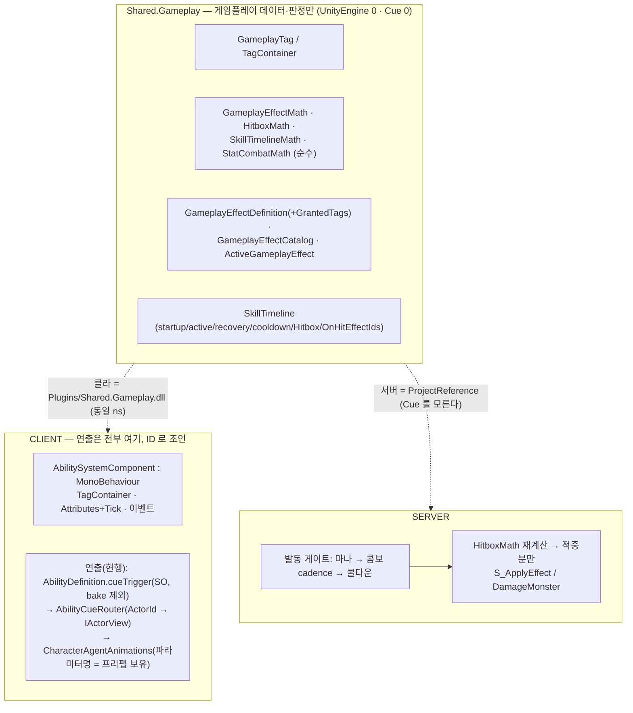
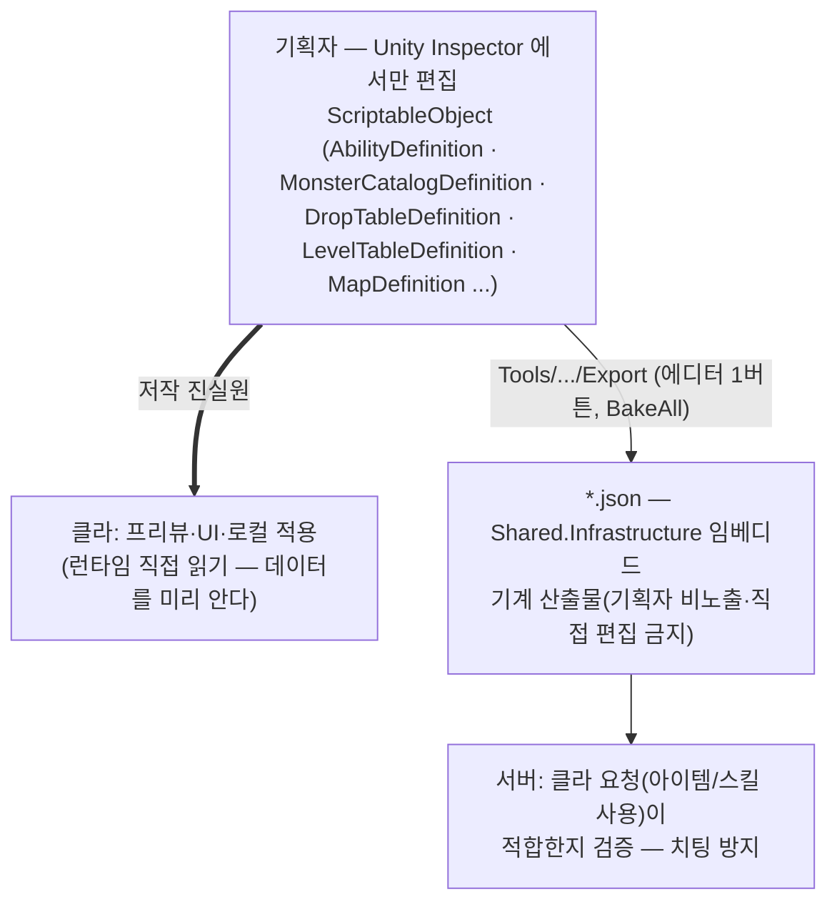
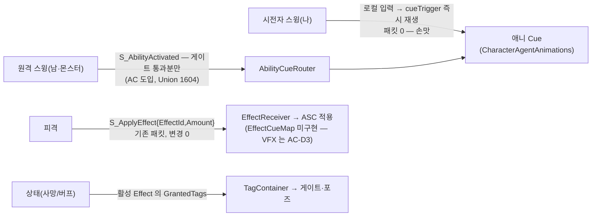
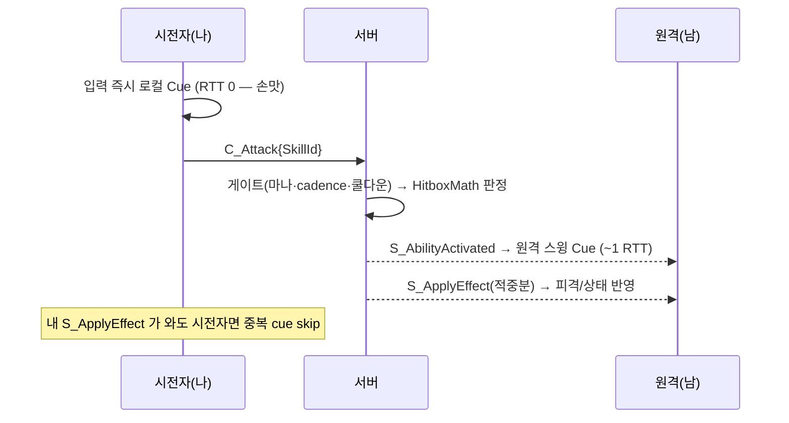
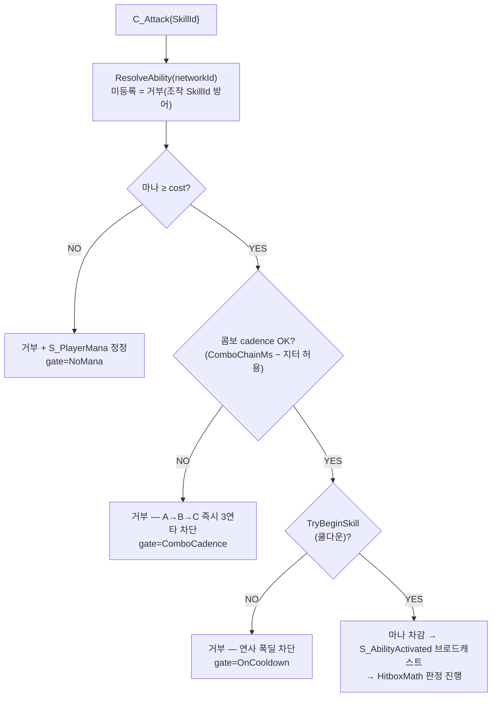

# GAS 아키텍처 (설계 기준)

> **2026-07-17 코드 대조 검수** — 문제 ①④⑤ 해소·③ 폐기(부활)·연출 SO 는 `cueTrigger` 경로로 대체 구현. 각 표에 반영됨. AC 구현 상세 = codemap §2.64~2.80.

> Gameplay Ability System(Tag·Effect·Ability·Cue)의 **합의된 정리 방향**.
> 버프/디버프 디테일은 [effect-system.md](effect-system.md), 권위 4축은 [authority-model.md](authority-model.md), 캐릭터 두 축은 [character-architecture.md](character-architecture.md) 참조.
> 구현 진행은 [plan.md](plan.md), 결정 요약은 [codemap.md](codemap.md).
> 작성: 2026-06-11 (대화 합의 박제). 코드는 점진 리팩터로 적용.

---

## 0. 한 줄 요약

**Shared = 게임플레이(판정·수치·상태) 단일소스 / Client = 연출 전부 / Server = 발동·적중 권위.**
연출 데이터는 네트워크로 한 글자도 안 보낸다 — ID(AbilityId/EffectId/Tag)로 클라가 로컬 조회한다.

---

## 1. 진단 — 현재 GAS의 문제 (정리 동기)

읽고 확인한 실제 결함(심각도 순):

| # | 문제 | 위치 |
|---|------|------|
| ① | ~~**데미지 수치 이중 정의** — 같은 effect가 클라/서버 카탈로그에 손으로 중복~~ → **해소**: 전투=`CombatEffectCatalog`가 Shared 코드 시드 위임(2.6b ⓑ), 소모품=클라 SO 저작→bake 단일소스(§2.5·2.6c). | (해소됨) |
| ② | **"Effect 적용"이 두 엔진** — 클라 ASC vs 서버 인라인(`Room.DamageMonster`가 `GameplayEffectMath` 직접 호출) | ASC가 MonoBehaviour라 Shared 불가 |
| ③ | ~~**죽은 구 ability 경로 잔존**~~ → **정정(2026-07-17 검수): 삭제 계획 폐기** — `GameplayEffect` 는 이후 **Main 로컬 권위 경로에서 부활**(`LocalMonster` 즉발 피해 생성·`ConsumableEffectHandler`), `AbilitySystemUtils` 는 테스트 헬퍼로 생존. 더는 죽은코드가 아니다 | `Effects/GameplayEffect.cs` |
| ④ | ~~**태그 시스템 부재**~~ → **✅ 해소** — `GameplayTagContainer` 가 ASC 에 존재(AddTag/HasTag + 활성 Effect 의 GrantedTags 동적 합산). CC(스턴·슬로우)·사망 태그가 실사용 중 | `AbilitySystemComponent` |
| ⑤ | ~~**서버 발동 권위 없음**~~ → **✅ 대부분 해소(AC, 2026-07-17)** — 쿨다운(`TryBeginSkill`)·콤보 cadence·마나 게이트가 구현돼 `C_Attack` 연사가 서버에서 거부된다(거부 사유는 `[CombatTrace]` gate 로 관측). **잔여**: active-window 정밀 타이밍·플레이어 서버측 HP 추적 | `CombatHandler.HandleAttack` |
| ⑥ | ASC가 MonoBehaviour + 자가 `Update` tick → 헤드리스 불가 (서버가 ASC 못 씀의 근인) | `AbilitySystemComponent` |

> ②⑥는 본 정리 범위 밖(option C, YAGNI). 이번은 ①③④⑤ 중심.

---

## 2. 목표 레이어링 — 무엇이 어디에



**원칙: Shared는 게임플레이 순수. 서버는 Cue 문자열을 하나도 안 가진다. 모든 연출 매핑은 클라 SO.**

> ⚠️ **현행화(2026-07-17 검수)** — 위 다이어그램의 "연출 SO 3종"은 그대로 구현되지 않았다. **실물**(AC-B B3):
> ① AbilityCueTrack → **`AbilityDefinition.cueTrigger/cueComboStep`**(Ability SO 안에 통합, bake 제외) + `AbilityCueRouter`(ActorId→`IActorView.PlayAbilityCue`) + `CharacterAgentAnimations`(파라미터명은 프리팹 보유).
> ② EffectCueMap — **미구현**(피격은 `EffectReceiver`→ASC 직결, 별도 연출 매핑 없음). ③ CueCatalog(VFX/SFX) — **잔여 = AC-D3**.
> "삭제: GameplayEffect+AbilitySystemUtils" 도 폐기됐다(문제③ 정정 참조). 원칙(서버는 Cue 무지)은 그대로 지켜지고 있다.
`SkillTimeline`의 기존 doc 주석("Cue/VFX 미포함")을 그대로 지킨다 — 연출은 별도 클라 트랙(①)으로 분리.

---

## 2.5 데이터 진실원 교리 — SO 저작(클라) → Shared 배포(서버 검증)  [2026-06-13 확정]

게임플레이 **콘텐츠 데이터**(아이템·소모품·스킬 수치)의 단일 교리. 문제①(수치 이중정의)의 근본 해법.



- **왜 SO가 저작 진실원**: ① Inspector 편집이 쉬움(기획 친화) ② **클라가 데이터를 미리 알아야** 아이템/스킬 정보를 화면에 보여줄 수 있음.
- **왜 Shared 사본이 필요**: 서버가 클라 요청(아이템 소비·스킬 발동)을 **검증하려면 같은 데이터를 알아야** 함. 서버는 UnityEngine 미참조라 SO를 못 읽으므로 SO→bake JSON 으로 배포.
- **공통 키**: `effectId == itemId`(소모품) · `skillId` 등 → 클라·서버 동일 조회. 기획자는 JSON을 만지지 않는다(자동 산출물).
- **2-소스 합류**(현재 상태): effect 수치는 `effectId` **단일 조회**로 합치되 출처는 둘 —
  - **콘텐츠(소모품 등)** = 클라 SO 저작 → bake (`ConsumableEffectCatalog`, 임베디드 JSON). ✅ 적용됨(2026-06-13, codemap §2.6c).
  - **전투 밸런스**(`basic_attack_dmg`/`monster_attack_dmg`) = **서버 권위**라 코드 시드(`GameplayEffectCatalog`) 유지(2.6b ⓑ). 전투·스킬의 SO 저작 수렴은 후속.
- **폐기**: effect-system.md 옛 전제 *"ScriptableObject를 진실원으로 쓰지 않음"* 은 이 교리로 **대체**됨 — SO = **저작** 진실원, JSON = bake 산출물(둘은 모순 아님: SO 상류 → JSON 하류).

---

## 3. 2층 분리 — 시간축은 로컬, 발동·적중만 네트워크

타임라인 프레임/큐를 매 순간 전송하지 않는다. 그러면 `Shared.Gameplay`(결정론 공유)의 의미가 사라진다.

| 층 | 누가 굴리나 | 네트워크 |
|----|------------|----------|
| **연출 타임라인**(스윙 VFX·트레일·캐스트) | 각 클라가 공유 데이터 로컬 재생 | ❌ |
| **게임플레이 결과**(적중·데미지·상태) | 서버 판정 | ✅ 적중분 `S_ApplyEffect`만 |

핵심: 클라는 **AbilityId만 알면 연출 전부**, **EffectId만 알면 피격 연출 전부**를 로컬에서 만든다(둘 다 공유 데이터 조회). 데미지는 항상 서버를 거친다.

---

## 4. 연출(Cue)이 터지는 3경로 — 전부 ID 조회, 패킷 무변경



**중요 — `S_ApplyEffect`에 `CueTags` 필드 추가는 불필요(철회).** 패킷은 이미 `EffectId`를 싣고, 클라가 그 ID로 `EffectCueMap`을 조회한다. **공개계약 변경 0.** (동적 큐 — 크리티컬 등 — 가 생기면 그때 필드 추가 검토.)

### 시전자 즉발 vs 원격 지연 (authority-model ③)

authority-model.md §5(데미지 숫자)와 동일 패턴 — View(CueManager)는 멍청하게, Source만 로컬/네트워크 교체.

### ~~의도된 누락 (YAGNI)~~ → **✅ 도입됨 (AC, 2026-07-17)**
당시 "지금은 안 만든다"고 접었던 `S_AbilityActivated` relay 가 **Actor 통합 설계에서 축으로 승격**됐다(Union 1604).
서버 게이트를 통과한 발동만 브로드캐스트되므로 연사 치팅이 원격 애니로 새지 않고, 플레이어·몬스터가 같은 파이프를 쓴다.

---

## 5. 서버 발동 권위 — 치팅 축(①) 차단

연출이 로컬이어도 **데미지는 항상 서버를 거친다**. ~~그러나 현재 서버는 발동 *조건*을 안 본다~~ → **✅ 구현됨(AC)**: 아래 게이트 체인이 `CombatHandler.HandleAttack` 에 그대로 있다(거부 사유는 `[CombatTrace]` gate 로 관측).



- `CooldownMs`·`ComboChainMs`·`ManaCost` 전부 `SkillTimeline` **데이터**(abilities.json) — 이제 서버가 읽는다.
- 선택: active/recovery 중 재발동 거부까지 더하면 "시전 끝났다"를 서버가 앎.
- 클라 예측은 유지(손맛). 서버 거부 시 데미지만 안 감(피격 Effect 없음 → 연출 자연 정리).
- **얇게 한정**: 쿨다운 + 시전중 거부까지. active-window 정밀(서버 tick 시뮬)은 더 큰 부채 → 별도.

### 부수 주의 — 위치도 "lite 권위"
hitbox *판정*은 서버 재계산이지만, **시전자 위치는 `C_Move` 클라 릴레이값**(원본 ts). 텔레포트 핵 위치로 판정될 수 있음. 이동 sanity 검증은 더 큰 별개 부채 — 본 범위 밖. "완전 서버 권위 아님"만 박제.

---

## 6. GameplayTag — 상태 표현의 공통 인프라

- 계층 문자열(`State.Dead`, `State.Buff.Atk`). `GameplayTagContainer`: `HasTag/Add/Remove/HasAny`.
- 용도: **상태 게이트**(입력 차단 등) + (선택) Effect의 `GrantedTags`로 부여/제거.
- **사망(2.5.1) = `State.Dead` 태그**: 입력 폴링이 `HasTag(State.Dead)`면 Move/Attack/Interact 억제. FSM 상태 추가 아님(character-architecture 두 축 규칙 준수 — "이동 제약은 태그로").
- 복제: 태그는 Effect 적용(`S_ApplyEffect`) 또는 직접 신호(2.5.1 `S_PlayerDead{userId}`)로 전파 → 클라 TagContainer 변경 → Cue/게이트 반응.

---

## 7. 2.5.1 사망과의 합류

GAS 정리가 사망 기능을 정석으로 만든다:
```
HP≤0(클라 결정론 감지, 기존) → ASC.AddTag(State.Dead) + C_PlayerDead 송신(기존)
   → 입력 게이트(HasTag) 발동: 이동/공격/상호작용 정지
   → State.Dead 묶인 Cue 재생(다운 포즈)
   → 서버가 S_PlayerDead{userId} 방 브로드캐스트 → 원격이 그 캐릭터에 다운 Cue
던전(코옵) = 다운-잠금, 던전 종료까지 유지. 던전 내 부활 = 2.5.2.
Main(싱글) = 일정 시간 후 로컬 리스폰(후속 증분, 로컬 권위라 별개).
```

---

## 8. 정리 범위 — 무엇을 옮기고/삭제/추가

| 작업 | 분류 | 비고 |
|------|------|------|
| `GameplayTag`+`Container` 신설 **✅ 구현** | Shared | 사망/버프/상태 공통 — CC·사망 태그 실사용 |
| `GameplayEffectDefinition`/`Catalog`/`ActiveGameplayEffect` 이사 **✅ 완료** | Client→Shared | `Shared.Gameplay/Effects/` 에 존재 |
| 클라/서버 effect 카탈로그 **단일화** | Shared | 문제① 해소(✅). 전투=`CombatEffectCatalog` 위임(2.6bⓑ) / 소모품=SO 저작→bake(§2.5) |
| `EffectDefinition`에 `GrantedTags[]` 추가 **✅ 완료** | Shared | 스턴/슬로우가 GrantedTags 로 동작 |
| ~~`GameplayEffect`+`AbilitySystemUtils` 삭제~~ **폐기(2026-07-17)** | Client | 문제③ 정정 — Main 로컬 권위 경로에서 부활해 더는 죽은코드가 아님 |
| ~~서버 발동 게이트(쿨다운/시전중)~~ **✅ 구현(AC)** | Server | 문제⑤ 해소 — 쿨다운·콤보 cadence·마나. active-window 정밀 타이밍은 잔여 |
| ASC에 TagContainer **✅ 완료** | Client | 게이트·상태 |
| ~~연출 SO ①②③ + CueManager~~ → **①은 `AbilityDefinition.cueTrigger` 로 대체 구현(AC-B)** | Client | ② EffectCueMap 미구현 · ③ CueCatalog(VFX/SFX)=**AC-D3 잔여** |
| **안 함**: ~~`S_AbilityActivated` relay~~(→ **AC 에서 도입**, Union 1604 — 플레이어·몬스터 공용 발동 파이프의 축이 됐다. 당시 YAGNI 판단이 Actor 통합 설계로 뒤집힌 사례) / `S_ApplyEffect` 필드 추가 / ASC 헤드리스화(②⑥) | — | — / 별도 |

---

## 9. 안 하는 것 (YAGNI 경계)

- 타임라인 프레임 네트워크 전송 — 로컬 공유재생으로 충분.
- `S_AbilityActivated` relay — 원격 헛스윙 연출 필요 시에만. 확장점만 남김.
- `S_ApplyEffect` 패킷 필드 추가 — EffectId 조회로 대체. 공개계약 보존.
- ASC 헤드리스화(서버 공유 엔진, ②⑥) — option C, M5 후반/별도 트랙.
- active-window 서버 tick 정밀 시뮬 — 쿨다운 게이트로 1차 차단, 정밀은 별도.
- 이동 sanity 검증(텔레포트 핵) — 별개 큰 부채.

---

## 10. 합의 상태

| 결정 | 값 | 상태 |
|------|----|----|
| 2층 분리(시간축 로컬 / 발동·적중 네트워크) | 채택 | ✅ 합의 |
| 연출 = 클라 SO 3종, Shared 게임플레이 순수 | 채택 | ✅ 합의 |
| `S_AbilityActivated` relay | 제외(확장점만) | ✅ 합의 |
| `S_ApplyEffect` 패킷 변경 | 불필요(철회) | ✅ 합의 |
| 서버 발동 게이트(쿨다운/시전중) | "실제 구멍, 고쳐야" | ✅ 합의 (이번 범위 포함 여부 = 미확정) |
| 사망 = `State.Dead` 태그 | 채택 | ✅ 합의 |
| 연출 3 SO를 *지금* 만들지 vs 2.5.1에서 최소로 | — | ⬜ 미확정 |

> 미확정 2건(서버 게이트를 이번 정리에 포함할지 / 연출 SO 착수 시점)은 구현 *범위* 결정 — 다음 단계에서 확정 후 TDD 증분 시작.
